# Collaborative transaction privacy

This document examines some challenges for privacy in a variety of multiparty transaction settings, from PayJoin to CoinJoin. None of the attacks described are novel, but some of the cited results of the privacy literature originated in a different setting than Bitcoin privacy.

Common misconceptions about how privacy works on-chain for such transactions paint a much rosier picture than what the published literature has shown. Unlike in cryptography, where the burden of proof for claims of security is rightfully rather high, various apologists and interested parties often promote the notion that the burden of proof should be reversed, or that addressing these problems is trivial.

This document isn't concerned with providing empirical proof of the viability of different attacks, partly because some of the structures whose weaknesses are examined are still hypothetical, but mostly because of the lack of novelty; the cited works are supported by evidence and most are peer reviewed.

This document *is* concerned with defining specific failure modes, and by extension, the success criteria for claims about privacy on-chain. Vendors of privacy-enhancing technologies, as is the norm in other industries, should be expected to address these widely understood attacks and argue for how privacy is maintained in the face of such adversaries.

## Unilateral transaction privacy

Unilateral transactions are highly susceptible to deanonymization using clustering techniques. After address reuse, the most obvious way to cluster, or link a user's coins, is the **common-input-ownership heuristic** (CIOH): A transaction that spends several inputs is evidence that one entity owns all of them, since at the protocol level signing for all of them normally requires all of their keys.[^cioh-wp][^cioh-scroll]

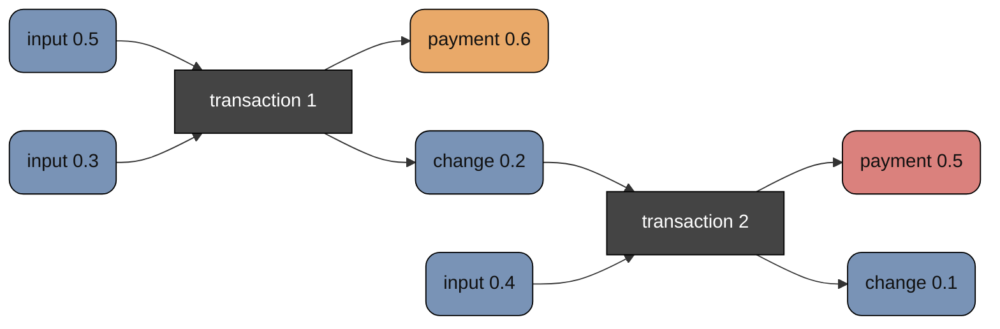
```mermaid
flowchart LR
  classDef ac fill:#7993b6,stroke:#000,color:#111,rx:12,ry:12
  classDef bc fill:#e9a969,stroke:#000,color:#111,rx:12,ry:12
  classDef cc fill:#da817d,stroke:#000,color:#111,rx:12,ry:12
  classDef txn fill:#444,stroke:#000,color:#fff
  a1("input 0.5"):::ac --> tx1["transaction 1"]:::txn
  a2("input 0.3"):::ac --> tx1
  tx1 --> pay1("payment 0.6"):::bc
  tx1 --> chg1("change 0.2"):::ac
  chg1 --> tx2["transaction 2"]:::txn
  a3("input 0.4"):::ac --> tx2
  tx2 --> pay2("payment 0.5"):::cc
  tx2 --> chg2("change 0.1"):::ac
```

*CIOH links the inputs of each transaction, and change identification links the two transactions: All five blue coins merge into a single cluster.*

Practical clustering combines heuristics beyond CIOH to build a **wallet cluster**: a set of addresses and coins inferred to share one owner.[^reid-harrigan][^ron-shamir][^androulaki][^meiklejohn][^nick][^harrigan-fretter][^scroll-history]

## Collaborative transactions

A transaction that spends inputs owned by more than one user falsifies CIOH by construction. Starting with just two parties, the observable structure can have (at least) two forms.[^forms] The on-chain transaction must be compatible with the actual allocation of inputs, outputs, and payments among the participants, but it might not reveal that allocation in its entirety.

The first form is a batched transaction, or a CoinJoin: two independent and balanced sub-transactions aggregated into a single transaction.

Here, a **sub-transaction** means some, but not all, of a transaction's inputs and outputs attributed to one participant's action. A more precise, probabilistic notion will be discussed below.

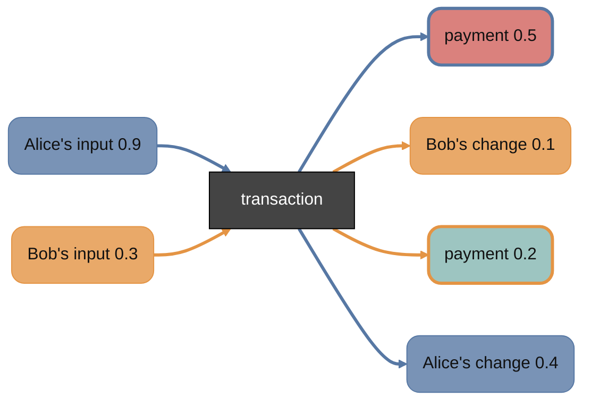
```mermaid
flowchart LR
  classDef ac fill:#7993b6,stroke:#5778a4,color:#111,rx:12,ry:12
  classDef bc fill:#e9a969,stroke:#e49444,color:#111,rx:12,ry:12
  classDef payA fill:#da817d,stroke:#5778a4,stroke-width:3px,color:#111,rx:12,ry:12
  classDef payB fill:#9dc5c1,stroke:#e49444,stroke-width:3px,color:#111,rx:12,ry:12
  classDef txn fill:#444,stroke:#000,color:#fff
  ai("Alice's input 0.9"):::ac --> tx["transaction"]:::txn
  bi("Bob's input 0.3"):::bc --> tx
  tx --> pa("payment 0.5"):::payA
  tx --> cb("Bob's change 0.1"):::bc
  tx --> pb("payment 0.2"):::payB
  tx --> ca("Alice's change 0.4"):::ac
  linkStyle 0,2,5 stroke:#5778a4,stroke-width:3px
  linkStyle 1,3,4 stroke:#e49444,stroke-width:3px
```

*A batch: two independent spends aggregated, SharedCoin style. Each sub-transaction balances on its own (0.9 = 0.5 + 0.4 and 0.3 = 0.2 + 0.1).*

In the example above, although CIOH is falsified, the amounts strongly suggest one way of partitioning the transaction, and CIOH still applies within each sub-transaction separately. We'll return to this form in later sections.

## Two-party PayJoin

The other main form a two-party transaction can take is a PayJoin.[^p2ep][^bip79][^bip78][^bip77] Unlike the independent, balanced sub-transactions in the preceding example, the sender's sub-transaction has a surplus that covers the receiver's deficit. This imbalance between the two sub-transactions is the payment.

The following illustrates a single payment from Alice to Bob, but Bob also contributes one of his own inputs alongside Alice's:

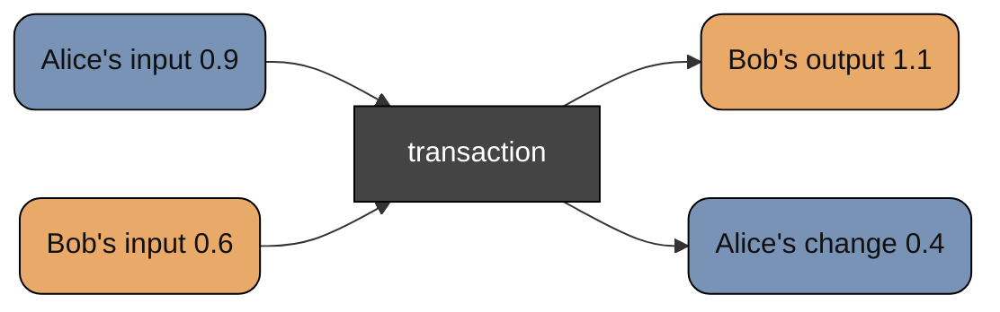
```mermaid
flowchart LR
  classDef alice fill:#7993b6,stroke:#000,color:#111,rx:12,ry:12
  classDef bob fill:#e9a969,stroke:#000,color:#111,rx:12,ry:12
  classDef txn fill:#444,stroke:#000,color:#fff
  ai("Alice's input 0.9"):::alice
  bi("Bob's input 0.6"):::bob
  tx["transaction"]:::txn
  pay("Bob's output 1.1"):::bob
  chg("Alice's change 0.4"):::alice
  ai --> tx
  bi --> tx
  tx --> pay
  tx --> chg
```

*Here, Alice pays Bob 0.5: Bob's 0.6 input grows into a 1.1 output. The payment amount appears nowhere on-chain, and the ownership coloring is of course not part of the on-chain data either.*

For privacy, a somewhat teleological but more general definition of PayJoin is a collaborative transaction that should be **indistinguishable from an ordinary single-party transaction**. The **unnecessary-input heuristics** flag an input when the remaining inputs could already fund the outputs and fees; such an input may reveal that another participant contributed it.[^uih-adamisz][^uih-ghesmati] If collaborative transactions were sufficiently common, naive application of CIOH would quickly lead to cluster collapse, forcing a more nuanced approach to clustering.

CIOH, seeing two inputs, would wrongly attribute them to a single owner. There's no single unambiguous interpretation: Looking at a transaction like the example in isolation, an analyst cannot be sure which inputs are Alice's, which output is the real payment, or even that a PayJoin occurred at all rather than an ordinary two-input spend.

With only two parties, there are only a few interpretations, namely the different ways of assigning inputs and outputs to sub-transactions attributed to Alice and Bob separately. The typical uncertainty is therefore on the order of a few bits to an external observer, even when looking only at the transaction in isolation and ignoring its context.[^payjoin-entropy] The next few sections discuss extensions to two-party PayJoin, but bear in mind that as they're more difficult to analyze, the same concerns apply even more to the two-party case.

More generally, a two-party PayJoin inherently cannot provide privacy from the counterparty. Each participant can eliminate their own inputs and outputs from consideration, which entails that everything else is attributable to the only other party. Privacy within a transaction requires three or more parties.

## Many senders, one receiver (NS1R)

A natural generalization is from one sender to many.[^ns1r] Several senders each contribute inputs to a single transaction that pays one common receiver, so it resembles an ordinary batched payout the receiver might have made by consolidating funds:

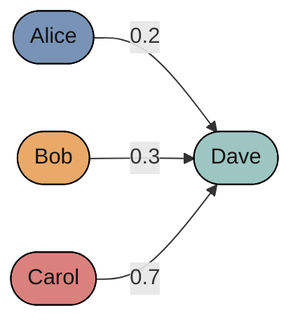
```mermaid
flowchart LR
  classDef s1c fill:#7993b6,stroke:#000,color:#111
  classDef s2c fill:#e9a969,stroke:#000,color:#111
  classDef s3c fill:#da817d,stroke:#000,color:#111
  classDef rc fill:#9dc5c1,stroke:#000,color:#111
  ls1(["Alice"]):::s1c -- "0.2" --> lr(["Dave"]):::rc
  ls2(["Bob"]):::s2c -- "0.3" --> lr
  ls3(["Carol"]):::s3c -- "0.7" --> lr
```

*The payment graph, which isn't observable on-chain.*

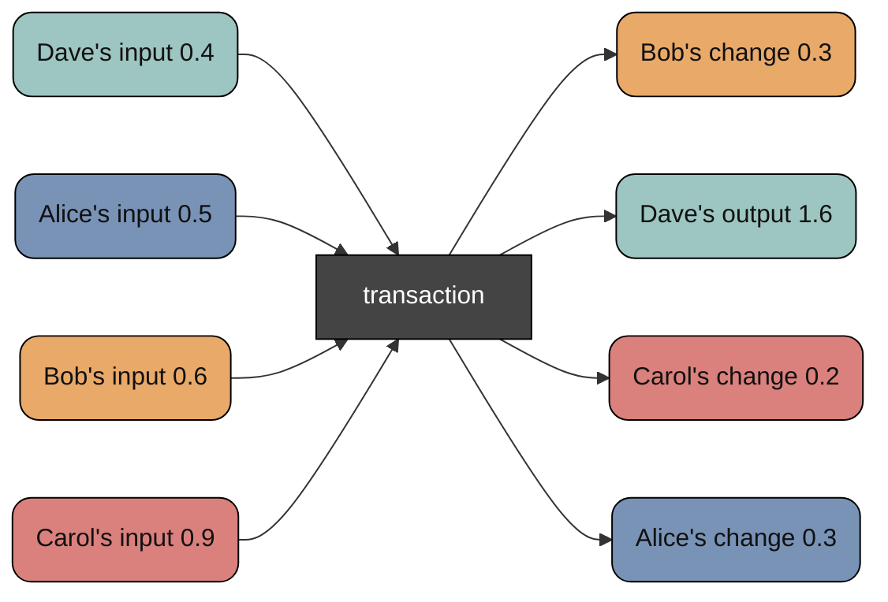
```mermaid
flowchart LR
  classDef s1c fill:#7993b6,stroke:#000,color:#111,rx:12,ry:12
  classDef s2c fill:#e9a969,stroke:#000,color:#111,rx:12,ry:12
  classDef s3c fill:#da817d,stroke:#000,color:#111,rx:12,ry:12
  classDef rc fill:#9dc5c1,stroke:#000,color:#111,rx:12,ry:12
  classDef txn fill:#444,stroke:#000,color:#fff
  r1("Dave's input 0.4"):::rc
  s1("Alice's input 0.5"):::s1c
  s2("Bob's input 0.6"):::s2c
  s3("Carol's input 0.9"):::s3c
  tx["transaction"]:::txn
  pay("Dave's output 1.6"):::rc
  c1("Alice's change 0.3"):::s1c
  c2("Bob's change 0.3"):::s2c
  c3("Carol's change 0.2"):::s3c
  r1 --> tx
  s1 --> tx
  s2 --> tx
  s3 --> tx
  tx --> c2
  tx --> pay
  tx --> c3
  tx --> c1
```

*Alice, Bob and Carol pay 0.2, 0.3 and 0.7 respectively; Dave consolidates the payments with a 0.4 input of his own. None of the payment amounts appear on-chain.*

This allows more payments to be consolidated into a single receiver output, so it's cheaper than paying separately.

Counterparty privacy depends on how the transaction is constructed. In the experimental NS1R implementation,[^ns1r] each sender supplied a pre-signed transaction to the receiver, revealing which inputs and change outputs belonged to that sender. If transaction construction conceals attribution, the receiver can still use its knowledge of each sender's payment amount to test possible input and change-output assignments. This can narrow the possibilities, and may identify a sender's change output, but does not by itself guarantee a unique assignment.

This structure can't really hide much more than that: The change outputs will likely still link, and as the number of senders grows, the receiver must consolidate more aggressively to leverage the savings — which is itself a detectable fingerprint. Avoiding it means foregoing the fee savings and splitting the received funds into several outputs of a smaller magnitude to better match the distribution of the change outputs. Splitting the receiver's funds creates another hazard: Later spending those sibling outputs together, even in a multiparty transaction, is wasteful and potentially more indicative of common ownership than spending non-sibling outputs together. Two independent users participating in one transaction and then independently spending their respective outputs in the same subsequent transaction would arguably require more coincidences.[^siblings]

## Many senders, many receivers (NSNR)

The two sides can instead be made symmetric. Let $n = 2m$ be the number of participants, half spending and half receiving. The transaction consists of $m$ payments between the $n$ sub-transactions, pairing sub-transactions uniquely.

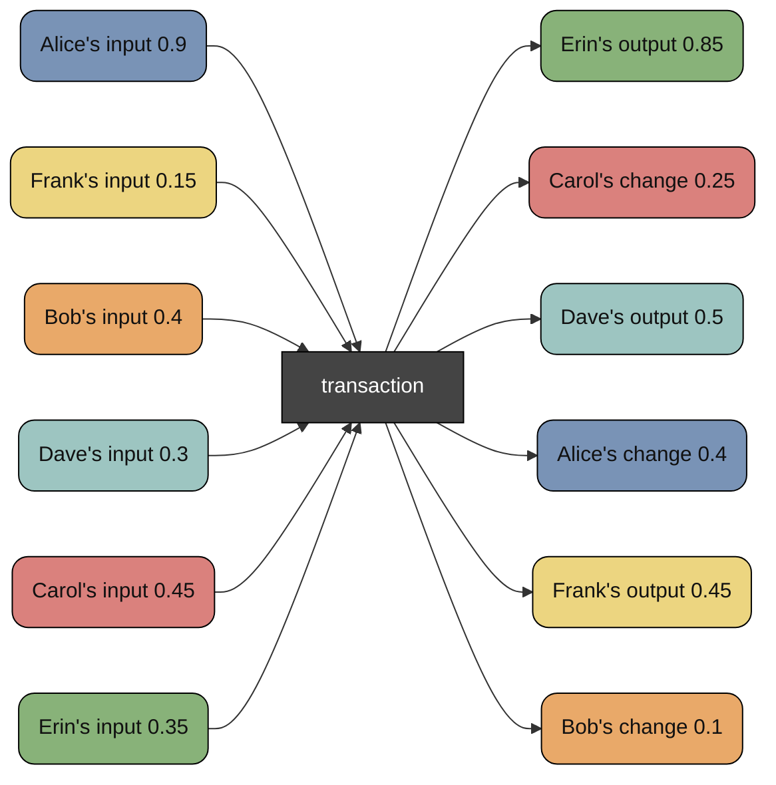
```mermaid
flowchart LR
  classDef s1c fill:#7993b6,stroke:#000,color:#111,rx:12,ry:12
  classDef s2c fill:#e9a969,stroke:#000,color:#111,rx:12,ry:12
  classDef s3c fill:#da817d,stroke:#000,color:#111,rx:12,ry:12
  classDef r1c fill:#9dc5c1,stroke:#000,color:#111,rx:12,ry:12
  classDef r2c fill:#88b279,stroke:#000,color:#111,rx:12,ry:12
  classDef r3c fill:#ecd580,stroke:#000,color:#111,rx:12,ry:12
  classDef txn fill:#444,stroke:#000,color:#fff
  s1("Alice's input 0.9"):::s1c --> tx["transaction"]:::txn
  r3("Frank's input 0.15"):::r3c --> tx
  s2("Bob's input 0.4"):::s2c --> tx
  r1("Dave's input 0.3"):::r1c --> tx
  s3("Carol's input 0.45"):::s3c --> tx
  r2("Erin's input 0.35"):::r2c --> tx
  tx --> p2("Erin's output 0.85"):::r2c
  tx --> c3("Carol's change 0.25"):::s3c
  tx --> p1("Dave's output 0.5"):::r1c
  tx --> c1("Alice's change 0.4"):::s1c
  tx --> p3("Frank's output 0.45"):::r3c
  tx --> c2("Bob's change 0.1"):::s2c
```

*A multiparty PayJoin transaction with three payments between six participants, with one input and one output per party.*

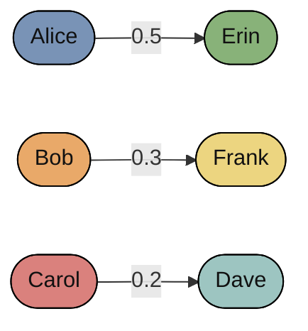
```mermaid
flowchart LR
  classDef s1c fill:#7993b6,stroke:#000,color:#111
  classDef s2c fill:#e9a969,stroke:#000,color:#111
  classDef s3c fill:#da817d,stroke:#000,color:#111
  classDef r1c fill:#9dc5c1,stroke:#000,color:#111
  classDef r2c fill:#88b279,stroke:#000,color:#111
  classDef r3c fill:#ecd580,stroke:#000,color:#111
  ls1(["Alice"]):::s1c -- "0.5" --> lr2(["Erin"]):::r2c
  ls2(["Bob"]):::s2c -- "0.3" --> lr3(["Frank"]):::r3c
  ls3(["Carol"]):::s3c -- "0.2" --> lr1(["Dave"]):::r1c
```

*The underlying payment graph, which isn't observable on-chain.*

A different interpretation of the same transaction might swap the candidate ownership of Alice's 0.4 change and Erin's 0.85 output:

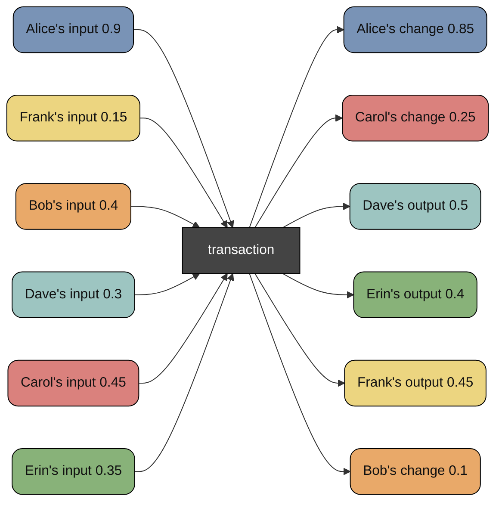
```mermaid
flowchart LR
  classDef s1c fill:#7993b6,stroke:#000,color:#111,rx:12,ry:12
  classDef s2c fill:#e9a969,stroke:#000,color:#111,rx:12,ry:12
  classDef s3c fill:#da817d,stroke:#000,color:#111,rx:12,ry:12
  classDef r1c fill:#9dc5c1,stroke:#000,color:#111,rx:12,ry:12
  classDef r2c fill:#88b279,stroke:#000,color:#111,rx:12,ry:12
  classDef r3c fill:#ecd580,stroke:#000,color:#111,rx:12,ry:12
  classDef txn fill:#444,stroke:#000,color:#fff
  s1("Alice's input 0.9"):::s1c --> tx["transaction"]:::txn
  r3("Frank's input 0.15"):::r3c --> tx
  s2("Bob's input 0.4"):::s2c --> tx
  r1("Dave's input 0.3"):::r1c --> tx
  s3("Carol's input 0.45"):::s3c --> tx
  r2("Erin's input 0.35"):::r2c --> tx
  tx --> c1("Alice's change 0.85"):::s1c
  tx --> c3("Carol's change 0.25"):::s3c
  tx --> p1("Dave's output 0.5"):::r1c
  tx --> p2("Erin's output 0.4"):::r2c
  tx --> p3("Frank's output 0.45"):::r3c
  tx --> c2("Bob's change 0.1"):::s2c
```

*Under this alternative assignment, Alice's 0.9 input leaves 0.85 in change, implying a payment of only 0.05 to Erin.*

Because each participant only participates in exactly one payment, each hidden sub-transaction is related to only *one payment of one amount*. The amounts therefore still carry information. In the example above, the alternative 0.05 payment may seem less plausible than the original 0.5 payment if its magnitude is atypical relative to prior on-chain payments and auxiliary context such as exchange rates, timing, fees, and wallet fingerprints. This is essentially the same logic as the unnecessary input heuristics.[^uih-adamisz][^uih-ghesmati] And if the adversary happens to know that Alice's cluster contains a smaller UTXO than the 0.9 one which still suffices for a payment of 0.05, that would be rather strong evidence in favor of the payment amount being 0.5.

## Net settlement with cycles

Net settlement is the most general form of multiparty PayJoin. Where NSNR fixed $\frac{n}{2}$ payments among $n$ participants, net settlement allows odd $n$ and up to $\frac{n(n-1)}{2}$ net payments to be aggregated: Any participant may pay any other.

Participants settle an arbitrary set of mutual obligations in a single transaction, including cycles (e.g. Alice pays Bob, Bob pays Carol, Carol pays Alice). A participant may both pay and receive payments in the same settlement. The number of participants $n$ is in general not observable from the transaction (though in some cases it can be statistically or directly inferred from its structure).

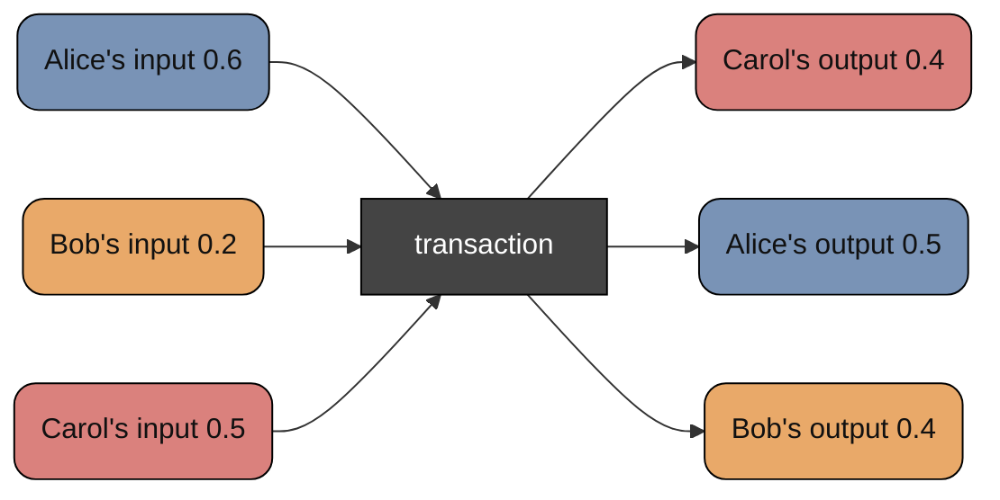
```mermaid
flowchart LR
  classDef ac fill:#7993b6,stroke:#000,color:#111,rx:12,ry:12
  classDef bc fill:#e9a969,stroke:#000,color:#111,rx:12,ry:12
  classDef cc fill:#da817d,stroke:#000,color:#111,rx:12,ry:12
  classDef txn fill:#444,stroke:#000,color:#fff
  ia("Alice's input 0.6"):::ac --> tx["transaction"]:::txn
  ib("Bob's input 0.2"):::bc --> tx
  ic("Carol's input 0.5"):::cc --> tx
  tx --> oc("Carol's output 0.4"):::cc
  tx --> oa("Alice's output 0.5"):::ac
  tx --> ob("Bob's output 0.4"):::bc
```

*A single settlement transaction. Only the net balances (Alice −0.1, Bob +0.2, Carol −0.1) are reflected on-chain; none of the obligation amounts appear anywhere.*

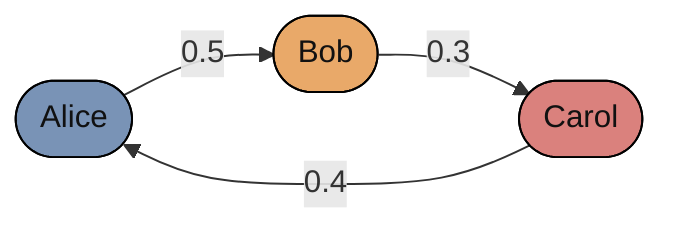
```mermaid
flowchart LR
  classDef ac fill:#7993b6,stroke:#000,color:#111
  classDef bc fill:#e9a969,stroke:#000,color:#111
  classDef cc fill:#da817d,stroke:#000,color:#111
  A(["Alice"]):::ac -- "0.5" --> B(["Bob"]):::bc
  B -- "0.3" --> C(["Carol"]):::cc
  C -- "0.4" --> A
```

*Three mutual obligations, including a cycle.*

Once cycles are allowed, a participant's *implied* payment balance is no longer a single, plausible magnitude amount but a signed sum of what they sent and received, which can net to anything, including near zero. This removes the discriminating power that payment amounts had in the previous scenario: Once more than one payment per sub-transaction is possible, the net balance of a candidate sub-transaction is much more difficult to interpret.

Since net settlement is strictly more general, if it's supported in implementations, then *every* multiparty batch could in principle be a net settlement transaction, even if that's not actually the case. Conversely, if the only thing actually deployed is the restricted NSNR above, users are forced back into that weaker regime where amounts still leak. The strength of the defense depends on the general form being the norm, not the exception.

Unfortunately, this isn't enough for privacy, because the resulting graph still has community structure. The adversary doesn't see only a single transaction; it sees the transaction graph and some clustering of it (which may be based just on the graph structure, or be based on blockchain-external information too). A settlement among counterparties is a slice of an economic network, and economic networks aren't featureless: They have recurring relationships, and the behaviors can often follow predictable patterns.

### Sparse datasets

Deanonymization of networks with exactly this kind of structure is a well studied problem. In 2008, Narayanan and Shmatikov showed that real-world high dimensional datasets are typically sparse — most records have no close neighbors in the feature space — and this sparseness makes deanonymization feasible with only a little auxiliary information, even when that information is noisy.[^ns-netflix][^ns-retro]

Any observable pattern in a cluster is potentially useful for such an analysis. These divide into *statistical* features (fee-rate habits, activity timing and time zone, value distributions) and *structural* features (the shape a cluster carves through the graph and its links to other clusters).

**Wallet software fingerprints** are a special case of the statistical kind: Signature grinding, fee-rate selection, script and address types, and `nSequence` and `nLockTime` conventions each vary from one wallet to the next. While some wallets randomize these, and specific entities may use more than one piece of software, fingerprint-based clustering — both more generally[^moser-narayanan][^kappos], and also specifically in the context of PayJoin[^sabouri] — has thus far proven to be extremely powerful.

In principle, this can be mitigated by the Sisyphean task of making all wallets behave the same, but this problem is pretty widespread, and while fixing it is a necessary precondition for clustering resistance, it isn't sufficient for addressing the concern, since wallet fingerprints aren't the only dimensions along which clusters can be compared for similarity.

### Social graphs

Turning to the structural features, in subsequent work,[^ns-social] the same authors showed that the vertices of two social graphs can be matched iteratively, starting from a relatively small seed matching, which matches some of the vertices of one graph with those of the other.

This builds on the sparseness exploited by the previous work. Here, a "dimension" can be thought of roughly as whether some target vertex is related to some other specific vertex. In a social graph, most nodes will be readily identifiable based on the identities of their neighbors. The actual result in the paper is significantly stronger, requiring only a seed of relatively few matched nodes to iteratively propagate the matching along the graphs. Later work by Narayanan et al. generalized this further to link prediction on incomplete graphs.[^ns-linkpred]

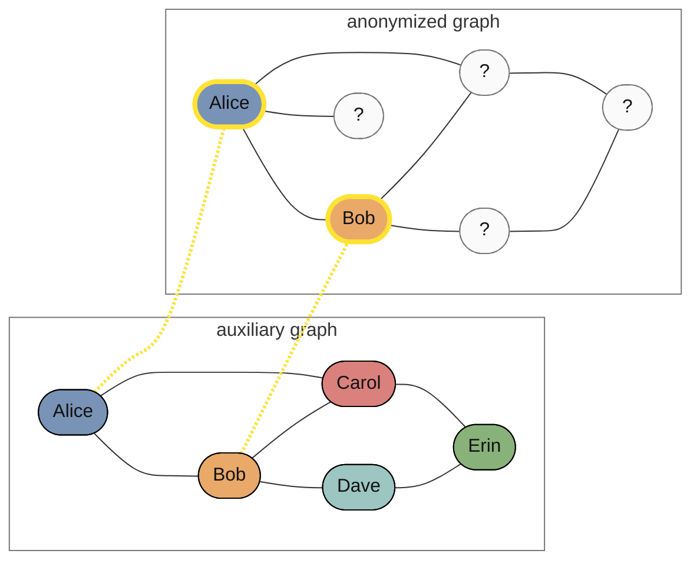
```mermaid
flowchart LR
  classDef ac fill:#7993b6,stroke:#000,color:#111
  classDef bc fill:#e9a969,stroke:#000,color:#111
  classDef cc fill:#da817d,stroke:#000,color:#111
  classDef dc fill:#9dc5c1,stroke:#000,color:#111
  classDef enc fill:#88b279,stroke:#000,color:#111
  classDef acs fill:#7993b6,stroke:#ffe234,stroke-width:4px,color:#111
  classDef bcs fill:#e9a969,stroke:#ffe234,stroke-width:4px,color:#111
  classDef amb fill:#fafafa,stroke:#777,stroke-dasharray:4 3,color:#111
  classDef ambs fill:#fafafa,stroke:#ffe234,stroke-width:4px,color:#111
  subgraph aux["auxiliary graph"]
    A(["Alice"]):::ac --- B(["Bob"]):::bc
    A --- C(["Carol"]):::cc
    B --- C
    B --- D(["Dave"]):::dc
    C --- E(["Erin"]):::enc
    D --- E
  end
  subgraph anon["anonymized graph"]
    v1(["Alice"]):::acs --- v2(["Bob"]):::bcs
    v1 --- v3(["&nbsp;?&nbsp;"]):::amb
    v2 --- v3
    v2 --- v4(["&nbsp;?&nbsp;"]):::amb
    v3 --- v5(["&nbsp;?&nbsp;"]):::amb
    v4 --- v5
    v1 --- v6(["&nbsp;?&nbsp;"]):::amb
  end
  A -.- v1
  B -.- v2
  style aux fill:none,stroke:#777
  style anon fill:none,stroke:#777
  linkStyle 13,14 stroke:#ffe234,stroke-width:3px
```

*The adversary holds two overlapping social graphs — one identified, one anonymized. The yellow correspondence edges mark the seed of confidently matched pairs, identifying their anonymous endpoints.*

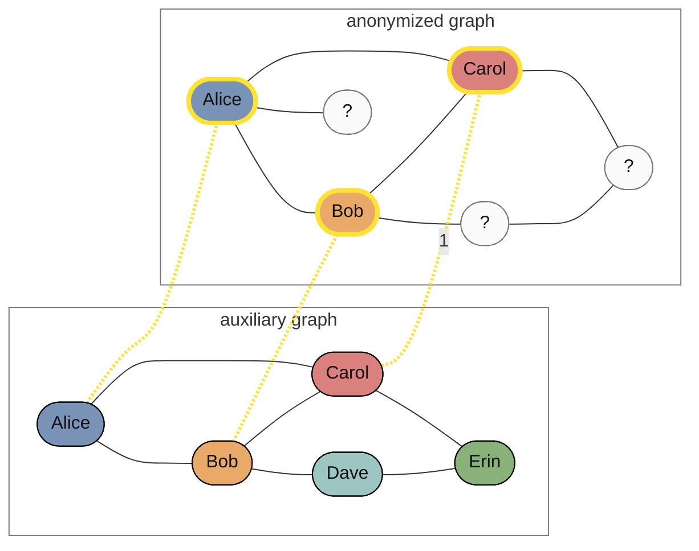
```mermaid
flowchart LR
  classDef ac fill:#7993b6,stroke:#000,color:#111
  classDef bc fill:#e9a969,stroke:#000,color:#111
  classDef cc fill:#da817d,stroke:#000,color:#111
  classDef dc fill:#9dc5c1,stroke:#000,color:#111
  classDef enc fill:#88b279,stroke:#000,color:#111
  classDef acs fill:#7993b6,stroke:#ffe234,stroke-width:4px,color:#111
  classDef bcs fill:#e9a969,stroke:#ffe234,stroke-width:4px,color:#111
  classDef ccs fill:#da817d,stroke:#ffe234,stroke-width:4px,color:#111
  classDef amb fill:#fafafa,stroke:#777,stroke-dasharray:4 3,color:#111
  classDef ambs fill:#fafafa,stroke:#ffe234,stroke-width:4px,color:#111
  subgraph aux["auxiliary graph"]
    A(["Alice"]):::ac --- B(["Bob"]):::bc
    A --- C(["Carol"]):::cc
    B --- C
    B --- D(["Dave"]):::dc
    C --- E(["Erin"]):::enc
    D --- E
  end
  subgraph anon["anonymized graph"]
    v1(["Alice"]):::acs --- v2(["Bob"]):::bcs
    v1 --- v3(["Carol"]):::ccs
    v2 --- v3
    v2 --- v4(["&nbsp;?&nbsp;"]):::amb
    v3 --- v5(["&nbsp;?&nbsp;"]):::amb
    v4 --- v5
    v1 --- v6(["&nbsp;?&nbsp;"]):::amb
  end
  A -.- v1
  B -.- v2
  C -. "1" .- v3
  style aux fill:none,stroke:#777
  style anon fill:none,stroke:#777
  linkStyle 13,14,15 stroke:#ffe234,stroke-width:3px
```

*The only unidentified vertex adjacent to both seeds must be Carol's, so it's matched first.*

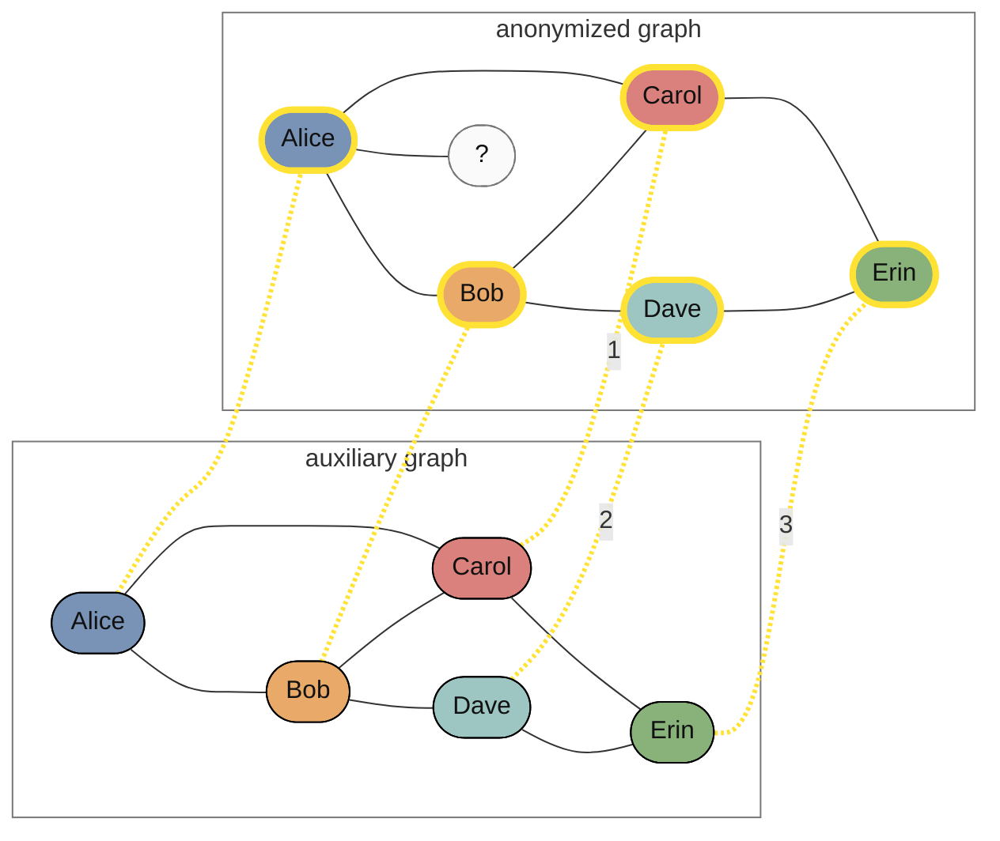
```mermaid
flowchart LR
  classDef ac fill:#7993b6,stroke:#000,color:#111
  classDef bc fill:#e9a969,stroke:#000,color:#111
  classDef cc fill:#da817d,stroke:#000,color:#111
  classDef dc fill:#9dc5c1,stroke:#000,color:#111
  classDef enc fill:#88b279,stroke:#000,color:#111
  classDef acs fill:#7993b6,stroke:#ffe234,stroke-width:4px,color:#111
  classDef bcs fill:#e9a969,stroke:#ffe234,stroke-width:4px,color:#111
  classDef ccs fill:#da817d,stroke:#ffe234,stroke-width:4px,color:#111
  classDef dcs fill:#9dc5c1,stroke:#ffe234,stroke-width:4px,color:#111
  classDef encs fill:#88b279,stroke:#ffe234,stroke-width:4px,color:#111
  classDef amb fill:#fafafa,stroke:#777,stroke-dasharray:4 3,color:#111
  classDef ambs fill:#fafafa,stroke:#ffe234,stroke-width:4px,color:#111
  subgraph aux["auxiliary graph"]
    A(["Alice"]):::ac --- B(["Bob"]):::bc
    A --- C(["Carol"]):::cc
    B --- C
    B --- D(["Dave"]):::dc
    C --- E(["Erin"]):::enc
    D --- E
  end
  subgraph anon["anonymized graph"]
    v1(["Alice"]):::acs --- v2(["Bob"]):::bcs
    v1 --- v3(["Carol"]):::ccs
    v2 --- v3
    v2 --- v4(["Dave"]):::dcs
    v3 --- v5(["Erin"]):::encs
    v4 --- v5
    v1 --- v6(["&nbsp;?&nbsp;"]):::amb
  end
  A -.- v1
  B -.- v2
  C -. "1" .- v3
  D -. "2" .- v4
  E -. "3" .- v5
  style aux fill:none,stroke:#777
  style anon fill:none,stroke:#777
  linkStyle 13,14,15,16,17 stroke:#ffe234,stroke-width:3px
```

*Each match extends the frontier: Dave's vertex is the remaining neighbor of Bob's, and Erin's is the remaining neighbor of Carol's. The graphs don't need to agree exactly — the vertex with no counterpart in the auxiliary graph simply remains unmatched.*

Suppose the adversary starts with an incomplete clustering of Bitcoin transaction outputs. While the clusters do link together some outputs, because it's incomplete, there may be several clusters per actual user. So long as the adversary still hasn't collected enough evidence to conclude that several clusters belong to the same user, that user still enjoys pseudonymity.

This adversary doesn't just apply CIOH blindly. When it's first observed, a transaction suspected to be a PayJoin, for example, will have four or more related clusters. Each entity will be represented by at least one input-side cluster and at least one output-side cluster. Naive CIOH would compel merging of all of the input clusters, and change identification may additionally link it to one of the outputs. Subsequent transactions will in turn link to those. The ensuing cluster collapse will of course be avoided by any competent adversary.

Starting with the transaction graph, where coins are vertices, let clusters be represented by undirected edges connecting the linked coins. By edge contraction on these edges, a graph minor analogue[^minor-nitpick] can be obtained from a given clustering, where all of the coins of a particular cluster are fused into just one vertex representing the cluster itself. The residual edges of this multigraph correspond to transfers of Bitcoin between clusters, so those relationships remain available for analysis.

Reid and Harrigan's paper[^reid-harrigan], in its discussion of clustering, introduced the notion of a user network, where vertices are users and edges represent the flows of Bitcoin between them. If the clustering is complete, and each user can be identified with just one node on the contracted graph, that is the user network. Otherwise, when the clustering is incomplete, this cluster graph is better thought of as a pseudonym graph rather than a user network. This is a social network per Shmatikov and Narayanan's definition.[^multigraph-nitpick] The statistical feature distributions of clusters reduce to attributes on the vertices, and both those and the structural features can inform the edge attributes used in their algorithm.

Narayanan and Shmatikov's propagation algorithm starts with two graph views and a seed correspondence between some of their vertices. Contracting the entire coin graph gives us only one view. To obtain several, we could first partition the cluster-annotated coin graph, for example into epochs, and then contract each subgraph separately. Each resulting graph minor analogue would then present a view of the pseudonym graph over a different period.

Existing clustering supplies the seed correspondence. If a coin in one epoch is already linked to a coin in another, their cluster vertices form a seed pair. Address reuse, heuristics applied to boundary transactions, or auxiliary information can supply such links.

The more active a user is, the more data they expose. Consistent economic relationships can also make their neighborhood recognizable across epochs. Where the views preserve enough of this structure and the adversary has suitable seeds, Shmatikov and Narayanan's graph matching algorithm can propagate clustering information beyond local heuristics.

A proliferation of pseudonyms may limit any one run of the propagation algorithm, but high-confidence matches can still inform other clustering heuristics. Epochs are also only one way to partition the coin graph.

Another approach would place the boundaries at high-ambiguity regions, where many clusters seemingly connect to many others, as CoinJoins tend to produce. Excluding those densely connected regions can leave components in which each cluster has relatively few neighbors. The adversary can then compare components from different partitions.

As a crude analogy, this is the “opposite” of expander decomposition: Instead of making sparse cuts that leave well-connected components, the adversary makes dense, high-ambiguity cuts that leave sparse components whose relationships are easier to match.

Some clustering must already have been produced by another technique for this to work, hence the starting assumption that the clustering is partial. It both supplies the annotations that make contraction possible in the first place and provides the seed correspondence from which graph matching can propagate.

So, even when net settlements call amount-based analysis into question, and the number of parties complicates things further, the nature of social networks and of the transaction graph is that over time, a lot of structure will inevitably be revealed. There's an expression that illustrates this; I think it goes something like "show [the adversary] who your friends are, and [the adversary] will [successfully deanonymize you]."

## Equal amount CoinJoin among arbitrary peers

Every construction so far required its participants to be doing business with one another: a payment, a batch of payments, a settlement of mutual obligations.

A CoinJoin doesn't have this limitation.[^maxwell] The participants of an equal amount CoinJoin transaction spend their inputs, with no payment passing between them, to produce outputs of the same amount and script type.

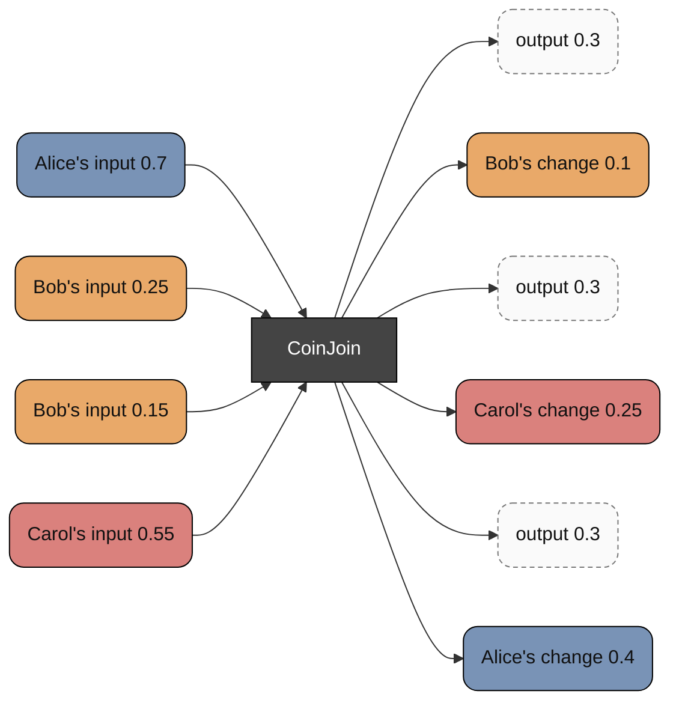
```mermaid
flowchart LR
  classDef ac fill:#7993b6,stroke:#000,color:#111,rx:12,ry:12
  classDef bc fill:#e9a969,stroke:#000,color:#111,rx:12,ry:12
  classDef cc fill:#da817d,stroke:#000,color:#111,rx:12,ry:12
  classDef txn fill:#444,stroke:#000,color:#fff
  classDef amb fill:#fafafa,stroke:#777,stroke-dasharray:4 3,color:#111,rx:12,ry:12
  a1("Alice's input 0.7"):::ac --> cj["CoinJoin"]:::txn
  b1("Bob's input 0.25"):::bc --> cj
  b2("Bob's input 0.15"):::bc --> cj
  c1("Carol's input 0.55"):::cc --> cj
  cj --> e1("output 0.3"):::amb
  cj --> cb("Bob's change 0.1"):::bc
  cj --> e2("output 0.3"):::amb
  cj --> cc2("Carol's change 0.25"):::cc
  cj --> e3("output 0.3"):::amb
  cj --> ca("Alice's change 0.4"):::ac
```

*The equal outputs are interchangeable, but the change outputs remain linked to the inputs by their amounts, and Bob's two inputs are linked to each other by the consolidation forced by a minimum denomination requirement.*

Because no payments are made, the peers don't need to have any economic relationship to each other. This means they can be chosen randomly from a broader population rather than from one's counterparties. While it may seem that this already confounds social-graph analysis, this type of CoinJoin is readily identifiable. A cautious adversary can decline to apply CIOH within it, leaving additional cluster pseudonyms, while still matching the implied user graphs on either side.[^ns-social] Observable flows between apparent clusters elsewhere in the graph can still expose recurring economic relationships and therefore community structure.

What it can do is introduce uncertainty about the origins of a coin, limiting the ability to perform input-side clustering for any subsequent transactions as well. This slows the rate at which certainty can be gained about clustering structures, but it isn't a comprehensive or robust defense, and over time, such structures will generally be revealed.[^danezis][^troncoso]

Unfortunately, linking inputs to one another is practically inherent in the equal-amount approach.[^tx0] Users generally cannot choose incoming payment amounts or outgoing-payment change to match a CoinJoin denomination, so reaching that denomination often requires combining inputs and almost always produces change. This change is also relatively easy to link to the input clusters, as discussed in the next section.

Turning to the equal amount outputs, their order is presumed to be meaningless, so as long as they're unspent, they're interchangeable. But this doesn't last indefinitely. Any spending transactions of these outputs will reveal more information about an output's ownership through its timing, fingerprints, and other information that can be incorporated into the adversary's clustering model.

Furthermore, even though such a transaction only spends a single output, any change left from the payment will, in general, not be of a specific denomination either. To avoid harming the privacy of the payment transaction, this change shouldn't be linkable to the spender's other on-chain activity, but even if spent into a CoinJoin, the equal amount approach necessitates consolidating multiple such coins together, which potentially links many "anonymous" transactions to each other, and to subsequent transactions via the change from the CoinJoin.

For example, suppose Alice obtains two seemingly anonymous coins from two independent CoinJoins of the same denomination and spends each in its own payment:

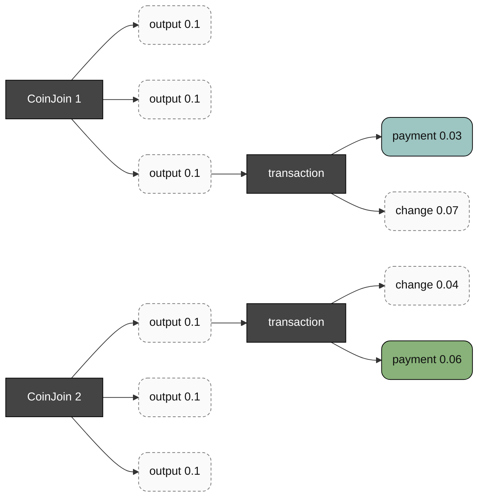
```mermaid
flowchart LR
  classDef rc fill:#9dc5c1,stroke:#000,color:#111,rx:12,ry:12
  classDef r2c fill:#88b279,stroke:#000,color:#111,rx:12,ry:12
  classDef txn fill:#444,stroke:#000,color:#fff
  classDef amb fill:#fafafa,stroke:#777,stroke-dasharray:4 3,color:#111,rx:12,ry:12
  cj1["CoinJoin 1"]:::txn
  cj1 --> m2("output 0.1"):::amb
  cj1 --> m3("output 0.1"):::amb
  cj1 --> m1("output 0.1"):::amb
  cj2["CoinJoin 2"]:::txn
  cj2 --> n1("output 0.1"):::amb
  cj2 --> n2("output 0.1"):::amb
  cj2 --> n3("output 0.1"):::amb
  m1 --> tx1["transaction"]:::txn
  tx1 --> p1("payment 0.03"):::rc
  tx1 --> g1("change 0.07"):::amb
  n1 --> tx2["transaction"]:::txn
  tx2 --> g2("change 0.04"):::amb
  tx2 --> p2("payment 0.06"):::r2c
```

*Two mixed coins spent independently: Each payment is ambiguous, and nothing links the payments to the same user.*

Later, wanting to CoinJoin again, she consolidates the two leftover change outputs:

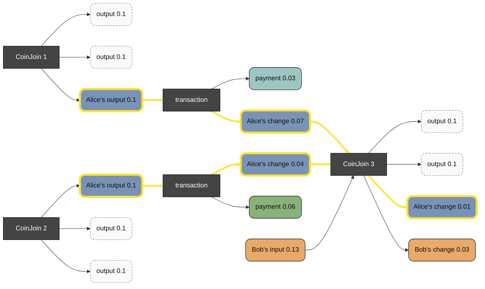
```mermaid
flowchart LR
  classDef ac fill:#7993b6,stroke:#000,color:#111,rx:12,ry:12
  classDef bc fill:#e9a969,stroke:#000,color:#111,rx:12,ry:12
  classDef rc fill:#9dc5c1,stroke:#000,color:#111,rx:12,ry:12
  classDef r2c fill:#88b279,stroke:#000,color:#111,rx:12,ry:12
  classDef txn fill:#444,stroke:#000,color:#fff
  classDef amb fill:#fafafa,stroke:#777,stroke-dasharray:4 3,color:#111,rx:12,ry:12
  classDef acg fill:#7993b6,stroke:#ffe234,stroke-width:5px,color:#111,rx:12,ry:12
  cj1["CoinJoin 1"]:::txn
  cj1 --> m2("output 0.1"):::amb
  cj1 --> m3("output 0.1"):::amb
  cj1 --> m1("Alice's output 0.1"):::acg
  cj2["CoinJoin 2"]:::txn
  cj2 --> n1("Alice's output 0.1"):::acg
  cj2 --> n2("output 0.1"):::amb
  cj2 --> n3("output 0.1"):::amb
  m1 --> tx1["transaction"]:::txn
  tx1 --> p1("payment 0.03"):::rc
  tx1 --> g1("Alice's change 0.07"):::acg
  n1 --> tx2["transaction"]:::txn
  tx2 --> g2("Alice's change 0.04"):::acg
  tx2 --> p2("payment 0.06"):::r2c
  g1 --> cj3["CoinJoin 3"]:::txn
  g2 --> cj3
  b1("Bob's input 0.13"):::bc --> cj3
  cj3 --> q1("output 0.1"):::amb
  cj3 --> q2("output 0.1"):::amb
  cj3 --> q3("Alice's change 0.01"):::acg
  cj3 --> q4("Bob's change 0.03"):::bc
  linkStyle 6,8,9,10,12,13,17 stroke:#ffe234,stroke-width:4px
```

*The consolidating CoinJoin links the two change outputs, which links the two payments and retroactively identifies Alice's outputs in both of the original CoinJoins.*

In other words, attempting to CoinJoin to recover the change and make it usable for private payments not only fails to achieve that goal, but also undoes the privacy of the previous transactions.

## Arbitrary amount CoinJoin

So strict adherence to the equal amount approach leaks information about linkage after the fact. Naive batching, which we glossed over, does too, even without considering the wider context of the graph.[^sudoku]

The Boltzmann link probability matrix[^boltzmann] and Maurer et al.'s sub-transaction model[^maurer] are two similar models. They employ a combinatorial approach: Count all the ways the transaction could be partitioned, grouping together subsets of the inputs and outputs into sub-transactions, which are assumed to be the actions of a single party in a multiparty transaction.

What exactly makes a partition a valid sub-transaction mapping is whether or not the sub-transaction is deemed plausible. In Maurer et al., the values of the inputs and the outputs must exactly cancel out, which isn't sufficiently general for real-world analyses. Boltzmann casts a wider net by allowing these to vary somewhat, accounting for fees (including JoinMarket maker fees).

A large number of possible partitions does not by itself imply much privacy: Most of the probability may be concentrated on just a few of them. Entropy quantifies the uncertainty in this distribution, measured in bits.[^diaz][^serjantov-danezis][^syverson][^scroll-intersection]

When a sub-transaction mapping is underdetermined, more than one assignment of inputs and outputs to separate sub-transactions remains possible. If several assignments have comparable probabilities, the adversary needs further information to distinguish them. The entropy of the distribution implies a lower bound on how much additional information is required. Output values can be deliberately chosen to create many possible assignments.[^radix]

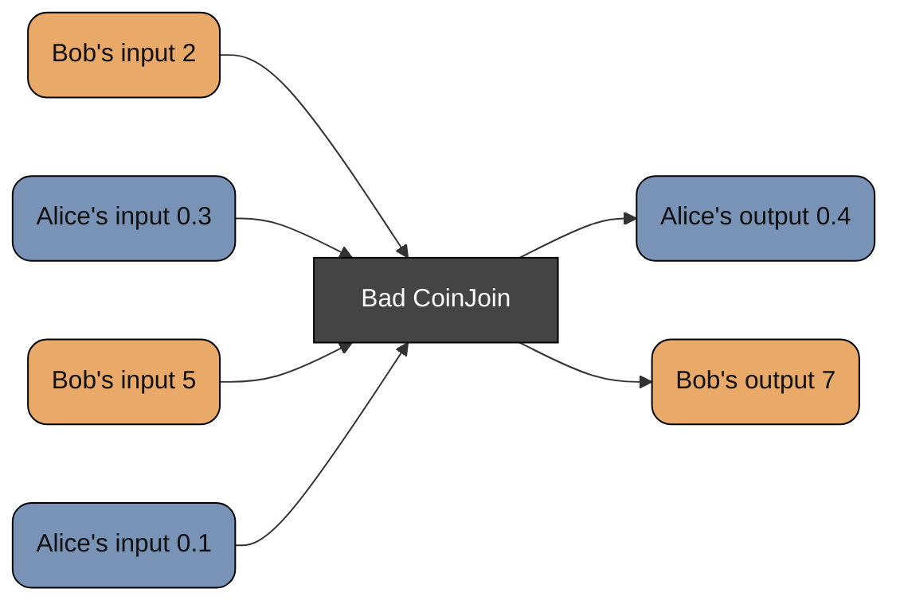
```mermaid
flowchart LR
  classDef ac fill:#7993b6,stroke:#000,color:#111,rx:12,ry:12
  classDef bc fill:#e9a969,stroke:#000,color:#111,rx:12,ry:12
  classDef txn fill:#444,stroke:#000,color:#fff
  b1("Bob's input 2"):::bc --> cj["Bad CoinJoin"]:::txn
  a1("Alice's input 0.3"):::ac --> cj
  b2("Bob's input 5"):::bc --> cj
  a2("Alice's input 0.1"):::ac --> cj
  cj --> o1("Alice's output 0.4"):::ac
  cj --> o2("Bob's output 7"):::bc
```

*Carelessly chosen values are no better than a naive batch: The only sub-transaction mapping consistent with the amounts is 0.1 + 0.3 = 0.4 and 2 + 5 = 7, so a subset sum analysis fully partitions the transaction.*

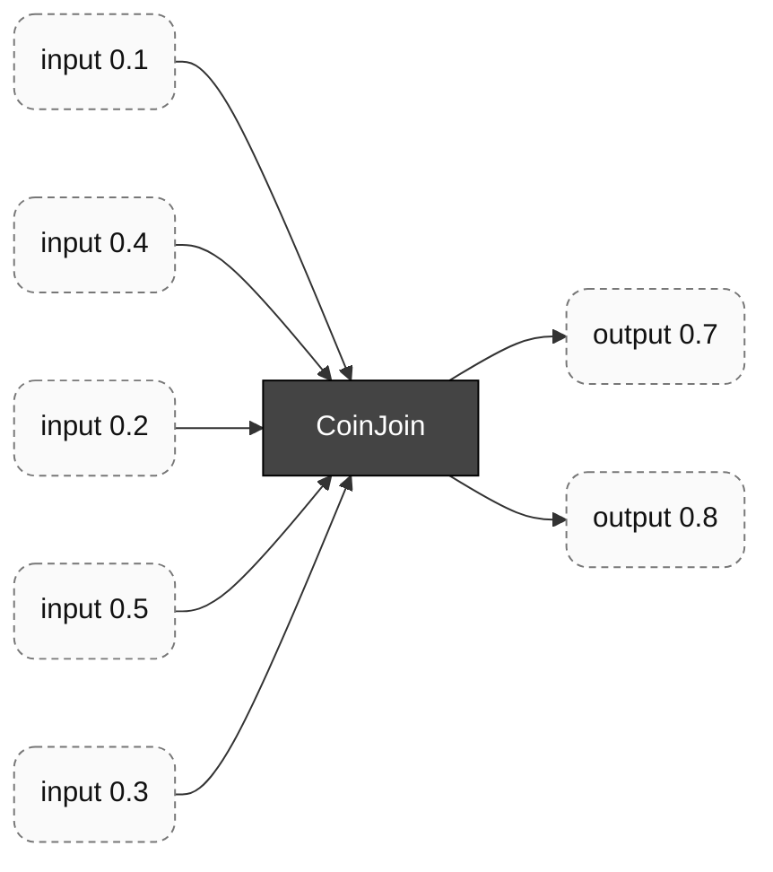
```mermaid
flowchart LR
  classDef txn fill:#444,stroke:#000,color:#fff
  classDef amb fill:#fafafa,stroke:#777,stroke-dasharray:4 3,color:#111,rx:12,ry:12
  b1("input 0.1"):::amb --> cj["CoinJoin"]:::txn
  a2("input 0.4"):::amb --> cj
  b2("input 0.2"):::amb --> cj
  b3("input 0.5"):::amb --> cj
  a1("input 0.3"):::amb --> cj
  cj --> o1("output 0.7"):::amb
  cj --> o2("output 0.8"):::amb
```

*With values chosen to be underdetermined, three distinct mappings balance: The 0.7 output can be funded by 0.3 + 0.4, by 0.2 + 0.5, or by 0.1 + 0.2 + 0.4, with the remaining inputs funding the 0.8 output. Across these readings — and the single-owner one — no input is linked to either output.*

Alternatively, the assumption that each participant's sub-transaction is balanced (allowing for fees), can be invalidated. As discussed above, net settlement allows one participant's surplus to cover another's deficit while the transaction as a whole still balances. There's no technical reason why economically related users couldn't settle within a protocol that also admits strangers to the same transaction. This will also conceal their business relationships better than a purely net settlement transaction structure.

The adversary can also incorporate statistical features, structural relationships in the surrounding graph, and auxiliary information into its sub-transaction analysis. These can change the plausibility of a mapping which only accounts for the amounts. Neither variant of the model, as originally described, incorporates these additional observables. For this reason, neither net settlement nor overtly ambiguous CoinJoins can offer a comprehensive solution to these problems.

## Taking provenance into account

Enumerating the possible points of origin of the funds of a particular coin is fairly intuitive based on the graph structure.[^kelen-seres] The entropy of the probability distribution of this candidate set can grow fairly quickly by CoinJoining, especially if an effort is made to diversify peer selection.

However, it can also decay rather quickly. Suppose the adversary successfully deanonymizes some auxiliary user. This can have two very different outcomes:

- The coins of that user are eliminated as linking candidates when attempting to deanonymize the target user. This is an additive decay of privacy.
- In addition, the eliminated coins form the boundary between regions of the transaction graph, fracturing it. This is a multiplicative decay of privacy, and the adversary can make progress at an exponential rate when this is the case.

An entropy estimate based on on-chain observations measures uncertainty under the information available to that particular observer. It cannot represent the uncertainty remaining for an adversary with additional information, nor how quickly that uncertainty could shrink.

For example, a chain analysis vendor with KYC information may already be able to separate regions of a graph that still appears highly ambiguous to an outside observer. Users therefore need a safety margin chosen for the auxiliary information their threat model allows the adversary to have.

## Robust connectivity

If the CoinJoin graph is *robustly connected*[^flow], then no small cut separates any output from the mass of its candidate origin coins. Stated differently, every output is connected to its candidate origins by multiple disjoint paths.

This redundancy forestalls the cliff of exponential decay, where privacy becomes much more brittle, extending the duration of the linear decay regime by requiring the adversary to deanonymize a much larger proportion of users before divide-and-conquer tactics start coming into play.

<svg viewBox="0 0 864 1120" width="864" height="1120" xmlns="http://www.w3.org/2000/svg" role="img" aria-label="Two CoinJoin graphs of thirty-two wallets under the same ten deanonymizations.">
<rect x="0" y="8" width="15" height="10" rx="3" fill="#4a6f9e"/>
<text class="ll" x="21" y="17">still a candidate</text>
<rect x="150" y="8" width="15" height="10" rx="3" fill="#d18f3e"/>
<text class="ll" x="171" y="17">struck off</text>
<rect class="o" x="258.5" y="8.5" width="14" height="9" rx="3"/>
<text class="ll" x="279" y="17">never a candidate</text>
<text class="lb" x="0" y="46">No small cut separates Alice's output from her candidate origins</text>
<text class="lq" x="0" y="64">32 → 31 → 30 → 29 → 28 → 27 → 26 → 25 → 24 → 23 → 22 candidate wallets<tspan class="lt">, one lost per strike, thirty-one in all to reach one</tspan></text>
<path class="wf" d="M107.8 301 L107.8 496"/>
<path class="wf" d="M110.0 301 L107.8 301"/>
<path class="wf" d="M107.8 301 L174.0 301"/>
<path class="wf" d="M110.0 466 L107.8 466"/>
<path class="wf" d="M107.8 466 L174.0 466"/>
<path class="wf" d="M110.0 481 L107.8 481"/>
<path class="wf" d="M107.8 481 L174.0 481"/>
<path class="wf" d="M110.0 496 L107.8 496"/>
<path class="wf" d="M107.8 496 L174.0 496"/>
<path class="wf" d="M117.6 121 L117.6 436"/>
<path class="wf" d="M110.0 121 L117.6 121"/>
<path class="wf" d="M117.6 121 L174.0 121"/>
<path class="wf" d="M110.0 346 L117.6 346"/>
<path class="wf" d="M117.6 346 L174.0 346"/>
<path class="wf" d="M110.0 406 L117.6 406"/>
<path class="wf" d="M117.6 406 L174.0 406"/>
<path class="wf" d="M110.0 436 L117.6 436"/>
<path class="wf" d="M117.6 436 L174.0 436"/>
<path class="wf" d="M127.3 166 L127.3 451"/>
<path class="wf" d="M110.0 166 L127.3 166"/>
<path class="wf" d="M127.3 166 L174.0 166"/>
<path class="wf" d="M110.0 211 L127.3 211"/>
<path class="wf" d="M127.3 211 L174.0 211"/>
<path class="wf" d="M110.0 271 L127.3 271"/>
<path class="wf" d="M127.3 271 L174.0 271"/>
<path class="wf" d="M110.0 451 L127.3 451"/>
<path class="wf" d="M127.3 451 L174.0 451"/>
<path class="wf" d="M137.1 181 L137.1 541"/>
<path class="wf" d="M110.0 181 L137.1 181"/>
<path class="wf" d="M137.1 181 L174.0 181"/>
<path class="wf" d="M110.0 256 L137.1 256"/>
<path class="wf" d="M137.1 256 L174.0 256"/>
<path class="wf" d="M110.0 376 L137.1 376"/>
<path class="wf" d="M137.1 376 L174.0 376"/>
<path class="wf" d="M110.0 541 L137.1 541"/>
<path class="wf" d="M137.1 541 L174.0 541"/>
<path class="wf" d="M146.9 91 L146.9 421"/>
<path class="wf" d="M110.0 91 L146.9 91"/>
<path class="wf" d="M146.9 91 L174.0 91"/>
<path class="wf" d="M110.0 106 L146.9 106"/>
<path class="wf" d="M146.9 106 L174.0 106"/>
<path class="wf" d="M110.0 331 L146.9 331"/>
<path class="wf" d="M146.9 331 L174.0 331"/>
<path class="wf" d="M110.0 421 L146.9 421"/>
<path class="wf" d="M146.9 421 L174.0 421"/>
<path class="wf" d="M156.7 226 L156.7 526"/>
<path class="wf" d="M110.0 226 L156.7 226"/>
<path class="wf" d="M156.7 226 L174.0 226"/>
<path class="wf" d="M110.0 286 L156.7 286"/>
<path class="wf" d="M156.7 286 L174.0 286"/>
<path class="wf" d="M110.0 316 L156.7 316"/>
<path class="wf" d="M156.7 316 L174.0 316"/>
<path class="wf" d="M110.0 526 L156.7 526"/>
<path class="wf" d="M156.7 526 L174.0 526"/>
<path class="wf" d="M166.4 76 L166.4 391"/>
<path class="wf" d="M110.0 76 L166.4 76"/>
<path class="wf" d="M166.4 76 L174.0 76"/>
<path class="wf" d="M110.0 136 L166.4 136"/>
<path class="wf" d="M166.4 136 L174.0 136"/>
<path class="wf" d="M110.0 151 L166.4 151"/>
<path class="wf" d="M166.4 151 L174.0 151"/>
<path class="wf" d="M110.0 391 L166.4 391"/>
<path class="wf" d="M166.4 391 L174.0 391"/>
<path class="wf" d="M176.2 196 L176.2 511"/>
<path class="wf" d="M110.0 196 L176.2 196"/>
<path class="wf" d="M176.2 196 L174.0 196"/>
<path class="wf" d="M110.0 241 L176.2 241"/>
<path class="wf" d="M176.2 241 L174.0 241"/>
<path class="wf" d="M110.0 361 L176.2 361"/>
<path class="wf" d="M176.2 361 L174.0 361"/>
<path class="wf" d="M110.0 511 L176.2 511"/>
<path class="wf" d="M176.2 511 L174.0 511"/>
<path class="wf" d="M195.8 136 L195.8 526"/>
<path class="wf" d="M198.0 136 L195.8 136"/>
<path class="wf" d="M195.8 136 L262.0 136"/>
<path class="wf" d="M198.0 241 L195.8 241"/>
<path class="wf" d="M195.8 241 L262.0 241"/>
<path class="wf" d="M198.0 331 L195.8 331"/>
<path class="wf" d="M195.8 331 L262.0 331"/>
<path class="wf" d="M198.0 526 L195.8 526"/>
<path class="wf" d="M195.8 526 L262.0 526"/>
<path class="wf" d="M205.6 121 L205.6 361"/>
<path class="wf" d="M198.0 121 L205.6 121"/>
<path class="wf" d="M205.6 121 L262.0 121"/>
<path class="wf" d="M198.0 151 L205.6 151"/>
<path class="wf" d="M205.6 151 L262.0 151"/>
<path class="wf" d="M198.0 346 L205.6 346"/>
<path class="wf" d="M205.6 346 L262.0 346"/>
<path class="wf" d="M198.0 361 L205.6 361"/>
<path class="wf" d="M205.6 361 L262.0 361"/>
<path class="wf" d="M215.3 376 L215.3 466"/>
<path class="wf" d="M198.0 376 L215.3 376"/>
<path class="wf" d="M215.3 376 L262.0 376"/>
<path class="wf" d="M198.0 436 L215.3 436"/>
<path class="wf" d="M215.3 436 L262.0 436"/>
<path class="wf" d="M198.0 451 L215.3 451"/>
<path class="wf" d="M215.3 451 L262.0 451"/>
<path class="wf" d="M198.0 466 L215.3 466"/>
<path class="wf" d="M215.3 466 L262.0 466"/>
<path class="wf" d="M225.1 76 L225.1 316"/>
<path class="wf" d="M198.0 76 L225.1 76"/>
<path class="wf" d="M225.1 76 L262.0 76"/>
<path class="wf" d="M198.0 286 L225.1 286"/>
<path class="wf" d="M225.1 286 L262.0 286"/>
<path class="wf" d="M198.0 301 L225.1 301"/>
<path class="wf" d="M225.1 301 L262.0 301"/>
<path class="wf" d="M198.0 316 L225.1 316"/>
<path class="wf" d="M225.1 316 L262.0 316"/>
<path class="wf" d="M234.9 91 L234.9 481"/>
<path class="wf" d="M198.0 91 L234.9 91"/>
<path class="wf" d="M234.9 91 L262.0 91"/>
<path class="wf" d="M198.0 226 L234.9 226"/>
<path class="wf" d="M234.9 226 L262.0 226"/>
<path class="wf" d="M198.0 406 L234.9 406"/>
<path class="wf" d="M234.9 406 L262.0 406"/>
<path class="wf" d="M198.0 481 L234.9 481"/>
<path class="wf" d="M234.9 481 L262.0 481"/>
<path class="wf" d="M244.7 106 L244.7 496"/>
<path class="wf" d="M198.0 106 L244.7 106"/>
<path class="wf" d="M244.7 106 L262.0 106"/>
<path class="wf" d="M198.0 196 L244.7 196"/>
<path class="wf" d="M244.7 196 L262.0 196"/>
<path class="wf" d="M198.0 256 L244.7 256"/>
<path class="wf" d="M244.7 256 L262.0 256"/>
<path class="wf" d="M198.0 496 L244.7 496"/>
<path class="wf" d="M244.7 496 L262.0 496"/>
<path class="wf" d="M254.4 181 L254.4 421"/>
<path class="wf" d="M198.0 181 L254.4 181"/>
<path class="wf" d="M254.4 181 L262.0 181"/>
<path class="wf" d="M198.0 271 L254.4 271"/>
<path class="wf" d="M254.4 271 L262.0 271"/>
<path class="wf" d="M198.0 391 L254.4 391"/>
<path class="wf" d="M254.4 391 L262.0 391"/>
<path class="wf" d="M198.0 421 L254.4 421"/>
<path class="wf" d="M254.4 421 L262.0 421"/>
<path class="wf" d="M264.2 166 L264.2 541"/>
<path class="wf" d="M198.0 166 L264.2 166"/>
<path class="wf" d="M264.2 166 L262.0 166"/>
<path class="wf" d="M198.0 211 L264.2 211"/>
<path class="wf" d="M264.2 211 L262.0 211"/>
<path class="wf" d="M198.0 511 L264.2 511"/>
<path class="wf" d="M264.2 511 L262.0 511"/>
<path class="wf" d="M198.0 541 L264.2 541"/>
<path class="wf" d="M264.2 541 L262.0 541"/>
<path class="wf" d="M283.8 151 L283.8 391"/>
<path class="wf" d="M286.0 151 L283.8 151"/>
<path class="wf" d="M283.8 151 L350.0 151"/>
<path class="wf" d="M286.0 241 L283.8 241"/>
<path class="wf" d="M283.8 241 L350.0 241"/>
<path class="wf" d="M286.0 286 L283.8 286"/>
<path class="wf" d="M283.8 286 L350.0 286"/>
<path class="wf" d="M286.0 391 L283.8 391"/>
<path class="wf" d="M283.8 391 L350.0 391"/>
<path class="wf" d="M293.6 181 L293.6 466"/>
<path class="wf" d="M286.0 181 L293.6 181"/>
<path class="wf" d="M293.6 181 L350.0 181"/>
<path class="wf" d="M286.0 196 L293.6 196"/>
<path class="wf" d="M293.6 196 L350.0 196"/>
<path class="wf" d="M286.0 436 L293.6 436"/>
<path class="wf" d="M293.6 436 L350.0 436"/>
<path class="wf" d="M286.0 466 L293.6 466"/>
<path class="wf" d="M293.6 466 L350.0 466"/>
<path class="wf" d="M303.3 91 L303.3 421"/>
<path class="wf" d="M286.0 91 L303.3 91"/>
<path class="wf" d="M303.3 91 L350.0 91"/>
<path class="wf" d="M286.0 211 L303.3 211"/>
<path class="wf" d="M303.3 211 L350.0 211"/>
<path class="wf" d="M286.0 361 L303.3 361"/>
<path class="wf" d="M303.3 361 L350.0 361"/>
<path class="wf" d="M286.0 421 L303.3 421"/>
<path class="wf" d="M303.3 421 L350.0 421"/>
<path class="wf" d="M313.1 121 L313.1 541"/>
<path class="wf" d="M286.0 121 L313.1 121"/>
<path class="wf" d="M313.1 121 L350.0 121"/>
<path class="wf" d="M286.0 376 L313.1 376"/>
<path class="wf" d="M313.1 376 L350.0 376"/>
<path class="wf" d="M286.0 526 L313.1 526"/>
<path class="wf" d="M313.1 526 L350.0 526"/>
<path class="wf" d="M286.0 541 L313.1 541"/>
<path class="wf" d="M313.1 541 L350.0 541"/>
<path class="wf" d="M322.9 166 L322.9 451"/>
<path class="wf" d="M286.0 166 L322.9 166"/>
<path class="wf" d="M322.9 166 L350.0 166"/>
<path class="wf" d="M286.0 271 L322.9 271"/>
<path class="wf" d="M322.9 271 L350.0 271"/>
<path class="wf" d="M286.0 406 L322.9 406"/>
<path class="wf" d="M322.9 406 L350.0 406"/>
<path class="wf" d="M286.0 451 L322.9 451"/>
<path class="wf" d="M322.9 451 L350.0 451"/>
<path class="wf" d="M332.7 301 L332.7 481"/>
<path class="wf" d="M286.0 301 L332.7 301"/>
<path class="wf" d="M332.7 301 L350.0 301"/>
<path class="wf" d="M286.0 316 L332.7 316"/>
<path class="wf" d="M332.7 316 L350.0 316"/>
<path class="wf" d="M286.0 346 L332.7 346"/>
<path class="wf" d="M332.7 346 L350.0 346"/>
<path class="wf" d="M286.0 481 L332.7 481"/>
<path class="wf" d="M332.7 481 L350.0 481"/>
<path class="wf" d="M342.4 106 L342.4 511"/>
<path class="wf" d="M286.0 106 L342.4 106"/>
<path class="wf" d="M342.4 106 L350.0 106"/>
<path class="wf" d="M286.0 136 L342.4 136"/>
<path class="wf" d="M342.4 136 L350.0 136"/>
<path class="wf" d="M286.0 331 L342.4 331"/>
<path class="wf" d="M342.4 331 L350.0 331"/>
<path class="wf" d="M286.0 511 L342.4 511"/>
<path class="wf" d="M342.4 511 L350.0 511"/>
<path class="wf" d="M352.2 76 L352.2 496"/>
<path class="wf" d="M286.0 76 L352.2 76"/>
<path class="wf" d="M352.2 76 L350.0 76"/>
<path class="wf" d="M286.0 226 L352.2 226"/>
<path class="wf" d="M352.2 226 L350.0 226"/>
<path class="wf" d="M286.0 256 L352.2 256"/>
<path class="wf" d="M352.2 256 L350.0 256"/>
<path class="wf" d="M286.0 496 L352.2 496"/>
<path class="wf" d="M352.2 496 L350.0 496"/>
<path class="wf" d="M371.8 286 L371.8 511"/>
<path class="wf" d="M374.0 286 L371.8 286"/>
<path class="wf" d="M371.8 286 L438.0 286"/>
<path class="wf" d="M374.0 376 L371.8 376"/>
<path class="wf" d="M371.8 376 L438.0 376"/>
<path class="wf" d="M374.0 496 L371.8 496"/>
<path class="wf" d="M371.8 496 L438.0 496"/>
<path class="wf" d="M374.0 511 L371.8 511"/>
<path class="wf" d="M371.8 511 L438.0 511"/>
<path class="wf" d="M381.6 76 L381.6 331"/>
<path class="wf" d="M374.0 76 L381.6 76"/>
<path class="wf" d="M381.6 76 L438.0 76"/>
<path class="wf" d="M374.0 136 L381.6 136"/>
<path class="wf" d="M381.6 136 L438.0 136"/>
<path class="wf" d="M374.0 196 L381.6 196"/>
<path class="wf" d="M381.6 196 L438.0 196"/>
<path class="wf" d="M374.0 331 L381.6 331"/>
<path class="wf" d="M381.6 331 L438.0 331"/>
<path class="wf" d="M391.3 166 L391.3 466"/>
<path class="wf" d="M374.0 166 L391.3 166"/>
<path class="wf" d="M391.3 166 L438.0 166"/>
<path class="wf" d="M374.0 226 L391.3 226"/>
<path class="wf" d="M391.3 226 L438.0 226"/>
<path class="wf" d="M374.0 301 L391.3 301"/>
<path class="wf" d="M391.3 301 L438.0 301"/>
<path class="wf" d="M374.0 466 L391.3 466"/>
<path class="wf" d="M391.3 466 L438.0 466"/>
<path class="wf" d="M401.1 211 L401.1 526"/>
<path class="wf" d="M374.0 211 L401.1 211"/>
<path class="wf" d="M401.1 211 L438.0 211"/>
<path class="wf" d="M374.0 271 L401.1 271"/>
<path class="wf" d="M401.1 271 L438.0 271"/>
<path class="wf" d="M374.0 451 L401.1 451"/>
<path class="wf" d="M401.1 451 L438.0 451"/>
<path class="wf" d="M374.0 526 L401.1 526"/>
<path class="wf" d="M401.1 526 L438.0 526"/>
<path class="wf" d="M410.9 346 L410.9 541"/>
<path class="wf" d="M374.0 346 L410.9 346"/>
<path class="wf" d="M410.9 346 L438.0 346"/>
<path class="wf" d="M374.0 391 L410.9 391"/>
<path class="wf" d="M410.9 391 L438.0 391"/>
<path class="wf" d="M374.0 436 L410.9 436"/>
<path class="wf" d="M410.9 436 L438.0 436"/>
<path class="wf" d="M374.0 541 L410.9 541"/>
<path class="wf" d="M410.9 541 L438.0 541"/>
<path class="wf" d="M420.7 91 L420.7 421"/>
<path class="wf" d="M374.0 91 L420.7 91"/>
<path class="wf" d="M420.7 91 L438.0 91"/>
<path class="wf" d="M374.0 241 L420.7 241"/>
<path class="wf" d="M420.7 241 L438.0 241"/>
<path class="wf" d="M374.0 316 L420.7 316"/>
<path class="wf" d="M420.7 316 L438.0 316"/>
<path class="wf" d="M374.0 421 L420.7 421"/>
<path class="wf" d="M420.7 421 L438.0 421"/>
<path class="wf" d="M430.4 151 L430.4 361"/>
<path class="wf" d="M374.0 151 L430.4 151"/>
<path class="wf" d="M430.4 151 L438.0 151"/>
<path class="wf" d="M374.0 181 L430.4 181"/>
<path class="wf" d="M430.4 181 L438.0 181"/>
<path class="wf" d="M374.0 256 L430.4 256"/>
<path class="wf" d="M430.4 256 L438.0 256"/>
<path class="wf" d="M374.0 361 L430.4 361"/>
<path class="wf" d="M430.4 361 L438.0 361"/>
<path class="wf" d="M440.2 106 L440.2 481"/>
<path class="wf" d="M374.0 106 L440.2 106"/>
<path class="wf" d="M440.2 106 L438.0 106"/>
<path class="wf" d="M374.0 121 L440.2 121"/>
<path class="wf" d="M440.2 121 L438.0 121"/>
<path class="wf" d="M374.0 406 L440.2 406"/>
<path class="wf" d="M440.2 406 L438.0 406"/>
<path class="wf" d="M374.0 481 L440.2 481"/>
<path class="wf" d="M440.2 481 L438.0 481"/>
<path class="wf" d="M459.8 451 L459.8 511"/>
<path class="wf" d="M462.0 451 L459.8 451"/>
<path class="wf" d="M459.8 451 L526.0 451"/>
<path class="wf" d="M462.0 481 L459.8 481"/>
<path class="wf" d="M459.8 481 L526.0 481"/>
<path class="wf" d="M462.0 496 L459.8 496"/>
<path class="wf" d="M459.8 496 L526.0 496"/>
<path class="wf" d="M462.0 511 L459.8 511"/>
<path class="wf" d="M459.8 511 L526.0 511"/>
<path class="wf" d="M469.6 136 L469.6 526"/>
<path class="wf" d="M462.0 136 L469.6 136"/>
<path class="wf" d="M469.6 136 L526.0 136"/>
<path class="wf" d="M462.0 346 L469.6 346"/>
<path class="wf" d="M469.6 346 L526.0 346"/>
<path class="wf" d="M462.0 421 L469.6 421"/>
<path class="wf" d="M469.6 421 L526.0 421"/>
<path class="wf" d="M462.0 526 L469.6 526"/>
<path class="wf" d="M469.6 526 L526.0 526"/>
<path class="wf" d="M479.3 166 L479.3 406"/>
<path class="wf" d="M462.0 166 L479.3 166"/>
<path class="wf" d="M479.3 166 L526.0 166"/>
<path class="wf" d="M462.0 361 L479.3 361"/>
<path class="wf" d="M479.3 361 L526.0 361"/>
<path class="wf" d="M462.0 391 L479.3 391"/>
<path class="wf" d="M479.3 391 L526.0 391"/>
<path class="wf" d="M462.0 406 L479.3 406"/>
<path class="wf" d="M479.3 406 L526.0 406"/>
<path class="wf" d="M489.1 151 L489.1 331"/>
<path class="wf" d="M462.0 151 L489.1 151"/>
<path class="wf" d="M489.1 151 L526.0 151"/>
<path class="wf" d="M462.0 241 L489.1 241"/>
<path class="wf" d="M489.1 241 L526.0 241"/>
<path class="wf" d="M462.0 301 L489.1 301"/>
<path class="wf" d="M489.1 301 L526.0 301"/>
<path class="wf" d="M462.0 331 L489.1 331"/>
<path class="wf" d="M489.1 331 L526.0 331"/>
<path class="wf" d="M498.9 76 L498.9 541"/>
<path class="wf" d="M462.0 76 L498.9 76"/>
<path class="wf" d="M498.9 76 L526.0 76"/>
<path class="wf" d="M462.0 91 L498.9 91"/>
<path class="wf" d="M498.9 91 L526.0 91"/>
<path class="wf" d="M462.0 256 L498.9 256"/>
<path class="wf" d="M498.9 256 L526.0 256"/>
<path class="wf" d="M462.0 541 L498.9 541"/>
<path class="wf" d="M498.9 541 L526.0 541"/>
<path class="wc" d="M508.7 121 L508.7 436"/>
<path class="wc" d="M462.0 121 L508.7 121"/>
<path class="wc" d="M508.7 121 L526.0 121"/>
<path class="wc" d="M462.0 316 L508.7 316"/>
<path class="wc" d="M508.7 316 L526.0 316"/>
<path class="wc" d="M462.0 376 L508.7 376"/>
<path class="wc" d="M508.7 376 L526.0 376"/>
<path class="wc" d="M462.0 436 L508.7 436"/>
<path class="wc" d="M508.7 436 L526.0 436"/>
<path class="wf" d="M518.4 106 L518.4 466"/>
<path class="wf" d="M462.0 106 L518.4 106"/>
<path class="wf" d="M518.4 106 L526.0 106"/>
<path class="wf" d="M462.0 211 L518.4 211"/>
<path class="wf" d="M518.4 211 L526.0 211"/>
<path class="wf" d="M462.0 226 L518.4 226"/>
<path class="wf" d="M518.4 226 L526.0 226"/>
<path class="wf" d="M462.0 466 L518.4 466"/>
<path class="wf" d="M518.4 466 L526.0 466"/>
<path class="wf" d="M528.2 181 L528.2 286"/>
<path class="wf" d="M462.0 181 L528.2 181"/>
<path class="wf" d="M528.2 181 L526.0 181"/>
<path class="wf" d="M462.0 196 L528.2 196"/>
<path class="wf" d="M528.2 196 L526.0 196"/>
<path class="wf" d="M462.0 271 L528.2 271"/>
<path class="wf" d="M528.2 271 L526.0 271"/>
<path class="wf" d="M462.0 286 L528.2 286"/>
<path class="wf" d="M528.2 286 L526.0 286"/>
<path class="w" d="M547.8 226 L547.8 526"/>
<path class="w" d="M550.0 226 L547.8 226"/>
<path class="w" d="M547.8 226 L614.0 226"/>
<path class="w" d="M550.0 241 L547.8 241"/>
<path class="w" d="M547.8 241 L614.0 241"/>
<path class="w" d="M550.0 286 L547.8 286"/>
<path class="w" d="M547.8 286 L614.0 286"/>
<path class="w" d="M550.0 526 L547.8 526"/>
<path class="w" d="M547.8 526 L614.0 526"/>
<path class="w" d="M557.6 106 L557.6 376"/>
<path class="w" d="M550.0 106 L557.6 106"/>
<path class="w" d="M557.6 106 L614.0 106"/>
<path class="w" d="M550.0 271 L557.6 271"/>
<path class="w" d="M557.6 271 L614.0 271"/>
<path class="w" d="M550.0 301 L557.6 301"/>
<path class="w" d="M557.6 301 L614.0 301"/>
<path class="w" d="M550.0 376 L557.6 376"/>
<path class="w" d="M557.6 376 L614.0 376"/>
<path class="wf" d="M567.3 166 L567.3 511"/>
<path class="wf" d="M550.0 166 L567.3 166"/>
<path class="wf" d="M567.3 166 L614.0 166"/>
<path class="wf" d="M550.0 331 L567.3 331"/>
<path class="wf" d="M567.3 331 L614.0 331"/>
<path class="wf" d="M550.0 346 L567.3 346"/>
<path class="wf" d="M567.3 346 L614.0 346"/>
<path class="wf" d="M550.0 511 L567.3 511"/>
<path class="wf" d="M567.3 511 L614.0 511"/>
<path class="wf" d="M577.1 181 L577.1 361"/>
<path class="wf" d="M550.0 181 L577.1 181"/>
<path class="wf" d="M577.1 181 L614.0 181"/>
<path class="wf" d="M550.0 256 L577.1 256"/>
<path class="wf" d="M577.1 256 L614.0 256"/>
<path class="wf" d="M550.0 316 L577.1 316"/>
<path class="wf" d="M577.1 316 L614.0 316"/>
<path class="wf" d="M550.0 361 L577.1 361"/>
<path class="wf" d="M577.1 361 L614.0 361"/>
<path class="w" d="M586.9 121 L586.9 436"/>
<path class="w" d="M550.0 121 L586.9 121"/>
<path class="w" d="M586.9 121 L614.0 121"/>
<path class="w" d="M550.0 136 L586.9 136"/>
<path class="w" d="M586.9 136 L614.0 136"/>
<path class="w" d="M550.0 421 L586.9 421"/>
<path class="w" d="M586.9 421 L614.0 421"/>
<path class="w" d="M550.0 436 L586.9 436"/>
<path class="w" d="M586.9 436 L614.0 436"/>
<path class="w" d="M596.7 91 L596.7 496"/>
<path class="w" d="M550.0 91 L596.7 91"/>
<path class="w" d="M596.7 91 L614.0 91"/>
<path class="w" d="M550.0 451 L596.7 451"/>
<path class="w" d="M596.7 451 L614.0 451"/>
<path class="w" d="M550.0 481 L596.7 481"/>
<path class="w" d="M596.7 481 L614.0 481"/>
<path class="w" d="M550.0 496 L596.7 496"/>
<path class="w" d="M596.7 496 L614.0 496"/>
<path class="wf" d="M606.4 76 L606.4 541"/>
<path class="wf" d="M550.0 76 L606.4 76"/>
<path class="wf" d="M606.4 76 L614.0 76"/>
<path class="wf" d="M550.0 406 L606.4 406"/>
<path class="wf" d="M606.4 406 L614.0 406"/>
<path class="wf" d="M550.0 466 L606.4 466"/>
<path class="wf" d="M606.4 466 L614.0 466"/>
<path class="wf" d="M550.0 541 L606.4 541"/>
<path class="wf" d="M606.4 541 L614.0 541"/>
<path class="wf" d="M616.2 151 L616.2 391"/>
<path class="wf" d="M550.0 151 L616.2 151"/>
<path class="wf" d="M616.2 151 L614.0 151"/>
<path class="wf" d="M550.0 196 L616.2 196"/>
<path class="wf" d="M616.2 196 L614.0 196"/>
<path class="wf" d="M550.0 211 L616.2 211"/>
<path class="wf" d="M616.2 211 L614.0 211"/>
<path class="wf" d="M550.0 391 L616.2 391"/>
<path class="wf" d="M616.2 391 L614.0 391"/>
<path class="w" d="M635.8 181 L635.8 481"/>
<path class="w" d="M638.0 181 L635.8 181"/>
<path class="w" d="M635.8 181 L702.0 181"/>
<path class="w" d="M638.0 376 L635.8 376"/>
<path class="w" d="M635.8 376 L702.0 376"/>
<path class="w" d="M638.0 466 L635.8 466"/>
<path class="w" d="M635.8 466 L702.0 466"/>
<path class="w" d="M638.0 481 L635.8 481"/>
<path class="w" d="M635.8 481 L702.0 481"/>
<path class="wf" d="M645.6 76 L645.6 316"/>
<path class="wf" d="M638.0 76 L645.6 76"/>
<path class="wf" d="M645.6 76 L702.0 76"/>
<path class="wf" d="M638.0 166 L645.6 166"/>
<path class="wf" d="M645.6 166 L702.0 166"/>
<path class="wf" d="M638.0 211 L645.6 211"/>
<path class="wf" d="M645.6 211 L702.0 211"/>
<path class="wf" d="M638.0 316 L645.6 316"/>
<path class="wf" d="M645.6 316 L702.0 316"/>
<path class="w" d="M655.3 226 L655.3 436"/>
<path class="w" d="M638.0 226 L655.3 226"/>
<path class="w" d="M655.3 226 L702.0 226"/>
<path class="w" d="M638.0 391 L655.3 391"/>
<path class="w" d="M655.3 391 L702.0 391"/>
<path class="w" d="M638.0 421 L655.3 421"/>
<path class="w" d="M655.3 421 L702.0 421"/>
<path class="w" d="M638.0 436 L655.3 436"/>
<path class="w" d="M655.3 436 L702.0 436"/>
<path class="w" d="M665.1 91 L665.1 496"/>
<path class="w" d="M638.0 91 L665.1 91"/>
<path class="w" d="M665.1 91 L702.0 91"/>
<path class="w" d="M638.0 361 L665.1 361"/>
<path class="w" d="M665.1 361 L702.0 361"/>
<path class="w" d="M638.0 451 L665.1 451"/>
<path class="w" d="M665.1 451 L702.0 451"/>
<path class="w" d="M638.0 496 L665.1 496"/>
<path class="w" d="M665.1 496 L702.0 496"/>
<path class="w" d="M674.9 196 L674.9 511"/>
<path class="w" d="M638.0 196 L674.9 196"/>
<path class="w" d="M674.9 196 L702.0 196"/>
<path class="w" d="M638.0 241 L674.9 241"/>
<path class="w" d="M674.9 241 L702.0 241"/>
<path class="w" d="M638.0 301 L674.9 301"/>
<path class="w" d="M674.9 301 L702.0 301"/>
<path class="w" d="M638.0 511 L674.9 511"/>
<path class="w" d="M674.9 511 L702.0 511"/>
<path class="w" d="M684.7 151 L684.7 541"/>
<path class="w" d="M638.0 151 L684.7 151"/>
<path class="w" d="M684.7 151 L702.0 151"/>
<path class="w" d="M638.0 256 L684.7 256"/>
<path class="w" d="M684.7 256 L702.0 256"/>
<path class="w" d="M638.0 331 L684.7 331"/>
<path class="w" d="M684.7 331 L702.0 331"/>
<path class="w" d="M638.0 541 L684.7 541"/>
<path class="w" d="M684.7 541 L702.0 541"/>
<path class="w" d="M694.4 136 L694.4 526"/>
<path class="w" d="M638.0 136 L694.4 136"/>
<path class="w" d="M694.4 136 L702.0 136"/>
<path class="w" d="M638.0 271 L694.4 271"/>
<path class="w" d="M694.4 271 L702.0 271"/>
<path class="w" d="M638.0 286 L694.4 286"/>
<path class="w" d="M694.4 286 L702.0 286"/>
<path class="w" d="M638.0 526 L694.4 526"/>
<path class="w" d="M694.4 526 L702.0 526"/>
<path class="w" d="M704.2 106 L704.2 406"/>
<path class="w" d="M638.0 106 L704.2 106"/>
<path class="w" d="M704.2 106 L702.0 106"/>
<path class="w" d="M638.0 121 L704.2 121"/>
<path class="w" d="M704.2 121 L702.0 121"/>
<path class="w" d="M638.0 346 L704.2 346"/>
<path class="w" d="M704.2 346 L702.0 346"/>
<path class="w" d="M638.0 406 L704.2 406"/>
<path class="w" d="M704.2 406 L702.0 406"/>
<rect x="86.0" y="72.0" width="24" height="8" rx="2" fill="#4a6f9e"/>
<rect x="174.0" y="72.0" width="24" height="8" rx="2" fill="#4a6f9e"/>
<rect x="262.0" y="72.0" width="24" height="8" rx="2" fill="#4a6f9e"/>
<rect x="350.0" y="72.0" width="24" height="8" rx="2" fill="#4a6f9e"/>
<rect x="438.0" y="72.0" width="24" height="8" rx="2" fill="#4a6f9e"/>
<rect x="526.0" y="72.0" width="24" height="8" rx="2" fill="#4a6f9e"/>
<rect x="614.0" y="72.0" width="24" height="8" rx="2" fill="#4a6f9e"/>
<rect x="702.0" y="72.0" width="24" height="8" rx="2" fill="#4a6f9e"/>
<rect x="86.0" y="87.0" width="24" height="8" rx="2" fill="#d18f3e"/>
<rect x="174.0" y="87.0" width="24" height="8" rx="2" fill="#d18f3e"/>
<rect x="262.0" y="87.0" width="24" height="8" rx="2" fill="#d18f3e"/>
<rect x="350.0" y="87.0" width="24" height="8" rx="2" fill="#d18f3e"/>
<rect x="438.0" y="87.0" width="24" height="8" rx="2" fill="#d18f3e"/>
<rect class="o" x="526.5" y="87.5" width="23" height="7" rx="2"/>
<rect class="o" x="614.5" y="87.5" width="23" height="7" rx="2"/>
<rect class="o" x="702.5" y="87.5" width="23" height="7" rx="2"/>
<rect x="86.0" y="102.0" width="24" height="8" rx="2" fill="#d18f3e"/>
<rect x="174.0" y="102.0" width="24" height="8" rx="2" fill="#d18f3e"/>
<rect x="262.0" y="102.0" width="24" height="8" rx="2" fill="#d18f3e"/>
<rect x="350.0" y="102.0" width="24" height="8" rx="2" fill="#d18f3e"/>
<rect x="438.0" y="102.0" width="24" height="8" rx="2" fill="#d18f3e"/>
<rect class="o" x="526.5" y="102.5" width="23" height="7" rx="2"/>
<rect class="o" x="614.5" y="102.5" width="23" height="7" rx="2"/>
<rect class="o" x="702.5" y="102.5" width="23" height="7" rx="2"/>
<rect x="86.0" y="117.0" width="24" height="8" rx="2" fill="#d18f3e"/>
<rect x="174.0" y="117.0" width="24" height="8" rx="2" fill="#d18f3e"/>
<rect x="262.0" y="117.0" width="24" height="8" rx="2" fill="#d18f3e"/>
<rect x="350.0" y="117.0" width="24" height="8" rx="2" fill="#d18f3e"/>
<rect x="438.0" y="117.0" width="24" height="8" rx="2" fill="#d18f3e"/>
<rect class="o" x="526.5" y="117.5" width="23" height="7" rx="2"/>
<rect class="o" x="614.5" y="117.5" width="23" height="7" rx="2"/>
<rect class="o" x="702.5" y="117.5" width="23" height="7" rx="2"/>
<rect x="86.0" y="132.0" width="24" height="8" rx="2" fill="#d18f3e"/>
<rect x="174.0" y="132.0" width="24" height="8" rx="2" fill="#d18f3e"/>
<rect x="262.0" y="132.0" width="24" height="8" rx="2" fill="#d18f3e"/>
<rect x="350.0" y="132.0" width="24" height="8" rx="2" fill="#d18f3e"/>
<rect x="438.0" y="132.0" width="24" height="8" rx="2" fill="#d18f3e"/>
<rect class="o" x="526.5" y="132.5" width="23" height="7" rx="2"/>
<rect class="o" x="614.5" y="132.5" width="23" height="7" rx="2"/>
<rect class="o" x="702.5" y="132.5" width="23" height="7" rx="2"/>
<rect x="86.0" y="147.0" width="24" height="8" rx="2" fill="#d18f3e"/>
<rect x="174.0" y="147.0" width="24" height="8" rx="2" fill="#d18f3e"/>
<rect x="262.0" y="147.0" width="24" height="8" rx="2" fill="#d18f3e"/>
<rect x="350.0" y="147.0" width="24" height="8" rx="2" fill="#d18f3e"/>
<rect x="438.0" y="147.0" width="24" height="8" rx="2" fill="#d18f3e"/>
<rect x="526.0" y="147.0" width="24" height="8" rx="2" fill="#d18f3e"/>
<rect class="o" x="614.5" y="147.5" width="23" height="7" rx="2"/>
<rect class="o" x="702.5" y="147.5" width="23" height="7" rx="2"/>
<rect x="86.0" y="162.0" width="24" height="8" rx="2" fill="#4a6f9e"/>
<rect x="174.0" y="162.0" width="24" height="8" rx="2" fill="#4a6f9e"/>
<rect x="262.0" y="162.0" width="24" height="8" rx="2" fill="#4a6f9e"/>
<rect x="350.0" y="162.0" width="24" height="8" rx="2" fill="#4a6f9e"/>
<rect x="438.0" y="162.0" width="24" height="8" rx="2" fill="#4a6f9e"/>
<rect x="526.0" y="162.0" width="24" height="8" rx="2" fill="#4a6f9e"/>
<rect x="614.0" y="162.0" width="24" height="8" rx="2" fill="#4a6f9e"/>
<rect class="o" x="702.5" y="162.5" width="23" height="7" rx="2"/>
<rect x="86.0" y="177.0" width="24" height="8" rx="2" fill="#d18f3e"/>
<rect x="174.0" y="177.0" width="24" height="8" rx="2" fill="#d18f3e"/>
<rect x="262.0" y="177.0" width="24" height="8" rx="2" fill="#d18f3e"/>
<rect x="350.0" y="177.0" width="24" height="8" rx="2" fill="#d18f3e"/>
<rect x="438.0" y="177.0" width="24" height="8" rx="2" fill="#d18f3e"/>
<rect x="526.0" y="177.0" width="24" height="8" rx="2" fill="#d18f3e"/>
<rect class="o" x="614.5" y="177.5" width="23" height="7" rx="2"/>
<rect class="o" x="702.5" y="177.5" width="23" height="7" rx="2"/>
<rect x="86.0" y="192.0" width="24" height="8" rx="2" fill="#d18f3e"/>
<rect x="174.0" y="192.0" width="24" height="8" rx="2" fill="#d18f3e"/>
<rect x="262.0" y="192.0" width="24" height="8" rx="2" fill="#d18f3e"/>
<rect x="350.0" y="192.0" width="24" height="8" rx="2" fill="#d18f3e"/>
<rect x="438.0" y="192.0" width="24" height="8" rx="2" fill="#d18f3e"/>
<rect x="526.0" y="192.0" width="24" height="8" rx="2" fill="#d18f3e"/>
<rect class="o" x="614.5" y="192.5" width="23" height="7" rx="2"/>
<rect class="o" x="702.5" y="192.5" width="23" height="7" rx="2"/>
<rect x="86.0" y="207.0" width="24" height="8" rx="2" fill="#d18f3e"/>
<rect x="174.0" y="207.0" width="24" height="8" rx="2" fill="#d18f3e"/>
<rect x="262.0" y="207.0" width="24" height="8" rx="2" fill="#d18f3e"/>
<rect x="350.0" y="207.0" width="24" height="8" rx="2" fill="#d18f3e"/>
<rect x="438.0" y="207.0" width="24" height="8" rx="2" fill="#d18f3e"/>
<rect x="526.0" y="207.0" width="24" height="8" rx="2" fill="#d18f3e"/>
<rect x="614.0" y="207.0" width="24" height="8" rx="2" fill="#d18f3e"/>
<rect class="o" x="702.5" y="207.5" width="23" height="7" rx="2"/>
<rect x="86.0" y="222.0" width="24" height="8" rx="2" fill="#4a6f9e"/>
<rect x="174.0" y="222.0" width="24" height="8" rx="2" fill="#4a6f9e"/>
<rect x="262.0" y="222.0" width="24" height="8" rx="2" fill="#4a6f9e"/>
<rect x="350.0" y="222.0" width="24" height="8" rx="2" fill="#4a6f9e"/>
<rect x="438.0" y="222.0" width="24" height="8" rx="2" fill="#4a6f9e"/>
<rect class="o" x="526.5" y="222.5" width="23" height="7" rx="2"/>
<rect class="o" x="614.5" y="222.5" width="23" height="7" rx="2"/>
<rect class="o" x="702.5" y="222.5" width="23" height="7" rx="2"/>
<rect x="86.0" y="237.0" width="24" height="8" rx="2" fill="#d18f3e"/>
<rect x="174.0" y="237.0" width="24" height="8" rx="2" fill="#d18f3e"/>
<rect x="262.0" y="237.0" width="24" height="8" rx="2" fill="#d18f3e"/>
<rect x="350.0" y="237.0" width="24" height="8" rx="2" fill="#d18f3e"/>
<rect x="438.0" y="237.0" width="24" height="8" rx="2" fill="#d18f3e"/>
<rect class="o" x="526.5" y="237.5" width="23" height="7" rx="2"/>
<rect class="o" x="614.5" y="237.5" width="23" height="7" rx="2"/>
<rect class="o" x="702.5" y="237.5" width="23" height="7" rx="2"/>
<rect x="86.0" y="252.0" width="24" height="8" rx="2" fill="#4a6f9e"/>
<rect x="174.0" y="252.0" width="24" height="8" rx="2" fill="#4a6f9e"/>
<rect x="262.0" y="252.0" width="24" height="8" rx="2" fill="#4a6f9e"/>
<rect x="350.0" y="252.0" width="24" height="8" rx="2" fill="#4a6f9e"/>
<rect x="438.0" y="252.0" width="24" height="8" rx="2" fill="#4a6f9e"/>
<rect x="526.0" y="252.0" width="24" height="8" rx="2" fill="#4a6f9e"/>
<rect class="o" x="614.5" y="252.5" width="23" height="7" rx="2"/>
<rect class="o" x="702.5" y="252.5" width="23" height="7" rx="2"/>
<rect x="86.0" y="267.0" width="24" height="8" rx="2" fill="#4a6f9e"/>
<rect x="174.0" y="267.0" width="24" height="8" rx="2" fill="#4a6f9e"/>
<rect x="262.0" y="267.0" width="24" height="8" rx="2" fill="#4a6f9e"/>
<rect x="350.0" y="267.0" width="24" height="8" rx="2" fill="#4a6f9e"/>
<rect x="438.0" y="267.0" width="24" height="8" rx="2" fill="#4a6f9e"/>
<rect class="o" x="526.5" y="267.5" width="23" height="7" rx="2"/>
<rect class="o" x="614.5" y="267.5" width="23" height="7" rx="2"/>
<rect class="o" x="702.5" y="267.5" width="23" height="7" rx="2"/>
<rect x="86.0" y="282.0" width="24" height="8" rx="2" fill="#4a6f9e"/>
<rect x="174.0" y="282.0" width="24" height="8" rx="2" fill="#4a6f9e"/>
<rect x="262.0" y="282.0" width="24" height="8" rx="2" fill="#4a6f9e"/>
<rect x="350.0" y="282.0" width="24" height="8" rx="2" fill="#4a6f9e"/>
<rect x="438.0" y="282.0" width="24" height="8" rx="2" fill="#4a6f9e"/>
<rect class="o" x="526.5" y="282.5" width="23" height="7" rx="2"/>
<rect class="o" x="614.5" y="282.5" width="23" height="7" rx="2"/>
<rect class="o" x="702.5" y="282.5" width="23" height="7" rx="2"/>
<rect x="86.0" y="297.0" width="24" height="8" rx="2" fill="#4a6f9e"/>
<rect x="174.0" y="297.0" width="24" height="8" rx="2" fill="#4a6f9e"/>
<rect x="262.0" y="297.0" width="24" height="8" rx="2" fill="#4a6f9e"/>
<rect x="350.0" y="297.0" width="24" height="8" rx="2" fill="#4a6f9e"/>
<rect x="438.0" y="297.0" width="24" height="8" rx="2" fill="#4a6f9e"/>
<rect class="o" x="526.5" y="297.5" width="23" height="7" rx="2"/>
<rect class="o" x="614.5" y="297.5" width="23" height="7" rx="2"/>
<rect class="o" x="702.5" y="297.5" width="23" height="7" rx="2"/>
<rect x="86.0" y="312.0" width="24" height="8" rx="2" fill="#d18f3e"/>
<rect x="174.0" y="312.0" width="24" height="8" rx="2" fill="#d18f3e"/>
<rect x="262.0" y="312.0" width="24" height="8" rx="2" fill="#d18f3e"/>
<rect x="350.0" y="312.0" width="24" height="8" rx="2" fill="#d18f3e"/>
<rect x="438.0" y="312.0" width="24" height="8" rx="2" fill="#d18f3e"/>
<rect x="526.0" y="312.0" width="24" height="8" rx="2" fill="#d18f3e"/>
<rect x="614.0" y="312.0" width="24" height="8" rx="2" fill="#d18f3e"/>
<rect class="o" x="702.5" y="312.5" width="23" height="7" rx="2"/>
<rect x="86.0" y="327.0" width="24" height="8" rx="2" fill="#4a6f9e"/>
<rect x="174.0" y="327.0" width="24" height="8" rx="2" fill="#4a6f9e"/>
<rect x="262.0" y="327.0" width="24" height="8" rx="2" fill="#4a6f9e"/>
<rect x="350.0" y="327.0" width="24" height="8" rx="2" fill="#4a6f9e"/>
<rect x="438.0" y="327.0" width="24" height="8" rx="2" fill="#4a6f9e"/>
<rect x="526.0" y="327.0" width="24" height="8" rx="2" fill="#4a6f9e"/>
<rect class="o" x="614.5" y="327.5" width="23" height="7" rx="2"/>
<rect class="o" x="702.5" y="327.5" width="23" height="7" rx="2"/>
<rect x="86.0" y="342.0" width="24" height="8" rx="2" fill="#4a6f9e"/>
<rect x="174.0" y="342.0" width="24" height="8" rx="2" fill="#4a6f9e"/>
<rect x="262.0" y="342.0" width="24" height="8" rx="2" fill="#4a6f9e"/>
<rect x="350.0" y="342.0" width="24" height="8" rx="2" fill="#4a6f9e"/>
<rect x="438.0" y="342.0" width="24" height="8" rx="2" fill="#4a6f9e"/>
<rect x="526.0" y="342.0" width="24" height="8" rx="2" fill="#4a6f9e"/>
<rect class="o" x="614.5" y="342.5" width="23" height="7" rx="2"/>
<rect class="o" x="702.5" y="342.5" width="23" height="7" rx="2"/>
<rect x="86.0" y="357.0" width="24" height="8" rx="2" fill="#4a6f9e"/>
<rect x="174.0" y="357.0" width="24" height="8" rx="2" fill="#4a6f9e"/>
<rect x="262.0" y="357.0" width="24" height="8" rx="2" fill="#4a6f9e"/>
<rect x="350.0" y="357.0" width="24" height="8" rx="2" fill="#4a6f9e"/>
<rect x="438.0" y="357.0" width="24" height="8" rx="2" fill="#4a6f9e"/>
<rect x="526.0" y="357.0" width="24" height="8" rx="2" fill="#4a6f9e"/>
<rect class="o" x="614.5" y="357.5" width="23" height="7" rx="2"/>
<rect class="o" x="702.5" y="357.5" width="23" height="7" rx="2"/>
<rect x="86.0" y="372.0" width="24" height="8" rx="2" fill="#4a6f9e"/>
<rect x="174.0" y="372.0" width="24" height="8" rx="2" fill="#4a6f9e"/>
<rect x="262.0" y="372.0" width="24" height="8" rx="2" fill="#4a6f9e"/>
<rect x="350.0" y="372.0" width="24" height="8" rx="2" fill="#4a6f9e"/>
<rect x="438.0" y="372.0" width="24" height="8" rx="2" fill="#d18f3e"/>
<rect class="o" x="526.5" y="372.5" width="23" height="7" rx="2"/>
<rect class="o" x="614.5" y="372.5" width="23" height="7" rx="2"/>
<rect class="o" x="702.5" y="372.5" width="23" height="7" rx="2"/>
<rect x="86.0" y="387.0" width="24" height="8" rx="2" fill="#4a6f9e"/>
<rect x="174.0" y="387.0" width="24" height="8" rx="2" fill="#4a6f9e"/>
<rect x="262.0" y="387.0" width="24" height="8" rx="2" fill="#4a6f9e"/>
<rect x="350.0" y="387.0" width="24" height="8" rx="2" fill="#4a6f9e"/>
<rect x="438.0" y="387.0" width="24" height="8" rx="2" fill="#4a6f9e"/>
<rect x="526.0" y="387.0" width="24" height="8" rx="2" fill="#4a6f9e"/>
<rect class="o" x="614.5" y="387.5" width="23" height="7" rx="2"/>
<rect class="o" x="702.5" y="387.5" width="23" height="7" rx="2"/>
<rect x="86.0" y="402.0" width="24" height="8" rx="2" fill="#4a6f9e"/>
<rect x="174.0" y="402.0" width="24" height="8" rx="2" fill="#4a6f9e"/>
<rect x="262.0" y="402.0" width="24" height="8" rx="2" fill="#4a6f9e"/>
<rect x="350.0" y="402.0" width="24" height="8" rx="2" fill="#4a6f9e"/>
<rect x="438.0" y="402.0" width="24" height="8" rx="2" fill="#4a6f9e"/>
<rect x="526.0" y="402.0" width="24" height="8" rx="2" fill="#4a6f9e"/>
<rect class="o" x="614.5" y="402.5" width="23" height="7" rx="2"/>
<rect class="o" x="702.5" y="402.5" width="23" height="7" rx="2"/>
<rect x="86.0" y="417.0" width="24" height="8" rx="2" fill="#4a6f9e"/>
<rect x="174.0" y="417.0" width="24" height="8" rx="2" fill="#4a6f9e"/>
<rect x="262.0" y="417.0" width="24" height="8" rx="2" fill="#4a6f9e"/>
<rect x="350.0" y="417.0" width="24" height="8" rx="2" fill="#4a6f9e"/>
<rect x="438.0" y="417.0" width="24" height="8" rx="2" fill="#4a6f9e"/>
<rect class="o" x="526.5" y="417.5" width="23" height="7" rx="2"/>
<rect class="o" x="614.5" y="417.5" width="23" height="7" rx="2"/>
<rect class="o" x="702.5" y="417.5" width="23" height="7" rx="2"/>
<rect x="86.0" y="432.0" width="24" height="8" rx="2" fill="#4a6f9e"/>
<rect x="174.0" y="432.0" width="24" height="8" rx="2" fill="#4a6f9e"/>
<rect x="262.0" y="432.0" width="24" height="8" rx="2" fill="#4a6f9e"/>
<rect x="350.0" y="432.0" width="24" height="8" rx="2" fill="#4a6f9e"/>
<rect x="438.0" y="432.0" width="24" height="8" rx="2" fill="#d18f3e"/>
<rect class="o" x="526.5" y="432.5" width="23" height="7" rx="2"/>
<rect class="o" x="614.5" y="432.5" width="23" height="7" rx="2"/>
<rect class="o" x="702.5" y="432.5" width="23" height="7" rx="2"/>
<rect x="86.0" y="447.0" width="24" height="8" rx="2" fill="#4a6f9e"/>
<rect x="174.0" y="447.0" width="24" height="8" rx="2" fill="#4a6f9e"/>
<rect x="262.0" y="447.0" width="24" height="8" rx="2" fill="#4a6f9e"/>
<rect x="350.0" y="447.0" width="24" height="8" rx="2" fill="#4a6f9e"/>
<rect x="438.0" y="447.0" width="24" height="8" rx="2" fill="#4a6f9e"/>
<rect class="o" x="526.5" y="447.5" width="23" height="7" rx="2"/>
<rect class="o" x="614.5" y="447.5" width="23" height="7" rx="2"/>
<rect class="o" x="702.5" y="447.5" width="23" height="7" rx="2"/>
<rect x="86.0" y="462.0" width="24" height="8" rx="2" fill="#4a6f9e"/>
<rect x="174.0" y="462.0" width="24" height="8" rx="2" fill="#4a6f9e"/>
<rect x="262.0" y="462.0" width="24" height="8" rx="2" fill="#4a6f9e"/>
<rect x="350.0" y="462.0" width="24" height="8" rx="2" fill="#4a6f9e"/>
<rect x="438.0" y="462.0" width="24" height="8" rx="2" fill="#4a6f9e"/>
<rect x="526.0" y="462.0" width="24" height="8" rx="2" fill="#4a6f9e"/>
<rect class="o" x="614.5" y="462.5" width="23" height="7" rx="2"/>
<rect class="o" x="702.5" y="462.5" width="23" height="7" rx="2"/>
<rect x="86.0" y="477.0" width="24" height="8" rx="2" fill="#4a6f9e"/>
<rect x="174.0" y="477.0" width="24" height="8" rx="2" fill="#4a6f9e"/>
<rect x="262.0" y="477.0" width="24" height="8" rx="2" fill="#4a6f9e"/>
<rect x="350.0" y="477.0" width="24" height="8" rx="2" fill="#4a6f9e"/>
<rect x="438.0" y="477.0" width="24" height="8" rx="2" fill="#4a6f9e"/>
<rect class="o" x="526.5" y="477.5" width="23" height="7" rx="2"/>
<rect class="o" x="614.5" y="477.5" width="23" height="7" rx="2"/>
<rect class="o" x="702.5" y="477.5" width="23" height="7" rx="2"/>
<rect x="86.0" y="492.0" width="24" height="8" rx="2" fill="#4a6f9e"/>
<rect x="174.0" y="492.0" width="24" height="8" rx="2" fill="#4a6f9e"/>
<rect x="262.0" y="492.0" width="24" height="8" rx="2" fill="#4a6f9e"/>
<rect x="350.0" y="492.0" width="24" height="8" rx="2" fill="#4a6f9e"/>
<rect x="438.0" y="492.0" width="24" height="8" rx="2" fill="#4a6f9e"/>
<rect class="o" x="526.5" y="492.5" width="23" height="7" rx="2"/>
<rect class="o" x="614.5" y="492.5" width="23" height="7" rx="2"/>
<rect class="o" x="702.5" y="492.5" width="23" height="7" rx="2"/>
<rect x="86.0" y="507.0" width="24" height="8" rx="2" fill="#4a6f9e"/>
<rect x="174.0" y="507.0" width="24" height="8" rx="2" fill="#4a6f9e"/>
<rect x="262.0" y="507.0" width="24" height="8" rx="2" fill="#4a6f9e"/>
<rect x="350.0" y="507.0" width="24" height="8" rx="2" fill="#4a6f9e"/>
<rect x="438.0" y="507.0" width="24" height="8" rx="2" fill="#4a6f9e"/>
<rect x="526.0" y="507.0" width="24" height="8" rx="2" fill="#4a6f9e"/>
<rect class="o" x="614.5" y="507.5" width="23" height="7" rx="2"/>
<rect class="o" x="702.5" y="507.5" width="23" height="7" rx="2"/>
<rect x="86.0" y="522.0" width="24" height="8" rx="2" fill="#4a6f9e"/>
<rect x="174.0" y="522.0" width="24" height="8" rx="2" fill="#4a6f9e"/>
<rect x="262.0" y="522.0" width="24" height="8" rx="2" fill="#4a6f9e"/>
<rect x="350.0" y="522.0" width="24" height="8" rx="2" fill="#4a6f9e"/>
<rect x="438.0" y="522.0" width="24" height="8" rx="2" fill="#4a6f9e"/>
<rect class="o" x="526.5" y="522.5" width="23" height="7" rx="2"/>
<rect class="o" x="614.5" y="522.5" width="23" height="7" rx="2"/>
<rect class="o" x="702.5" y="522.5" width="23" height="7" rx="2"/>
<rect x="86.0" y="537.0" width="24" height="8" rx="2" fill="#4a6f9e"/>
<rect x="174.0" y="537.0" width="24" height="8" rx="2" fill="#4a6f9e"/>
<rect x="262.0" y="537.0" width="24" height="8" rx="2" fill="#4a6f9e"/>
<rect x="350.0" y="537.0" width="24" height="8" rx="2" fill="#4a6f9e"/>
<rect x="438.0" y="537.0" width="24" height="8" rx="2" fill="#4a6f9e"/>
<rect x="526.0" y="537.0" width="24" height="8" rx="2" fill="#4a6f9e"/>
<rect class="o" x="614.5" y="537.5" width="23" height="7" rx="2"/>
<rect class="o" x="702.5" y="537.5" width="23" height="7" rx="2"/>
<rect x="524.0" y="310.0" width="28" height="12" rx="3" fill="none" stroke="#d18f3e" stroke-width="1.5"/>
<circle cx="556.0" cy="316" r="5.5" fill="#d18f3e"/>
<text class="num" x="556.0" y="318.8" text-anchor="middle">1</text>
<rect x="436.0" y="190.0" width="28" height="12" rx="3" fill="none" stroke="#d18f3e" stroke-width="1.5"/>
<circle cx="468.0" cy="196" r="5.5" fill="#d18f3e"/>
<text class="num" x="468.0" y="198.8" text-anchor="middle">2</text>
<rect x="348.0" y="130.0" width="28" height="12" rx="3" fill="none" stroke="#d18f3e" stroke-width="1.5"/>
<circle cx="380.0" cy="136" r="5.5" fill="#d18f3e"/>
<text class="num" x="380.0" y="138.8" text-anchor="middle">3</text>
<rect x="260.0" y="100.0" width="28" height="12" rx="3" fill="none" stroke="#d18f3e" stroke-width="1.5"/>
<circle cx="292.0" cy="106" r="5.5" fill="#d18f3e"/>
<text class="num" x="292.0" y="108.8" text-anchor="middle">4</text>
<rect x="172.0" y="85.0" width="28" height="12" rx="3" fill="none" stroke="#d18f3e" stroke-width="1.5"/>
<circle cx="204.0" cy="91" r="5.5" fill="#d18f3e"/>
<text class="num" x="204.0" y="93.8" text-anchor="middle">5</text>
<rect x="172.0" y="115.0" width="28" height="12" rx="3" fill="none" stroke="#d18f3e" stroke-width="1.5"/>
<circle cx="204.0" cy="121" r="5.5" fill="#d18f3e"/>
<text class="num" x="204.0" y="123.8" text-anchor="middle">6</text>
<rect x="172.0" y="145.0" width="28" height="12" rx="3" fill="none" stroke="#d18f3e" stroke-width="1.5"/>
<circle cx="204.0" cy="151" r="5.5" fill="#d18f3e"/>
<text class="num" x="204.0" y="153.8" text-anchor="middle">7</text>
<rect x="172.0" y="175.0" width="28" height="12" rx="3" fill="none" stroke="#d18f3e" stroke-width="1.5"/>
<circle cx="204.0" cy="181" r="5.5" fill="#d18f3e"/>
<text class="num" x="204.0" y="183.8" text-anchor="middle">8</text>
<rect x="172.0" y="205.0" width="28" height="12" rx="3" fill="none" stroke="#d18f3e" stroke-width="1.5"/>
<circle cx="204.0" cy="211" r="5.5" fill="#d18f3e"/>
<text class="num" x="204.0" y="213.8" text-anchor="middle">9</text>
<rect x="172.0" y="235.0" width="28" height="12" rx="3" fill="none" stroke="#d18f3e" stroke-width="1.5"/>
<circle cx="204.0" cy="241" r="5.5" fill="#d18f3e"/>
<text class="num" x="204.0" y="243.8" text-anchor="middle">10</text>
<rect x="700.0" y="70.0" width="28" height="12" rx="3" fill="none" stroke="var(--ch-ink)" stroke-width="1.5"/>
<text class="ln" x="79.0" y="79" text-anchor="end">Alice</text>
<text class="ln" x="79.0" y="94" text-anchor="end">Frank</text>
<text class="ln" x="79.0" y="109" text-anchor="end">Erin</text>
<text class="ln" x="79.0" y="139" text-anchor="end">Dave</text>
<text class="ln" x="79.0" y="199" text-anchor="end">Carol</text>
<text class="ln" x="79.0" y="319" text-anchor="end">Bob</text>
<text class="lt" x="79.0" y="544" text-anchor="end">wallet 32</text>
<text class="lb" x="0" y="595">One coin separates Alice's output from half her candidate origins</text>
<text class="lq" x="0" y="613">32 → 16 → 8 → 4 → 2 → 1 candidate wallet<tspan class="lt">, exhausted after five</tspan></text>
<path class="wf" d="M103.2 625 L103.2 640"/>
<path class="wf" d="M110.0 625 L103.2 625"/>
<path class="wf" d="M103.2 625 L174.0 625"/>
<path class="wf" d="M110.0 640 L103.2 640"/>
<path class="wf" d="M103.2 640 L174.0 640"/>
<path class="wc" d="M108.4 655 L108.4 670"/>
<path class="wc" d="M110.0 655 L108.4 655"/>
<path class="wc" d="M108.4 655 L174.0 655"/>
<path class="wc" d="M110.0 670 L108.4 670"/>
<path class="wc" d="M108.4 670 L174.0 670"/>
<path class="wc" d="M113.5 685 L113.5 700"/>
<path class="wc" d="M110.0 685 L113.5 685"/>
<path class="wc" d="M113.5 685 L174.0 685"/>
<path class="wc" d="M110.0 700 L113.5 700"/>
<path class="wc" d="M113.5 700 L174.0 700"/>
<path class="wc" d="M118.7 715 L118.7 730"/>
<path class="wc" d="M110.0 715 L118.7 715"/>
<path class="wc" d="M118.7 715 L174.0 715"/>
<path class="wc" d="M110.0 730 L118.7 730"/>
<path class="wc" d="M118.7 730 L174.0 730"/>
<path class="wc" d="M123.9 745 L123.9 760"/>
<path class="wc" d="M110.0 745 L123.9 745"/>
<path class="wc" d="M123.9 745 L174.0 745"/>
<path class="wc" d="M110.0 760 L123.9 760"/>
<path class="wc" d="M123.9 760 L174.0 760"/>
<path class="wc" d="M129.1 775 L129.1 790"/>
<path class="wc" d="M110.0 775 L129.1 775"/>
<path class="wc" d="M129.1 775 L174.0 775"/>
<path class="wc" d="M110.0 790 L129.1 790"/>
<path class="wc" d="M129.1 790 L174.0 790"/>
<path class="wc" d="M134.2 805 L134.2 820"/>
<path class="wc" d="M110.0 805 L134.2 805"/>
<path class="wc" d="M134.2 805 L174.0 805"/>
<path class="wc" d="M110.0 820 L134.2 820"/>
<path class="wc" d="M134.2 820 L174.0 820"/>
<path class="wc" d="M139.4 835 L139.4 850"/>
<path class="wc" d="M110.0 835 L139.4 835"/>
<path class="wc" d="M139.4 835 L174.0 835"/>
<path class="wc" d="M110.0 850 L139.4 850"/>
<path class="wc" d="M139.4 850 L174.0 850"/>
<path class="wc" d="M144.6 865 L144.6 880"/>
<path class="wc" d="M110.0 865 L144.6 865"/>
<path class="wc" d="M144.6 865 L174.0 865"/>
<path class="wc" d="M110.0 880 L144.6 880"/>
<path class="wc" d="M144.6 880 L174.0 880"/>
<path class="wc" d="M149.8 895 L149.8 910"/>
<path class="wc" d="M110.0 895 L149.8 895"/>
<path class="wc" d="M149.8 895 L174.0 895"/>
<path class="wc" d="M110.0 910 L149.8 910"/>
<path class="wc" d="M149.8 910 L174.0 910"/>
<path class="wc" d="M154.9 925 L154.9 940"/>
<path class="wc" d="M110.0 925 L154.9 925"/>
<path class="wc" d="M154.9 925 L174.0 925"/>
<path class="wc" d="M110.0 940 L154.9 940"/>
<path class="wc" d="M154.9 940 L174.0 940"/>
<path class="wc" d="M160.1 955 L160.1 970"/>
<path class="wc" d="M110.0 955 L160.1 955"/>
<path class="wc" d="M160.1 955 L174.0 955"/>
<path class="wc" d="M110.0 970 L160.1 970"/>
<path class="wc" d="M160.1 970 L174.0 970"/>
<path class="wc" d="M165.3 985 L165.3 1000"/>
<path class="wc" d="M110.0 985 L165.3 985"/>
<path class="wc" d="M165.3 985 L174.0 985"/>
<path class="wc" d="M110.0 1000 L165.3 1000"/>
<path class="wc" d="M165.3 1000 L174.0 1000"/>
<path class="wc" d="M170.5 1015 L170.5 1030"/>
<path class="wc" d="M110.0 1015 L170.5 1015"/>
<path class="wc" d="M170.5 1015 L174.0 1015"/>
<path class="wc" d="M110.0 1030 L170.5 1030"/>
<path class="wc" d="M170.5 1030 L174.0 1030"/>
<path class="wc" d="M175.6 1045 L175.6 1060"/>
<path class="wc" d="M110.0 1045 L175.6 1045"/>
<path class="wc" d="M175.6 1045 L174.0 1045"/>
<path class="wc" d="M110.0 1060 L175.6 1060"/>
<path class="wc" d="M175.6 1060 L174.0 1060"/>
<path class="wc" d="M180.8 1075 L180.8 1090"/>
<path class="wc" d="M110.0 1075 L180.8 1075"/>
<path class="wc" d="M180.8 1075 L174.0 1075"/>
<path class="wc" d="M110.0 1090 L180.8 1090"/>
<path class="wc" d="M180.8 1090 L174.0 1090"/>
<path class="wf" d="M191.2 625 L191.2 640"/>
<path class="wf" d="M198.0 625 L191.2 625"/>
<path class="wf" d="M191.2 625 L262.0 625"/>
<path class="wf" d="M198.0 640 L191.2 640"/>
<path class="wf" d="M191.2 640 L262.0 640"/>
<path class="wc" d="M196.4 655 L196.4 670"/>
<path class="wc" d="M198.0 655 L196.4 655"/>
<path class="wc" d="M196.4 655 L262.0 655"/>
<path class="wc" d="M198.0 670 L196.4 670"/>
<path class="wc" d="M196.4 670 L262.0 670"/>
<path class="wc" d="M201.5 685 L201.5 700"/>
<path class="wc" d="M198.0 685 L201.5 685"/>
<path class="wc" d="M201.5 685 L262.0 685"/>
<path class="wc" d="M198.0 700 L201.5 700"/>
<path class="wc" d="M201.5 700 L262.0 700"/>
<path class="wc" d="M206.7 715 L206.7 730"/>
<path class="wc" d="M198.0 715 L206.7 715"/>
<path class="wc" d="M206.7 715 L262.0 715"/>
<path class="wc" d="M198.0 730 L206.7 730"/>
<path class="wc" d="M206.7 730 L262.0 730"/>
<path class="wc" d="M211.9 745 L211.9 760"/>
<path class="wc" d="M198.0 745 L211.9 745"/>
<path class="wc" d="M211.9 745 L262.0 745"/>
<path class="wc" d="M198.0 760 L211.9 760"/>
<path class="wc" d="M211.9 760 L262.0 760"/>
<path class="wc" d="M217.1 775 L217.1 790"/>
<path class="wc" d="M198.0 775 L217.1 775"/>
<path class="wc" d="M217.1 775 L262.0 775"/>
<path class="wc" d="M198.0 790 L217.1 790"/>
<path class="wc" d="M217.1 790 L262.0 790"/>
<path class="wc" d="M222.2 805 L222.2 820"/>
<path class="wc" d="M198.0 805 L222.2 805"/>
<path class="wc" d="M222.2 805 L262.0 805"/>
<path class="wc" d="M198.0 820 L222.2 820"/>
<path class="wc" d="M222.2 820 L262.0 820"/>
<path class="wc" d="M227.4 835 L227.4 850"/>
<path class="wc" d="M198.0 835 L227.4 835"/>
<path class="wc" d="M227.4 835 L262.0 835"/>
<path class="wc" d="M198.0 850 L227.4 850"/>
<path class="wc" d="M227.4 850 L262.0 850"/>
<path class="wc" d="M232.6 865 L232.6 880"/>
<path class="wc" d="M198.0 865 L232.6 865"/>
<path class="wc" d="M232.6 865 L262.0 865"/>
<path class="wc" d="M198.0 880 L232.6 880"/>
<path class="wc" d="M232.6 880 L262.0 880"/>
<path class="wc" d="M237.8 895 L237.8 910"/>
<path class="wc" d="M198.0 895 L237.8 895"/>
<path class="wc" d="M237.8 895 L262.0 895"/>
<path class="wc" d="M198.0 910 L237.8 910"/>
<path class="wc" d="M237.8 910 L262.0 910"/>
<path class="wc" d="M242.9 925 L242.9 940"/>
<path class="wc" d="M198.0 925 L242.9 925"/>
<path class="wc" d="M242.9 925 L262.0 925"/>
<path class="wc" d="M198.0 940 L242.9 940"/>
<path class="wc" d="M242.9 940 L262.0 940"/>
<path class="wc" d="M248.1 955 L248.1 970"/>
<path class="wc" d="M198.0 955 L248.1 955"/>
<path class="wc" d="M248.1 955 L262.0 955"/>
<path class="wc" d="M198.0 970 L248.1 970"/>
<path class="wc" d="M248.1 970 L262.0 970"/>
<path class="wc" d="M253.3 985 L253.3 1000"/>
<path class="wc" d="M198.0 985 L253.3 985"/>
<path class="wc" d="M253.3 985 L262.0 985"/>
<path class="wc" d="M198.0 1000 L253.3 1000"/>
<path class="wc" d="M253.3 1000 L262.0 1000"/>
<path class="wc" d="M258.5 1015 L258.5 1030"/>
<path class="wc" d="M198.0 1015 L258.5 1015"/>
<path class="wc" d="M258.5 1015 L262.0 1015"/>
<path class="wc" d="M198.0 1030 L258.5 1030"/>
<path class="wc" d="M258.5 1030 L262.0 1030"/>
<path class="wc" d="M263.6 1045 L263.6 1060"/>
<path class="wc" d="M198.0 1045 L263.6 1045"/>
<path class="wc" d="M263.6 1045 L262.0 1045"/>
<path class="wc" d="M198.0 1060 L263.6 1060"/>
<path class="wc" d="M263.6 1060 L262.0 1060"/>
<path class="wc" d="M268.8 1075 L268.8 1090"/>
<path class="wc" d="M198.0 1075 L268.8 1075"/>
<path class="wc" d="M268.8 1075 L262.0 1075"/>
<path class="wc" d="M198.0 1090 L268.8 1090"/>
<path class="wc" d="M268.8 1090 L262.0 1090"/>
<path class="wf" d="M279.2 625 L279.2 655"/>
<path class="wf" d="M286.0 625 L279.2 625"/>
<path class="wf" d="M279.2 625 L350.0 625"/>
<path class="wf" d="M286.0 655 L279.2 655"/>
<path class="wf" d="M279.2 655 L350.0 655"/>
<path class="wc" d="M284.4 685 L284.4 715"/>
<path class="wc" d="M286.0 685 L284.4 685"/>
<path class="wc" d="M284.4 685 L350.0 685"/>
<path class="wc" d="M286.0 715 L284.4 715"/>
<path class="wc" d="M284.4 715 L350.0 715"/>
<path class="wc" d="M289.5 745 L289.5 775"/>
<path class="wc" d="M286.0 745 L289.5 745"/>
<path class="wc" d="M289.5 745 L350.0 745"/>
<path class="wc" d="M286.0 775 L289.5 775"/>
<path class="wc" d="M289.5 775 L350.0 775"/>
<path class="wc" d="M294.7 805 L294.7 835"/>
<path class="wc" d="M286.0 805 L294.7 805"/>
<path class="wc" d="M294.7 805 L350.0 805"/>
<path class="wc" d="M286.0 835 L294.7 835"/>
<path class="wc" d="M294.7 835 L350.0 835"/>
<path class="wc" d="M299.9 865 L299.9 895"/>
<path class="wc" d="M286.0 865 L299.9 865"/>
<path class="wc" d="M299.9 865 L350.0 865"/>
<path class="wc" d="M286.0 895 L299.9 895"/>
<path class="wc" d="M299.9 895 L350.0 895"/>
<path class="wc" d="M305.1 925 L305.1 955"/>
<path class="wc" d="M286.0 925 L305.1 925"/>
<path class="wc" d="M305.1 925 L350.0 925"/>
<path class="wc" d="M286.0 955 L305.1 955"/>
<path class="wc" d="M305.1 955 L350.0 955"/>
<path class="wc" d="M310.2 985 L310.2 1015"/>
<path class="wc" d="M286.0 985 L310.2 985"/>
<path class="wc" d="M310.2 985 L350.0 985"/>
<path class="wc" d="M286.0 1015 L310.2 1015"/>
<path class="wc" d="M310.2 1015 L350.0 1015"/>
<path class="wc" d="M315.4 1045 L315.4 1075"/>
<path class="wc" d="M286.0 1045 L315.4 1045"/>
<path class="wc" d="M315.4 1045 L350.0 1045"/>
<path class="wc" d="M286.0 1075 L315.4 1075"/>
<path class="wc" d="M315.4 1075 L350.0 1075"/>
<path class="w" d="M320.6 640 L320.6 670"/>
<path class="w" d="M286.0 640 L320.6 640"/>
<path class="w" d="M320.6 640 L350.0 640"/>
<path class="w" d="M286.0 670 L320.6 670"/>
<path class="w" d="M320.6 670 L350.0 670"/>
<path class="w" d="M325.8 700 L325.8 730"/>
<path class="w" d="M286.0 700 L325.8 700"/>
<path class="w" d="M325.8 700 L350.0 700"/>
<path class="w" d="M286.0 730 L325.8 730"/>
<path class="w" d="M325.8 730 L350.0 730"/>
<path class="w" d="M330.9 760 L330.9 790"/>
<path class="w" d="M286.0 760 L330.9 760"/>
<path class="w" d="M330.9 760 L350.0 760"/>
<path class="w" d="M286.0 790 L330.9 790"/>
<path class="w" d="M330.9 790 L350.0 790"/>
<path class="w" d="M336.1 820 L336.1 850"/>
<path class="w" d="M286.0 820 L336.1 820"/>
<path class="w" d="M336.1 820 L350.0 820"/>
<path class="w" d="M286.0 850 L336.1 850"/>
<path class="w" d="M336.1 850 L350.0 850"/>
<path class="w" d="M341.3 880 L341.3 910"/>
<path class="w" d="M286.0 880 L341.3 880"/>
<path class="w" d="M341.3 880 L350.0 880"/>
<path class="w" d="M286.0 910 L341.3 910"/>
<path class="w" d="M341.3 910 L350.0 910"/>
<path class="w" d="M346.5 940 L346.5 970"/>
<path class="w" d="M286.0 940 L346.5 940"/>
<path class="w" d="M346.5 940 L350.0 940"/>
<path class="w" d="M286.0 970 L346.5 970"/>
<path class="w" d="M346.5 970 L350.0 970"/>
<path class="w" d="M351.6 1000 L351.6 1030"/>
<path class="w" d="M286.0 1000 L351.6 1000"/>
<path class="w" d="M351.6 1000 L350.0 1000"/>
<path class="w" d="M286.0 1030 L351.6 1030"/>
<path class="w" d="M351.6 1030 L350.0 1030"/>
<path class="w" d="M356.8 1060 L356.8 1090"/>
<path class="w" d="M286.0 1060 L356.8 1060"/>
<path class="w" d="M356.8 1060 L350.0 1060"/>
<path class="w" d="M286.0 1090 L356.8 1090"/>
<path class="w" d="M356.8 1090 L350.0 1090"/>
<path class="wf" d="M367.2 625 L367.2 685"/>
<path class="wf" d="M374.0 625 L367.2 625"/>
<path class="wf" d="M367.2 625 L438.0 625"/>
<path class="wf" d="M374.0 685 L367.2 685"/>
<path class="wf" d="M367.2 685 L438.0 685"/>
<path class="wc" d="M372.4 745 L372.4 805"/>
<path class="wc" d="M374.0 745 L372.4 745"/>
<path class="wc" d="M372.4 745 L438.0 745"/>
<path class="wc" d="M374.0 805 L372.4 805"/>
<path class="wc" d="M372.4 805 L438.0 805"/>
<path class="wc" d="M377.5 865 L377.5 925"/>
<path class="wc" d="M374.0 865 L377.5 865"/>
<path class="wc" d="M377.5 865 L438.0 865"/>
<path class="wc" d="M374.0 925 L377.5 925"/>
<path class="wc" d="M377.5 925 L438.0 925"/>
<path class="wc" d="M382.7 985 L382.7 1045"/>
<path class="wc" d="M374.0 985 L382.7 985"/>
<path class="wc" d="M382.7 985 L438.0 985"/>
<path class="wc" d="M374.0 1045 L382.7 1045"/>
<path class="wc" d="M382.7 1045 L438.0 1045"/>
<path class="w" d="M387.9 640 L387.9 655"/>
<path class="w" d="M374.0 640 L387.9 640"/>
<path class="w" d="M387.9 640 L438.0 640"/>
<path class="w" d="M374.0 655 L387.9 655"/>
<path class="w" d="M387.9 655 L438.0 655"/>
<path class="w" d="M393.1 670 L393.1 700"/>
<path class="w" d="M374.0 670 L393.1 670"/>
<path class="w" d="M393.1 670 L438.0 670"/>
<path class="w" d="M374.0 700 L393.1 700"/>
<path class="w" d="M393.1 700 L438.0 700"/>
<path class="w" d="M398.2 715 L398.2 730"/>
<path class="w" d="M374.0 715 L398.2 715"/>
<path class="w" d="M398.2 715 L438.0 715"/>
<path class="w" d="M374.0 730 L398.2 730"/>
<path class="w" d="M398.2 730 L438.0 730"/>
<path class="w" d="M403.4 760 L403.4 775"/>
<path class="w" d="M374.0 760 L403.4 760"/>
<path class="w" d="M403.4 760 L438.0 760"/>
<path class="w" d="M374.0 775 L403.4 775"/>
<path class="w" d="M403.4 775 L438.0 775"/>
<path class="w" d="M408.6 790 L408.6 820"/>
<path class="w" d="M374.0 790 L408.6 790"/>
<path class="w" d="M408.6 790 L438.0 790"/>
<path class="w" d="M374.0 820 L408.6 820"/>
<path class="w" d="M408.6 820 L438.0 820"/>
<path class="w" d="M413.8 835 L413.8 850"/>
<path class="w" d="M374.0 835 L413.8 835"/>
<path class="w" d="M413.8 835 L438.0 835"/>
<path class="w" d="M374.0 850 L413.8 850"/>
<path class="w" d="M413.8 850 L438.0 850"/>
<path class="w" d="M418.9 880 L418.9 895"/>
<path class="w" d="M374.0 880 L418.9 880"/>
<path class="w" d="M418.9 880 L438.0 880"/>
<path class="w" d="M374.0 895 L418.9 895"/>
<path class="w" d="M418.9 895 L438.0 895"/>
<path class="w" d="M424.1 910 L424.1 940"/>
<path class="w" d="M374.0 910 L424.1 910"/>
<path class="w" d="M424.1 910 L438.0 910"/>
<path class="w" d="M374.0 940 L424.1 940"/>
<path class="w" d="M424.1 940 L438.0 940"/>
<path class="w" d="M429.3 955 L429.3 970"/>
<path class="w" d="M374.0 955 L429.3 955"/>
<path class="w" d="M429.3 955 L438.0 955"/>
<path class="w" d="M374.0 970 L429.3 970"/>
<path class="w" d="M429.3 970 L438.0 970"/>
<path class="w" d="M434.5 1000 L434.5 1015"/>
<path class="w" d="M374.0 1000 L434.5 1000"/>
<path class="w" d="M434.5 1000 L438.0 1000"/>
<path class="w" d="M374.0 1015 L434.5 1015"/>
<path class="w" d="M434.5 1015 L438.0 1015"/>
<path class="w" d="M439.6 1030 L439.6 1060"/>
<path class="w" d="M374.0 1030 L439.6 1030"/>
<path class="w" d="M439.6 1030 L438.0 1030"/>
<path class="w" d="M374.0 1060 L439.6 1060"/>
<path class="w" d="M439.6 1060 L438.0 1060"/>
<path class="w" d="M444.8 1075 L444.8 1090"/>
<path class="w" d="M374.0 1075 L444.8 1075"/>
<path class="w" d="M444.8 1075 L438.0 1075"/>
<path class="w" d="M374.0 1090 L444.8 1090"/>
<path class="w" d="M444.8 1090 L438.0 1090"/>
<path class="wf" d="M455.2 625 L455.2 745"/>
<path class="wf" d="M462.0 625 L455.2 625"/>
<path class="wf" d="M455.2 625 L526.0 625"/>
<path class="wf" d="M462.0 745 L455.2 745"/>
<path class="wf" d="M455.2 745 L526.0 745"/>
<path class="wc" d="M460.4 865 L460.4 985"/>
<path class="wc" d="M462.0 865 L460.4 865"/>
<path class="wc" d="M460.4 865 L526.0 865"/>
<path class="wc" d="M462.0 985 L460.4 985"/>
<path class="wc" d="M460.4 985 L526.0 985"/>
<path class="w" d="M465.5 640 L465.5 655"/>
<path class="w" d="M462.0 640 L465.5 640"/>
<path class="w" d="M465.5 640 L526.0 640"/>
<path class="w" d="M462.0 655 L465.5 655"/>
<path class="w" d="M465.5 655 L526.0 655"/>
<path class="w" d="M470.7 670 L470.7 685"/>
<path class="w" d="M462.0 670 L470.7 670"/>
<path class="w" d="M470.7 670 L526.0 670"/>
<path class="w" d="M462.0 685 L470.7 685"/>
<path class="w" d="M470.7 685 L526.0 685"/>
<path class="w" d="M475.9 700 L475.9 715"/>
<path class="w" d="M462.0 700 L475.9 700"/>
<path class="w" d="M475.9 700 L526.0 700"/>
<path class="w" d="M462.0 715 L475.9 715"/>
<path class="w" d="M475.9 715 L526.0 715"/>
<path class="w" d="M481.1 730 L481.1 760"/>
<path class="w" d="M462.0 730 L481.1 730"/>
<path class="w" d="M481.1 730 L526.0 730"/>
<path class="w" d="M462.0 760 L481.1 760"/>
<path class="w" d="M481.1 760 L526.0 760"/>
<path class="w" d="M486.2 775 L486.2 790"/>
<path class="w" d="M462.0 775 L486.2 775"/>
<path class="w" d="M486.2 775 L526.0 775"/>
<path class="w" d="M462.0 790 L486.2 790"/>
<path class="w" d="M486.2 790 L526.0 790"/>
<path class="w" d="M491.4 805 L491.4 820"/>
<path class="w" d="M462.0 805 L491.4 805"/>
<path class="w" d="M491.4 805 L526.0 805"/>
<path class="w" d="M462.0 820 L491.4 820"/>
<path class="w" d="M491.4 820 L526.0 820"/>
<path class="w" d="M496.6 835 L496.6 850"/>
<path class="w" d="M462.0 835 L496.6 835"/>
<path class="w" d="M496.6 835 L526.0 835"/>
<path class="w" d="M462.0 850 L496.6 850"/>
<path class="w" d="M496.6 850 L526.0 850"/>
<path class="w" d="M501.8 880 L501.8 895"/>
<path class="w" d="M462.0 880 L501.8 880"/>
<path class="w" d="M501.8 880 L526.0 880"/>
<path class="w" d="M462.0 895 L501.8 895"/>
<path class="w" d="M501.8 895 L526.0 895"/>
<path class="w" d="M506.9 910 L506.9 925"/>
<path class="w" d="M462.0 910 L506.9 910"/>
<path class="w" d="M506.9 910 L526.0 910"/>
<path class="w" d="M462.0 925 L506.9 925"/>
<path class="w" d="M506.9 925 L526.0 925"/>
<path class="w" d="M512.1 940 L512.1 955"/>
<path class="w" d="M462.0 940 L512.1 940"/>
<path class="w" d="M512.1 940 L526.0 940"/>
<path class="w" d="M462.0 955 L512.1 955"/>
<path class="w" d="M512.1 955 L526.0 955"/>
<path class="w" d="M517.3 970 L517.3 1000"/>
<path class="w" d="M462.0 970 L517.3 970"/>
<path class="w" d="M517.3 970 L526.0 970"/>
<path class="w" d="M462.0 1000 L517.3 1000"/>
<path class="w" d="M517.3 1000 L526.0 1000"/>
<path class="w" d="M522.5 1015 L522.5 1030"/>
<path class="w" d="M462.0 1015 L522.5 1015"/>
<path class="w" d="M522.5 1015 L526.0 1015"/>
<path class="w" d="M462.0 1030 L522.5 1030"/>
<path class="w" d="M522.5 1030 L526.0 1030"/>
<path class="w" d="M527.6 1045 L527.6 1060"/>
<path class="w" d="M462.0 1045 L527.6 1045"/>
<path class="w" d="M527.6 1045 L526.0 1045"/>
<path class="w" d="M462.0 1060 L527.6 1060"/>
<path class="w" d="M527.6 1060 L526.0 1060"/>
<path class="w" d="M532.8 1075 L532.8 1090"/>
<path class="w" d="M462.0 1075 L532.8 1075"/>
<path class="w" d="M532.8 1075 L526.0 1075"/>
<path class="w" d="M462.0 1090 L532.8 1090"/>
<path class="w" d="M532.8 1090 L526.0 1090"/>
<path class="wf" d="M543.2 625 L543.2 865"/>
<path class="wf" d="M550.0 625 L543.2 625"/>
<path class="wf" d="M543.2 625 L614.0 625"/>
<path class="wf" d="M550.0 865 L543.2 865"/>
<path class="wf" d="M543.2 865 L614.0 865"/>
<path class="w" d="M548.4 640 L548.4 655"/>
<path class="w" d="M550.0 640 L548.4 640"/>
<path class="w" d="M548.4 640 L614.0 640"/>
<path class="w" d="M550.0 655 L548.4 655"/>
<path class="w" d="M548.4 655 L614.0 655"/>
<path class="w" d="M553.5 670 L553.5 685"/>
<path class="w" d="M550.0 670 L553.5 670"/>
<path class="w" d="M553.5 670 L614.0 670"/>
<path class="w" d="M550.0 685 L553.5 685"/>
<path class="w" d="M553.5 685 L614.0 685"/>
<path class="w" d="M558.7 700 L558.7 715"/>
<path class="w" d="M550.0 700 L558.7 700"/>
<path class="w" d="M558.7 700 L614.0 700"/>
<path class="w" d="M550.0 715 L558.7 715"/>
<path class="w" d="M558.7 715 L614.0 715"/>
<path class="w" d="M563.9 730 L563.9 745"/>
<path class="w" d="M550.0 730 L563.9 730"/>
<path class="w" d="M563.9 730 L614.0 730"/>
<path class="w" d="M550.0 745 L563.9 745"/>
<path class="w" d="M563.9 745 L614.0 745"/>
<path class="w" d="M569.1 760 L569.1 775"/>
<path class="w" d="M550.0 760 L569.1 760"/>
<path class="w" d="M569.1 760 L614.0 760"/>
<path class="w" d="M550.0 775 L569.1 775"/>
<path class="w" d="M569.1 775 L614.0 775"/>
<path class="w" d="M574.2 790 L574.2 805"/>
<path class="w" d="M550.0 790 L574.2 790"/>
<path class="w" d="M574.2 790 L614.0 790"/>
<path class="w" d="M550.0 805 L574.2 805"/>
<path class="w" d="M574.2 805 L614.0 805"/>
<path class="w" d="M579.4 820 L579.4 835"/>
<path class="w" d="M550.0 820 L579.4 820"/>
<path class="w" d="M579.4 820 L614.0 820"/>
<path class="w" d="M550.0 835 L579.4 835"/>
<path class="w" d="M579.4 835 L614.0 835"/>
<path class="w" d="M584.6 850 L584.6 880"/>
<path class="w" d="M550.0 850 L584.6 850"/>
<path class="w" d="M584.6 850 L614.0 850"/>
<path class="w" d="M550.0 880 L584.6 880"/>
<path class="w" d="M584.6 880 L614.0 880"/>
<path class="w" d="M589.8 895 L589.8 910"/>
<path class="w" d="M550.0 895 L589.8 895"/>
<path class="w" d="M589.8 895 L614.0 895"/>
<path class="w" d="M550.0 910 L589.8 910"/>
<path class="w" d="M589.8 910 L614.0 910"/>
<path class="w" d="M594.9 925 L594.9 940"/>
<path class="w" d="M550.0 925 L594.9 925"/>
<path class="w" d="M594.9 925 L614.0 925"/>
<path class="w" d="M550.0 940 L594.9 940"/>
<path class="w" d="M594.9 940 L614.0 940"/>
<path class="w" d="M600.1 955 L600.1 970"/>
<path class="w" d="M550.0 955 L600.1 955"/>
<path class="w" d="M600.1 955 L614.0 955"/>
<path class="w" d="M550.0 970 L600.1 970"/>
<path class="w" d="M600.1 970 L614.0 970"/>
<path class="w" d="M605.3 985 L605.3 1000"/>
<path class="w" d="M550.0 985 L605.3 985"/>
<path class="w" d="M605.3 985 L614.0 985"/>
<path class="w" d="M550.0 1000 L605.3 1000"/>
<path class="w" d="M605.3 1000 L614.0 1000"/>
<path class="w" d="M610.5 1015 L610.5 1030"/>
<path class="w" d="M550.0 1015 L610.5 1015"/>
<path class="w" d="M610.5 1015 L614.0 1015"/>
<path class="w" d="M550.0 1030 L610.5 1030"/>
<path class="w" d="M610.5 1030 L614.0 1030"/>
<path class="w" d="M615.6 1045 L615.6 1060"/>
<path class="w" d="M550.0 1045 L615.6 1045"/>
<path class="w" d="M615.6 1045 L614.0 1045"/>
<path class="w" d="M550.0 1060 L615.6 1060"/>
<path class="w" d="M615.6 1060 L614.0 1060"/>
<path class="w" d="M620.8 1075 L620.8 1090"/>
<path class="w" d="M550.0 1075 L620.8 1075"/>
<path class="w" d="M620.8 1075 L614.0 1075"/>
<path class="w" d="M550.0 1090 L620.8 1090"/>
<path class="w" d="M620.8 1090 L614.0 1090"/>
<rect x="86.0" y="621.0" width="24" height="8" rx="2" fill="#4a6f9e"/>
<rect x="174.0" y="621.0" width="24" height="8" rx="2" fill="#4a6f9e"/>
<rect x="262.0" y="621.0" width="24" height="8" rx="2" fill="#4a6f9e"/>
<rect x="350.0" y="621.0" width="24" height="8" rx="2" fill="#4a6f9e"/>
<rect x="438.0" y="621.0" width="24" height="8" rx="2" fill="#4a6f9e"/>
<rect x="526.0" y="621.0" width="24" height="8" rx="2" fill="#4a6f9e"/>
<rect x="614.0" y="621.0" width="24" height="8" rx="2" fill="#4a6f9e"/>
<rect x="702.0" y="621.0" width="24" height="8" rx="2" fill="#4a6f9e"/>
<rect x="86.0" y="636.0" width="24" height="8" rx="2" fill="#d18f3e"/>
<rect x="174.0" y="636.0" width="24" height="8" rx="2" fill="#d18f3e"/>
<rect class="o" x="262.5" y="636.5" width="23" height="7" rx="2"/>
<rect class="o" x="350.5" y="636.5" width="23" height="7" rx="2"/>
<rect class="o" x="438.5" y="636.5" width="23" height="7" rx="2"/>
<rect class="o" x="526.5" y="636.5" width="23" height="7" rx="2"/>
<rect class="o" x="614.5" y="636.5" width="23" height="7" rx="2"/>
<rect class="o" x="702.5" y="636.5" width="23" height="7" rx="2"/>
<rect x="86.0" y="651.0" width="24" height="8" rx="2" fill="#d18f3e"/>
<rect x="174.0" y="651.0" width="24" height="8" rx="2" fill="#d18f3e"/>
<rect x="262.0" y="651.0" width="24" height="8" rx="2" fill="#d18f3e"/>
<rect class="o" x="350.5" y="651.5" width="23" height="7" rx="2"/>
<rect class="o" x="438.5" y="651.5" width="23" height="7" rx="2"/>
<rect class="o" x="526.5" y="651.5" width="23" height="7" rx="2"/>
<rect class="o" x="614.5" y="651.5" width="23" height="7" rx="2"/>
<rect class="o" x="702.5" y="651.5" width="23" height="7" rx="2"/>
<rect x="86.0" y="666.0" width="24" height="8" rx="2" fill="#d18f3e"/>
<rect x="174.0" y="666.0" width="24" height="8" rx="2" fill="#d18f3e"/>
<rect class="o" x="262.5" y="666.5" width="23" height="7" rx="2"/>
<rect class="o" x="350.5" y="666.5" width="23" height="7" rx="2"/>
<rect class="o" x="438.5" y="666.5" width="23" height="7" rx="2"/>
<rect class="o" x="526.5" y="666.5" width="23" height="7" rx="2"/>
<rect class="o" x="614.5" y="666.5" width="23" height="7" rx="2"/>
<rect class="o" x="702.5" y="666.5" width="23" height="7" rx="2"/>
<rect x="86.0" y="681.0" width="24" height="8" rx="2" fill="#d18f3e"/>
<rect x="174.0" y="681.0" width="24" height="8" rx="2" fill="#d18f3e"/>
<rect x="262.0" y="681.0" width="24" height="8" rx="2" fill="#d18f3e"/>
<rect x="350.0" y="681.0" width="24" height="8" rx="2" fill="#d18f3e"/>
<rect class="o" x="438.5" y="681.5" width="23" height="7" rx="2"/>
<rect class="o" x="526.5" y="681.5" width="23" height="7" rx="2"/>
<rect class="o" x="614.5" y="681.5" width="23" height="7" rx="2"/>
<rect class="o" x="702.5" y="681.5" width="23" height="7" rx="2"/>
<rect x="86.0" y="696.0" width="24" height="8" rx="2" fill="#d18f3e"/>
<rect x="174.0" y="696.0" width="24" height="8" rx="2" fill="#d18f3e"/>
<rect class="o" x="262.5" y="696.5" width="23" height="7" rx="2"/>
<rect class="o" x="350.5" y="696.5" width="23" height="7" rx="2"/>
<rect class="o" x="438.5" y="696.5" width="23" height="7" rx="2"/>
<rect class="o" x="526.5" y="696.5" width="23" height="7" rx="2"/>
<rect class="o" x="614.5" y="696.5" width="23" height="7" rx="2"/>
<rect class="o" x="702.5" y="696.5" width="23" height="7" rx="2"/>
<rect x="86.0" y="711.0" width="24" height="8" rx="2" fill="#d18f3e"/>
<rect x="174.0" y="711.0" width="24" height="8" rx="2" fill="#d18f3e"/>
<rect x="262.0" y="711.0" width="24" height="8" rx="2" fill="#d18f3e"/>
<rect class="o" x="350.5" y="711.5" width="23" height="7" rx="2"/>
<rect class="o" x="438.5" y="711.5" width="23" height="7" rx="2"/>
<rect class="o" x="526.5" y="711.5" width="23" height="7" rx="2"/>
<rect class="o" x="614.5" y="711.5" width="23" height="7" rx="2"/>
<rect class="o" x="702.5" y="711.5" width="23" height="7" rx="2"/>
<rect x="86.0" y="726.0" width="24" height="8" rx="2" fill="#d18f3e"/>
<rect x="174.0" y="726.0" width="24" height="8" rx="2" fill="#d18f3e"/>
<rect class="o" x="262.5" y="726.5" width="23" height="7" rx="2"/>
<rect class="o" x="350.5" y="726.5" width="23" height="7" rx="2"/>
<rect class="o" x="438.5" y="726.5" width="23" height="7" rx="2"/>
<rect class="o" x="526.5" y="726.5" width="23" height="7" rx="2"/>
<rect class="o" x="614.5" y="726.5" width="23" height="7" rx="2"/>
<rect class="o" x="702.5" y="726.5" width="23" height="7" rx="2"/>
<rect x="86.0" y="741.0" width="24" height="8" rx="2" fill="#d18f3e"/>
<rect x="174.0" y="741.0" width="24" height="8" rx="2" fill="#d18f3e"/>
<rect x="262.0" y="741.0" width="24" height="8" rx="2" fill="#d18f3e"/>
<rect x="350.0" y="741.0" width="24" height="8" rx="2" fill="#d18f3e"/>
<rect x="438.0" y="741.0" width="24" height="8" rx="2" fill="#d18f3e"/>
<rect class="o" x="526.5" y="741.5" width="23" height="7" rx="2"/>
<rect class="o" x="614.5" y="741.5" width="23" height="7" rx="2"/>
<rect class="o" x="702.5" y="741.5" width="23" height="7" rx="2"/>
<rect x="86.0" y="756.0" width="24" height="8" rx="2" fill="#d18f3e"/>
<rect x="174.0" y="756.0" width="24" height="8" rx="2" fill="#d18f3e"/>
<rect class="o" x="262.5" y="756.5" width="23" height="7" rx="2"/>
<rect class="o" x="350.5" y="756.5" width="23" height="7" rx="2"/>
<rect class="o" x="438.5" y="756.5" width="23" height="7" rx="2"/>
<rect class="o" x="526.5" y="756.5" width="23" height="7" rx="2"/>
<rect class="o" x="614.5" y="756.5" width="23" height="7" rx="2"/>
<rect class="o" x="702.5" y="756.5" width="23" height="7" rx="2"/>
<rect x="86.0" y="771.0" width="24" height="8" rx="2" fill="#d18f3e"/>
<rect x="174.0" y="771.0" width="24" height="8" rx="2" fill="#d18f3e"/>
<rect x="262.0" y="771.0" width="24" height="8" rx="2" fill="#d18f3e"/>
<rect class="o" x="350.5" y="771.5" width="23" height="7" rx="2"/>
<rect class="o" x="438.5" y="771.5" width="23" height="7" rx="2"/>
<rect class="o" x="526.5" y="771.5" width="23" height="7" rx="2"/>
<rect class="o" x="614.5" y="771.5" width="23" height="7" rx="2"/>
<rect class="o" x="702.5" y="771.5" width="23" height="7" rx="2"/>
<rect x="86.0" y="786.0" width="24" height="8" rx="2" fill="#d18f3e"/>
<rect x="174.0" y="786.0" width="24" height="8" rx="2" fill="#d18f3e"/>
<rect class="o" x="262.5" y="786.5" width="23" height="7" rx="2"/>
<rect class="o" x="350.5" y="786.5" width="23" height="7" rx="2"/>
<rect class="o" x="438.5" y="786.5" width="23" height="7" rx="2"/>
<rect class="o" x="526.5" y="786.5" width="23" height="7" rx="2"/>
<rect class="o" x="614.5" y="786.5" width="23" height="7" rx="2"/>
<rect class="o" x="702.5" y="786.5" width="23" height="7" rx="2"/>
<rect x="86.0" y="801.0" width="24" height="8" rx="2" fill="#d18f3e"/>
<rect x="174.0" y="801.0" width="24" height="8" rx="2" fill="#d18f3e"/>
<rect x="262.0" y="801.0" width="24" height="8" rx="2" fill="#d18f3e"/>
<rect x="350.0" y="801.0" width="24" height="8" rx="2" fill="#d18f3e"/>
<rect class="o" x="438.5" y="801.5" width="23" height="7" rx="2"/>
<rect class="o" x="526.5" y="801.5" width="23" height="7" rx="2"/>
<rect class="o" x="614.5" y="801.5" width="23" height="7" rx="2"/>
<rect class="o" x="702.5" y="801.5" width="23" height="7" rx="2"/>
<rect x="86.0" y="816.0" width="24" height="8" rx="2" fill="#d18f3e"/>
<rect x="174.0" y="816.0" width="24" height="8" rx="2" fill="#d18f3e"/>
<rect class="o" x="262.5" y="816.5" width="23" height="7" rx="2"/>
<rect class="o" x="350.5" y="816.5" width="23" height="7" rx="2"/>
<rect class="o" x="438.5" y="816.5" width="23" height="7" rx="2"/>
<rect class="o" x="526.5" y="816.5" width="23" height="7" rx="2"/>
<rect class="o" x="614.5" y="816.5" width="23" height="7" rx="2"/>
<rect class="o" x="702.5" y="816.5" width="23" height="7" rx="2"/>
<rect x="86.0" y="831.0" width="24" height="8" rx="2" fill="#d18f3e"/>
<rect x="174.0" y="831.0" width="24" height="8" rx="2" fill="#d18f3e"/>
<rect x="262.0" y="831.0" width="24" height="8" rx="2" fill="#d18f3e"/>
<rect class="o" x="350.5" y="831.5" width="23" height="7" rx="2"/>
<rect class="o" x="438.5" y="831.5" width="23" height="7" rx="2"/>
<rect class="o" x="526.5" y="831.5" width="23" height="7" rx="2"/>
<rect class="o" x="614.5" y="831.5" width="23" height="7" rx="2"/>
<rect class="o" x="702.5" y="831.5" width="23" height="7" rx="2"/>
<rect x="86.0" y="846.0" width="24" height="8" rx="2" fill="#d18f3e"/>
<rect x="174.0" y="846.0" width="24" height="8" rx="2" fill="#d18f3e"/>
<rect class="o" x="262.5" y="846.5" width="23" height="7" rx="2"/>
<rect class="o" x="350.5" y="846.5" width="23" height="7" rx="2"/>
<rect class="o" x="438.5" y="846.5" width="23" height="7" rx="2"/>
<rect class="o" x="526.5" y="846.5" width="23" height="7" rx="2"/>
<rect class="o" x="614.5" y="846.5" width="23" height="7" rx="2"/>
<rect class="o" x="702.5" y="846.5" width="23" height="7" rx="2"/>
<rect x="86.0" y="861.0" width="24" height="8" rx="2" fill="#d18f3e"/>
<rect x="174.0" y="861.0" width="24" height="8" rx="2" fill="#d18f3e"/>
<rect x="262.0" y="861.0" width="24" height="8" rx="2" fill="#d18f3e"/>
<rect x="350.0" y="861.0" width="24" height="8" rx="2" fill="#d18f3e"/>
<rect x="438.0" y="861.0" width="24" height="8" rx="2" fill="#d18f3e"/>
<rect x="526.0" y="861.0" width="24" height="8" rx="2" fill="#d18f3e"/>
<rect class="o" x="614.5" y="861.5" width="23" height="7" rx="2"/>
<rect class="o" x="702.5" y="861.5" width="23" height="7" rx="2"/>
<rect x="86.0" y="876.0" width="24" height="8" rx="2" fill="#d18f3e"/>
<rect x="174.0" y="876.0" width="24" height="8" rx="2" fill="#d18f3e"/>
<rect class="o" x="262.5" y="876.5" width="23" height="7" rx="2"/>
<rect class="o" x="350.5" y="876.5" width="23" height="7" rx="2"/>
<rect class="o" x="438.5" y="876.5" width="23" height="7" rx="2"/>
<rect class="o" x="526.5" y="876.5" width="23" height="7" rx="2"/>
<rect class="o" x="614.5" y="876.5" width="23" height="7" rx="2"/>
<rect class="o" x="702.5" y="876.5" width="23" height="7" rx="2"/>
<rect x="86.0" y="891.0" width="24" height="8" rx="2" fill="#d18f3e"/>
<rect x="174.0" y="891.0" width="24" height="8" rx="2" fill="#d18f3e"/>
<rect x="262.0" y="891.0" width="24" height="8" rx="2" fill="#d18f3e"/>
<rect class="o" x="350.5" y="891.5" width="23" height="7" rx="2"/>
<rect class="o" x="438.5" y="891.5" width="23" height="7" rx="2"/>
<rect class="o" x="526.5" y="891.5" width="23" height="7" rx="2"/>
<rect class="o" x="614.5" y="891.5" width="23" height="7" rx="2"/>
<rect class="o" x="702.5" y="891.5" width="23" height="7" rx="2"/>
<rect x="86.0" y="906.0" width="24" height="8" rx="2" fill="#d18f3e"/>
<rect x="174.0" y="906.0" width="24" height="8" rx="2" fill="#d18f3e"/>
<rect class="o" x="262.5" y="906.5" width="23" height="7" rx="2"/>
<rect class="o" x="350.5" y="906.5" width="23" height="7" rx="2"/>
<rect class="o" x="438.5" y="906.5" width="23" height="7" rx="2"/>
<rect class="o" x="526.5" y="906.5" width="23" height="7" rx="2"/>
<rect class="o" x="614.5" y="906.5" width="23" height="7" rx="2"/>
<rect class="o" x="702.5" y="906.5" width="23" height="7" rx="2"/>
<rect x="86.0" y="921.0" width="24" height="8" rx="2" fill="#d18f3e"/>
<rect x="174.0" y="921.0" width="24" height="8" rx="2" fill="#d18f3e"/>
<rect x="262.0" y="921.0" width="24" height="8" rx="2" fill="#d18f3e"/>
<rect x="350.0" y="921.0" width="24" height="8" rx="2" fill="#d18f3e"/>
<rect class="o" x="438.5" y="921.5" width="23" height="7" rx="2"/>
<rect class="o" x="526.5" y="921.5" width="23" height="7" rx="2"/>
<rect class="o" x="614.5" y="921.5" width="23" height="7" rx="2"/>
<rect class="o" x="702.5" y="921.5" width="23" height="7" rx="2"/>
<rect x="86.0" y="936.0" width="24" height="8" rx="2" fill="#d18f3e"/>
<rect x="174.0" y="936.0" width="24" height="8" rx="2" fill="#d18f3e"/>
<rect class="o" x="262.5" y="936.5" width="23" height="7" rx="2"/>
<rect class="o" x="350.5" y="936.5" width="23" height="7" rx="2"/>
<rect class="o" x="438.5" y="936.5" width="23" height="7" rx="2"/>
<rect class="o" x="526.5" y="936.5" width="23" height="7" rx="2"/>
<rect class="o" x="614.5" y="936.5" width="23" height="7" rx="2"/>
<rect class="o" x="702.5" y="936.5" width="23" height="7" rx="2"/>
<rect x="86.0" y="951.0" width="24" height="8" rx="2" fill="#d18f3e"/>
<rect x="174.0" y="951.0" width="24" height="8" rx="2" fill="#d18f3e"/>
<rect x="262.0" y="951.0" width="24" height="8" rx="2" fill="#d18f3e"/>
<rect class="o" x="350.5" y="951.5" width="23" height="7" rx="2"/>
<rect class="o" x="438.5" y="951.5" width="23" height="7" rx="2"/>
<rect class="o" x="526.5" y="951.5" width="23" height="7" rx="2"/>
<rect class="o" x="614.5" y="951.5" width="23" height="7" rx="2"/>
<rect class="o" x="702.5" y="951.5" width="23" height="7" rx="2"/>
<rect x="86.0" y="966.0" width="24" height="8" rx="2" fill="#d18f3e"/>
<rect x="174.0" y="966.0" width="24" height="8" rx="2" fill="#d18f3e"/>
<rect class="o" x="262.5" y="966.5" width="23" height="7" rx="2"/>
<rect class="o" x="350.5" y="966.5" width="23" height="7" rx="2"/>
<rect class="o" x="438.5" y="966.5" width="23" height="7" rx="2"/>
<rect class="o" x="526.5" y="966.5" width="23" height="7" rx="2"/>
<rect class="o" x="614.5" y="966.5" width="23" height="7" rx="2"/>
<rect class="o" x="702.5" y="966.5" width="23" height="7" rx="2"/>
<rect x="86.0" y="981.0" width="24" height="8" rx="2" fill="#d18f3e"/>
<rect x="174.0" y="981.0" width="24" height="8" rx="2" fill="#d18f3e"/>
<rect x="262.0" y="981.0" width="24" height="8" rx="2" fill="#d18f3e"/>
<rect x="350.0" y="981.0" width="24" height="8" rx="2" fill="#d18f3e"/>
<rect x="438.0" y="981.0" width="24" height="8" rx="2" fill="#d18f3e"/>
<rect class="o" x="526.5" y="981.5" width="23" height="7" rx="2"/>
<rect class="o" x="614.5" y="981.5" width="23" height="7" rx="2"/>
<rect class="o" x="702.5" y="981.5" width="23" height="7" rx="2"/>
<rect x="86.0" y="996.0" width="24" height="8" rx="2" fill="#d18f3e"/>
<rect x="174.0" y="996.0" width="24" height="8" rx="2" fill="#d18f3e"/>
<rect class="o" x="262.5" y="996.5" width="23" height="7" rx="2"/>
<rect class="o" x="350.5" y="996.5" width="23" height="7" rx="2"/>
<rect class="o" x="438.5" y="996.5" width="23" height="7" rx="2"/>
<rect class="o" x="526.5" y="996.5" width="23" height="7" rx="2"/>
<rect class="o" x="614.5" y="996.5" width="23" height="7" rx="2"/>
<rect class="o" x="702.5" y="996.5" width="23" height="7" rx="2"/>
<rect x="86.0" y="1011.0" width="24" height="8" rx="2" fill="#d18f3e"/>
<rect x="174.0" y="1011.0" width="24" height="8" rx="2" fill="#d18f3e"/>
<rect x="262.0" y="1011.0" width="24" height="8" rx="2" fill="#d18f3e"/>
<rect class="o" x="350.5" y="1011.5" width="23" height="7" rx="2"/>
<rect class="o" x="438.5" y="1011.5" width="23" height="7" rx="2"/>
<rect class="o" x="526.5" y="1011.5" width="23" height="7" rx="2"/>
<rect class="o" x="614.5" y="1011.5" width="23" height="7" rx="2"/>
<rect class="o" x="702.5" y="1011.5" width="23" height="7" rx="2"/>
<rect x="86.0" y="1026.0" width="24" height="8" rx="2" fill="#d18f3e"/>
<rect x="174.0" y="1026.0" width="24" height="8" rx="2" fill="#d18f3e"/>
<rect class="o" x="262.5" y="1026.5" width="23" height="7" rx="2"/>
<rect class="o" x="350.5" y="1026.5" width="23" height="7" rx="2"/>
<rect class="o" x="438.5" y="1026.5" width="23" height="7" rx="2"/>
<rect class="o" x="526.5" y="1026.5" width="23" height="7" rx="2"/>
<rect class="o" x="614.5" y="1026.5" width="23" height="7" rx="2"/>
<rect class="o" x="702.5" y="1026.5" width="23" height="7" rx="2"/>
<rect x="86.0" y="1041.0" width="24" height="8" rx="2" fill="#d18f3e"/>
<rect x="174.0" y="1041.0" width="24" height="8" rx="2" fill="#d18f3e"/>
<rect x="262.0" y="1041.0" width="24" height="8" rx="2" fill="#d18f3e"/>
<rect x="350.0" y="1041.0" width="24" height="8" rx="2" fill="#d18f3e"/>
<rect class="o" x="438.5" y="1041.5" width="23" height="7" rx="2"/>
<rect class="o" x="526.5" y="1041.5" width="23" height="7" rx="2"/>
<rect class="o" x="614.5" y="1041.5" width="23" height="7" rx="2"/>
<rect class="o" x="702.5" y="1041.5" width="23" height="7" rx="2"/>
<rect x="86.0" y="1056.0" width="24" height="8" rx="2" fill="#d18f3e"/>
<rect x="174.0" y="1056.0" width="24" height="8" rx="2" fill="#d18f3e"/>
<rect class="o" x="262.5" y="1056.5" width="23" height="7" rx="2"/>
<rect class="o" x="350.5" y="1056.5" width="23" height="7" rx="2"/>
<rect class="o" x="438.5" y="1056.5" width="23" height="7" rx="2"/>
<rect class="o" x="526.5" y="1056.5" width="23" height="7" rx="2"/>
<rect class="o" x="614.5" y="1056.5" width="23" height="7" rx="2"/>
<rect class="o" x="702.5" y="1056.5" width="23" height="7" rx="2"/>
<rect x="86.0" y="1071.0" width="24" height="8" rx="2" fill="#d18f3e"/>
<rect x="174.0" y="1071.0" width="24" height="8" rx="2" fill="#d18f3e"/>
<rect x="262.0" y="1071.0" width="24" height="8" rx="2" fill="#d18f3e"/>
<rect class="o" x="350.5" y="1071.5" width="23" height="7" rx="2"/>
<rect class="o" x="438.5" y="1071.5" width="23" height="7" rx="2"/>
<rect class="o" x="526.5" y="1071.5" width="23" height="7" rx="2"/>
<rect class="o" x="614.5" y="1071.5" width="23" height="7" rx="2"/>
<rect class="o" x="702.5" y="1071.5" width="23" height="7" rx="2"/>
<rect x="86.0" y="1086.0" width="24" height="8" rx="2" fill="#d18f3e"/>
<rect x="174.0" y="1086.0" width="24" height="8" rx="2" fill="#d18f3e"/>
<rect class="o" x="262.5" y="1086.5" width="23" height="7" rx="2"/>
<rect class="o" x="350.5" y="1086.5" width="23" height="7" rx="2"/>
<rect class="o" x="438.5" y="1086.5" width="23" height="7" rx="2"/>
<rect class="o" x="526.5" y="1086.5" width="23" height="7" rx="2"/>
<rect class="o" x="614.5" y="1086.5" width="23" height="7" rx="2"/>
<rect class="o" x="702.5" y="1086.5" width="23" height="7" rx="2"/>
<rect x="524.0" y="859.0" width="28" height="12" rx="3" fill="none" stroke="#d18f3e" stroke-width="1.5"/>
<circle cx="556.0" cy="865" r="5.5" fill="#d18f3e"/>
<text class="num" x="556.0" y="867.8" text-anchor="middle">1</text>
<rect x="436.0" y="739.0" width="28" height="12" rx="3" fill="none" stroke="#d18f3e" stroke-width="1.5"/>
<circle cx="468.0" cy="745" r="5.5" fill="#d18f3e"/>
<text class="num" x="468.0" y="747.8" text-anchor="middle">2</text>
<rect x="348.0" y="679.0" width="28" height="12" rx="3" fill="none" stroke="#d18f3e" stroke-width="1.5"/>
<circle cx="380.0" cy="685" r="5.5" fill="#d18f3e"/>
<text class="num" x="380.0" y="687.8" text-anchor="middle">3</text>
<rect x="260.0" y="649.0" width="28" height="12" rx="3" fill="none" stroke="#d18f3e" stroke-width="1.5"/>
<circle cx="292.0" cy="655" r="5.5" fill="#d18f3e"/>
<text class="num" x="292.0" y="657.8" text-anchor="middle">4</text>
<rect x="172.0" y="634.0" width="28" height="12" rx="3" fill="none" stroke="#d18f3e" stroke-width="1.5"/>
<circle cx="204.0" cy="640" r="5.5" fill="#d18f3e"/>
<text class="num" x="204.0" y="642.8" text-anchor="middle">5</text>
<rect x="172.0" y="664.0" width="28" height="12" rx="3" fill="none" stroke="#d18f3e" stroke-width="1.5"/>
<circle cx="204.0" cy="670" r="5.5" fill="#d18f3e"/>
<text class="num" x="204.0" y="672.8" text-anchor="middle">6</text>
<rect x="172.0" y="694.0" width="28" height="12" rx="3" fill="none" stroke="#d18f3e" stroke-width="1.5"/>
<circle cx="204.0" cy="700" r="5.5" fill="#d18f3e"/>
<text class="num" x="204.0" y="702.8" text-anchor="middle">7</text>
<rect x="172.0" y="724.0" width="28" height="12" rx="3" fill="none" stroke="#d18f3e" stroke-width="1.5"/>
<circle cx="204.0" cy="730" r="5.5" fill="#d18f3e"/>
<text class="num" x="204.0" y="732.8" text-anchor="middle">8</text>
<rect x="172.0" y="754.0" width="28" height="12" rx="3" fill="none" stroke="#d18f3e" stroke-width="1.5"/>
<circle cx="204.0" cy="760" r="5.5" fill="#d18f3e"/>
<text class="num" x="204.0" y="762.8" text-anchor="middle">9</text>
<rect x="172.0" y="784.0" width="28" height="12" rx="3" fill="none" stroke="#d18f3e" stroke-width="1.5"/>
<circle cx="204.0" cy="790" r="5.5" fill="#d18f3e"/>
<text class="num" x="204.0" y="792.8" text-anchor="middle">10</text>
<rect x="700.0" y="619.0" width="28" height="12" rx="3" fill="none" stroke="var(--ch-ink)" stroke-width="1.5"/>
<text class="ln" x="79.0" y="628" text-anchor="end">Alice</text>
<text class="ln" x="79.0" y="643" text-anchor="end">Frank</text>
<text class="ln" x="79.0" y="658" text-anchor="end">Erin</text>
<text class="ln" x="79.0" y="688" text-anchor="end">Dave</text>
<text class="ln" x="79.0" y="748" text-anchor="end">Carol</text>
<text class="ln" x="79.0" y="868" text-anchor="end">Bob</text>
<text class="lt" x="79.0" y="1093" text-anchor="end">wallet 32</text>
<text class="lt" x="98" y="1110" text-anchor="middle">round 1</text>
<text class="lt" x="186" y="1110" text-anchor="middle">round 2</text>
<text class="lt" x="274" y="1110" text-anchor="middle">round 3</text>
<text class="lt" x="362" y="1110" text-anchor="middle">round 4</text>
<text class="lt" x="450" y="1110" text-anchor="middle">round 5</text>
<text class="lt" x="538" y="1110" text-anchor="middle">round 6</text>
<text class="lt" x="626" y="1110" text-anchor="middle">round 7</text>
<text class="lt" x="714" y="1110" text-anchor="middle">round 8</text>
</svg>

*The same ten peers, deanonymized in the same order, in both graphs.*

But when two post-CoinJoin outputs are linked, on-chain or otherwise, this makes **intersection attacks**[^goldfeder][^scroll-intersection] possible. In such attacks, we take the candidate origins of these now-linked coins and check for any overlaps.

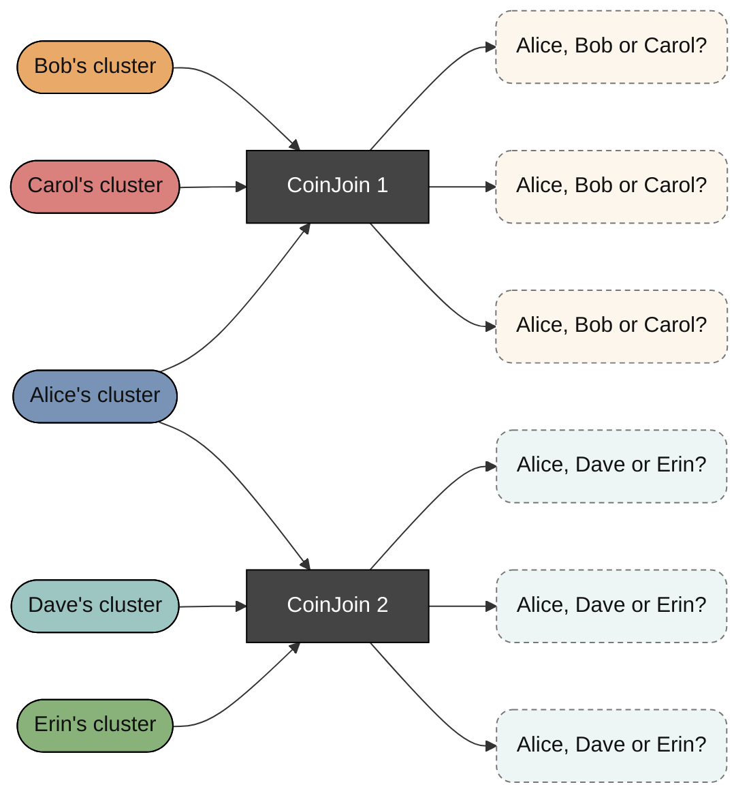
```mermaid
flowchart LR
  classDef ac fill:#7993b6,stroke:#000,color:#111
  classDef bc fill:#e9a969,stroke:#000,color:#111
  classDef cc fill:#da817d,stroke:#000,color:#111
  classDef dc fill:#9dc5c1,stroke:#000,color:#111
  classDef enc fill:#88b279,stroke:#000,color:#111
  classDef txn fill:#444,stroke:#000,color:#fff
  classDef amb1 fill:#fdf6ec,stroke:#777,stroke-dasharray:4 3,color:#111,rx:12,ry:12
  classDef amb2 fill:#edf5f5,stroke:#777,stroke-dasharray:4 3,color:#111,rx:12,ry:12
  B(["Bob's cluster"]):::bc --> cj1
  C(["Carol's cluster"]):::cc --> cj1
  A(["Alice's cluster"]):::ac --> cj1["CoinJoin 1"]:::txn
  A --> cj2["CoinJoin 2"]:::txn
  D(["Dave's cluster"]):::dc --> cj2
  E(["Erin's cluster"]):::enc --> cj2
  cj1 --> x1("Alice, Bob or Carol?"):::amb1
  cj1 --> x2("Alice, Bob or Carol?"):::amb1
  cj1 --> x3("Alice, Bob or Carol?"):::amb1
  cj2 --> y1("Alice, Dave or Erin?"):::amb2
  cj2 --> y2("Alice, Dave or Erin?"):::amb2
  cj2 --> y3("Alice, Dave or Erin?"):::amb2
```

*The adversary's view while the CoinJoin outputs remain unspent: six outputs in two equivalence classes, each output ambiguous among its CoinJoin's participants.*

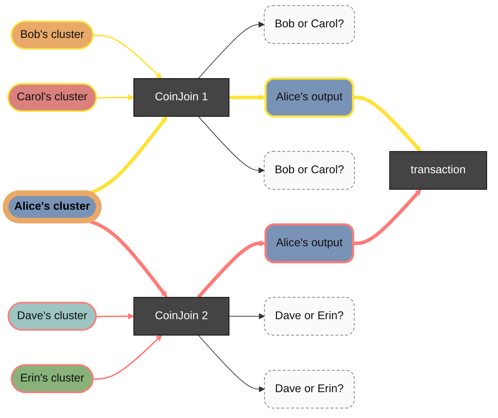
```mermaid
flowchart LR
  classDef txn fill:#444,stroke:#000,color:#fff
  classDef amb fill:#fafafa,stroke:#777,stroke-dasharray:4 3,color:#111,rx:12,ry:12
  classDef aci fill:#7993b6,stroke:#e9a969,stroke-width:8px,color:#000,font-weight:bold
  classDef bc1 fill:#e9a969,stroke:#ffe234,stroke-width:2px,color:#111
  classDef cc1 fill:#da817d,stroke:#ffe234,stroke-width:2px,color:#111
  classDef aco1 fill:#7993b6,stroke:#ffe234,stroke-width:3px,color:#111,rx:12,ry:12
  classDef dc2 fill:#9dc5c1,stroke:#ff7a76,stroke-width:2px,color:#111
  classDef enc2 fill:#88b279,stroke:#ff7a76,stroke-width:2px,color:#111
  classDef aco2 fill:#7993b6,stroke:#ff7a76,stroke-width:3px,color:#111,rx:12,ry:12
  B(["Bob's cluster"]):::bc1 --> cj1
  C(["Carol's cluster"]):::cc1 --> cj1
  A(["Alice's cluster"]):::aci --> cj1["CoinJoin 1"]:::txn
  A --> cj2["CoinJoin 2"]:::txn
  D(["Dave's cluster"]):::dc2 --> cj2
  E(["Erin's cluster"]):::enc2 --> cj2
  cj1 --> xo1("Bob or Carol?"):::amb
  cj1 --> x("Alice's output"):::aco1
  cj1 --> xo2("Bob or Carol?"):::amb
  cj2 --> y("Alice's output"):::aco2
  x --> sp["transaction"]:::txn
  y --> sp
  cj2 --> yo1("Dave or Erin?"):::amb
  cj2 --> yo2("Dave or Erin?"):::amb
  linkStyle 0,1 stroke:#ffe234,stroke-width:2px
  linkStyle 2,7,10 stroke:#ffe234,stroke-width:5px
  linkStyle 4,5 stroke:#ff7a76,stroke-width:2px
  linkStyle 3,9,11 stroke:#ff7a76,stroke-width:5px
```

*Alice's spend links one output from each class. Tracing each input back — from spent output, through its creating CoinJoin, and to the pre-CoinJoin input clusters — gives the two antecessor sets, highlighted in yellow and red. These overlap only at Alice's cluster, highlighted as the one node belonging to both: The intersection identifies her, and by elimination also narrows the remaining outputs' candidate sets: CoinJoin 1's to Bob or Carol, CoinJoin 2's to Dave or Erin.*

If each additional intersection reduces the remaining candidate set by a constant factor, its size falls exponentially with the number of observations. Starting from $n$ candidates, a process of elimination that rules out one candidate at a time will take $O(n)$ time to narrow down a single candidate, but if intersections are used to eliminate them then $O(\log n)$ observations may suffice for successful deanonymization.

This holds unless the size of the symmetric difference between antecessor sets is bounded by a constant — i.e. the antecessor sets of linked coins are very similar — because then the size of the intersection is similar to the size of the intersected sets. This attack is powerful because that similarity is rare in practice: The intersection will usually be significantly smaller than the sets themselves.

It's also important to bear in mind that the candidate origins aren't coins, but rather clusters, so the objects being intersected needn't be connected on the transaction graph for the adversary to notice an overlap. This is particularly concerning because the clusters being intersected are the pre-CoinJoin ones, where — presumably — privacy is inherently weak. It's also worth emphasizing that the change outputs of equal amount CoinJoins are part of these clusters as well.

Next, consider an adversary who is also a counterparty — for example, an ATM in some remote location that sells coins to a user in exchange for cash, and later receives funds from descendants of those coins. Such a counterparty knows, from its own records, exactly which coins it paid out and can observe when descendants of those coins are sold back to it. Connectivity to a crowd of strangers over the internet does little against this, because none of those strangers are likely to have transacted with the ATM, and the CoinJoin doesn't sever the link from a coin to its past. By the same logic of intersection attacks, privacy loss arising from consolidation of more than one input doesn't just add up; it compounds. This is known as the **Eve-Alice-Eve** threat model.

## Own-origin robustness

The privileged counterparty knows one endpoint because it *is* the origin, so the property is stated relative to that origin. It demands that a coin have many plausible, counterfactual paths back to the user's own antecedent coins.

Suppose Alice withdraws from that ATM, and that is her only means of obtaining Bitcoin. She then CoinJoins with Bob. If one of those coins is then returned to the ATM, its operator can conclude that it is likely Alice.

```mermaid
flowchart LR
  classDef ac fill:#7993b6,stroke:#000,color:#111,rx:12,ry:12
  classDef bc fill:#e9a969,stroke:#000,color:#111,rx:12,ry:12
  classDef ec fill:#b996b2,stroke:#000,color:#111,rx:12,ry:12
  classDef txn fill:#444,stroke:#000,color:#fff
  classDef amb fill:#fafafa,stroke:#777,stroke-dasharray:4 3,color:#111,rx:12,ry:12
  atm(("ATM")):::ec -. "withdrawal" .-> a0("Alice's coin"):::ac
  a0 --> cj["CoinJoin<br/>Alice + Bob"]:::txn
  b0("Bob's coin"):::bc --> cj
  cj --> x1("Alice or Bob?"):::amb
  cj --> x2("Alice or Bob?"):::amb
  x1 --> deposit["deposit"]:::txn
  deposit --> atmd("ATM's output"):::ec
```

*Taken in isolation, the deposited coin is ambiguous: It could be Alice's or Bob's.*

```mermaid
flowchart LR
  classDef ac fill:#7993b6,stroke:#000,color:#111,rx:12,ry:12
  classDef bc fill:#e9a969,stroke:#000,color:#111,rx:12,ry:12
  classDef ec fill:#b996b2,stroke:#000,color:#111,rx:12,ry:12
  classDef txn fill:#444,stroke:#000,color:#fff
  classDef acg fill:#7993b6,stroke:#ffe234,stroke-width:5px,color:#111,rx:12,ry:12
  atm(("ATM")):::ec -. "withdrawal" .-> a0("Alice's coin"):::acg
  a0 --> cj["CoinJoin<br/>Alice + Bob"]:::txn
  b0("Bob's coin"):::bc --> cj
  cj --> x1("Alice's output"):::acg
  cj --> x2("Bob's output"):::bc
  x1 --> deposit["deposit"]:::txn
  deposit --> atmd("ATM's output"):::ec
  linkStyle 0,1,3,5,6 stroke:#ffe234,stroke-width:4px
```

*But in this minimal example, the ambiguity is thin. The ATM can conclude with reasonable certainty that the deposit is Alice's, because it's much more likely to get repeated business from her than it is for her to randomly interact with Bob just before Bob happens to use the ATM.*

Consolidation makes the ATM's job easier still. Suppose Alice withdraws two coins, mixes each once with a different peer, and then spends the two mixed outputs together:

```mermaid
flowchart LR
  classDef ac fill:#7993b6,stroke:#000,color:#111,rx:12,ry:12
  classDef bc fill:#e9a969,stroke:#000,color:#111,rx:12,ry:12
  classDef cc fill:#da817d,stroke:#000,color:#111,rx:12,ry:12
  classDef ec fill:#b996b2,stroke:#000,color:#111,rx:12,ry:12
  classDef txn fill:#444,stroke:#000,color:#fff
  classDef acg fill:#7993b6,stroke:#ffe234,stroke-width:5px,color:#111,rx:12,ry:12
  atm(("ATM")):::ec -. "withdrawal" .-> a0("Alice's coin"):::acg
  atm -. "withdrawal" .-> a0b("Alice's other coin"):::acg
  b0("Bob's coin"):::bc --> cj1
  a0 --> cj1["CoinJoin 1<br/>Alice + Bob"]:::txn
  cj1 --> o2("Bob's output"):::bc
  cj1 --> o1("Alice's output"):::acg
  a0b --> cj2["CoinJoin 2<br/>Alice + Carol"]:::txn
  c0("Carol's coin"):::cc --> cj2
  cj2 --> o3("Alice's output"):::acg
  cj2 --> o4("Carol's output"):::cc
  o1 --> deposit["deposit"]:::txn
  o3 --> deposit
  deposit --> atmd("ATM's output"):::ec
  linkStyle 0,1,3,5,6,8,10,11,12 stroke:#ffe234,stroke-width:4px
```

*Each CoinJoin output on its own is ambiguous, but only Alice is consistent with both inputs of the consolidation, so the deposit identifies her. Additional inputs amplify the ATM's observing power exponentially.*

Suppose instead that Bob CoinJoins with another user, Carol, and then Carol CoinJoins with Alice.

If *Carol* were to use the ATM at that point, her coin would have inherited Alice's provenance, which may cause the ATM to incorrectly conclude that it is Alice who is using it. By symmetry, if it were Alice who did that, she gets some degree of plausible deniability.

```mermaid
flowchart LR
  classDef ac fill:#7993b6,stroke:#000,color:#111,rx:12,ry:12
  classDef bc fill:#e9a969,stroke:#000,color:#111,rx:12,ry:12
  classDef cc fill:#da817d,stroke:#000,color:#111,rx:12,ry:12
  classDef ec fill:#b996b2,stroke:#000,color:#111,rx:12,ry:12
  classDef txn fill:#444,stroke:#000,color:#fff
  atm(("ATM")):::ec -. "withdrawal" .-> a0("Alice's coin"):::ac
  a0 --> cj1["CoinJoin 1<br/>Alice + Bob"]:::txn
  b0("Bob's coin"):::bc --> cj1
  cj1 --> a1("Alice's output"):::ac
  cj1 --> b1("Bob's output"):::bc
  b1 --> cj2["CoinJoin<br/>Bob + Carol"]:::txn
  c0("Carol's coin"):::cc --> cj2
  cj2 --> c1("Carol's output"):::cc
  cj2 --> b2("Bob's output"):::bc
  a1 --> cj3["CoinJoin 3<br/>Carol + Alice"]:::txn
  c1 --> cj3
  cj3 --> o1("Alice's output"):::ac
  cj3 --> o2("Carol's output"):::cc
  o2 --> deposit["deposit"]:::txn
  deposit --> atmd("ATM's output"):::ec
```

*In this scenario, it *is* actually Carol who deposits, and the funds were never in Alice's possession, but their history is interwoven with Alice's through the CoinJoins, which, by the same logic, would cause the adversary to mistakenly conclude that it is Alice.*

```mermaid
flowchart LR
  classDef ac fill:#7993b6,stroke:#000,color:#111,rx:12,ry:12
  classDef bc fill:#e9a969,stroke:#000,color:#111,rx:12,ry:12
  classDef cc fill:#da817d,stroke:#000,color:#111,rx:12,ry:12
  classDef ec fill:#b996b2,stroke:#000,color:#111,rx:12,ry:12
  classDef txn fill:#444,stroke:#000,color:#fff
  classDef amb fill:#fafafa,stroke:#777,stroke-dasharray:4 3,color:#111,rx:12,ry:12
  atm(("ATM")):::ec -. "withdrawal" .-> a0("Alice's coin"):::ac
  a0 --> cj1["CoinJoin 1<br/>Alice + Bob"]:::txn
  b0("Bob's coin"):::bc --> cj1
  cj1 --> a1("Alice or Bob?"):::amb
  cj1 --> b1("Alice or Bob?"):::amb
  b1 --> cj2["CoinJoin<br/>Bob + Carol"]:::txn
  c0("Carol's coin"):::cc --> cj2
  cj2 --> c1("Alice, Bob or Carol?"):::amb
  cj2 --> b2("Alice, Bob or Carol?"):::amb
  a1 --> cj3["CoinJoin 3<br/>Carol or Bob + Alice"]:::txn
  c1 --> cj3
  cj3 --> o1("Alice, Bob or Carol?"):::amb
  cj3 --> o2("Alice, Bob or Carol?"):::amb
  o2 --> deposit["deposit"]:::txn
  deposit --> atmd("ATM's output"):::ec
```

*The same transactions from the ATM's point of view: After CoinJoin 3, the two outputs are equivalent — whichever one is deposited has plausible paths back to the dispensed coin, directly through CoinJoin 3 or via Bob through CoinJoins 1 and 2 — so the ATM cannot tell Alice returning from either Bob or Carol.*

Repeated CoinJoins can spread Alice's coins' provenance-related features to other users' coins while spreading their features to hers. This allows her to build up to a quantifiable anonymity set.

```mermaid
flowchart LR
  classDef ac fill:#7993b6,stroke:#000,color:#111,rx:12,ry:12
  classDef bc fill:#e9a969,stroke:#000,color:#111,rx:12,ry:12
  classDef cc fill:#da817d,stroke:#000,color:#111,rx:12,ry:12
  classDef dc fill:#9dc5c1,stroke:#000,color:#111,rx:12,ry:12
  classDef enc fill:#88b279,stroke:#000,color:#111,rx:12,ry:12
  classDef fc fill:#ecd580,stroke:#000,color:#111,rx:12,ry:12
  classDef txn fill:#444,stroke:#000,color:#fff
  classDef txni fill:#444,stroke:#5778a4,stroke-width:6px,color:#fff
  classDef ai fill:#7993b6,stroke:#5778a4,stroke-width:6px,color:#111,rx:12,ry:12
  classDef bi fill:#e9a969,stroke:#5778a4,stroke-width:6px,color:#111,rx:12,ry:12
  classDef ci fill:#da817d,stroke:#5778a4,stroke-width:6px,color:#111,rx:12,ry:12
  classDef di fill:#9dc5c1,stroke:#5778a4,stroke-width:6px,color:#111,rx:12,ry:12
  a0("Alice's coin"):::ac --> cj1["CoinJoin<br/>Alice + Bob"]:::txni
  b0("Bob's coin"):::bc --> cj1
  cj1 --> a1("Alice's output"):::ai
  cj1 --> b1("Bob's output"):::bi
  b1 --> cj2["CoinJoin<br/>Bob + Carol"]:::txni
  c0("Carol's coin"):::cc --> cj2
  cj2 --> b2("Bob's output"):::bi
  cj2 --> c1("Carol's output"):::ci
  d0("Dave's coin"):::dc --> cjx1["CoinJoin<br/>Dave + Erin"]:::txn
  e0("Erin's coin"):::enc --> cjx1
  cjx1 --> d1("Dave's output"):::dc
  cjx1 --> e1("Erin's output"):::enc
  c1 --> cj3["CoinJoin<br/>Carol + Dave"]:::txni
  d1 --> cj3
  cj3 --> c2("Carol's output"):::ci
  cj3 --> d2("Dave's output"):::di
  e1 --> cjx2["CoinJoin<br/>Erin + Frank"]:::txn
  f0("Frank's coin"):::fc --> cjx2
  cjx2 --> e2("Erin's output"):::enc
  cjx2 --> f1("Frank's output"):::fc
  linkStyle 0,2,3,4,6,7,12,14,15 stroke:#5778a4,stroke-width:3px
```

*Coins are colored by their true owner; a thick blue border marks the coins descending from Alice's. Dave's coin picks up the fingerprint when mixing with Carol, for example.*

As this set grows, Alice's chances of CoinJoining her actual funds with such a coin increase with time. If Alice participates in enough CoinJoins so that eventually inputs to the next CoinJoin are already descendants of her prior coin and many such counterfactual paths exist, that can provide privacy even against an adversarial counterparty, which by finding its own coins in the intersection is able to cluster much more reliably than a third-party observer relying on heuristics.

```mermaid
flowchart LR
  classDef ac fill:#7993b6,stroke:#000,color:#111,rx:12,ry:12
  classDef bc fill:#e9a969,stroke:#000,color:#111,rx:12,ry:12
  classDef cc fill:#da817d,stroke:#000,color:#111,rx:12,ry:12
  classDef dc fill:#9dc5c1,stroke:#000,color:#111,rx:12,ry:12
  classDef enc fill:#88b279,stroke:#000,color:#111,rx:12,ry:12
  classDef fc fill:#ecd580,stroke:#000,color:#111,rx:12,ry:12
  classDef gc fill:#b9a0d8,stroke:#000,color:#111,rx:12,ry:12
  classDef txn fill:#444,stroke:#000,color:#fff
  classDef txni fill:#444,stroke:#5778a4,stroke-width:6px,color:#fff
  classDef ai fill:#7993b6,stroke:#5778a4,stroke-width:6px,color:#111,rx:12,ry:12
  classDef bi fill:#e9a969,stroke:#5778a4,stroke-width:6px,color:#111,rx:12,ry:12
  classDef ci fill:#da817d,stroke:#5778a4,stroke-width:6px,color:#111,rx:12,ry:12
  classDef di fill:#9dc5c1,stroke:#5778a4,stroke-width:6px,color:#111,rx:12,ry:12
  classDef ei fill:#88b279,stroke:#5778a4,stroke-width:6px,color:#111,rx:12,ry:12
  classDef fi fill:#ecd580,stroke:#5778a4,stroke-width:6px,color:#111,rx:12,ry:12
  classDef gi fill:#b9a0d8,stroke:#5778a4,stroke-width:6px,color:#111,rx:12,ry:12

  a0("Alice"):::ac --> cj1[" "]:::txni
  b0("Bob"):::bc --> cj1
  cj1 --> a1("Alice"):::ai
  cj1 --> b1("Bob"):::bi
  a1 --> cj6[" "]:::txni

  b1 --> cj2[" "]:::txni
  c0("Carol"):::cc --> cj2
  cj2 --> c1("Carol"):::ci
  cj2 --> b2("Bob"):::bi
  d0("Dave"):::dc --> cjx1[" "]:::txn
  e0("Erin"):::enc --> cjx1
  cjx1 --> d1("Dave"):::dc
  cjx1 --> e1("Erin"):::enc
  c1 --> cj3[" "]:::txni
  d1 --> cj3
  cj3 --> d2("Dave"):::di
  cj3 --> c2("Carol"):::ci
  e1 --> cjx2[" "]:::txn
  f0("Frank"):::fc --> cjx2
  cjx2 --> e2("Erin"):::enc
  cjx2 --> f1("Frank"):::fc

  b2 --> cj4[" "]:::txni
  e2 --> cj4
  cj4 --> b3("Bob"):::bi
  cj4 --> e3("Erin"):::ei

  d2 --> cj5[" "]:::txni
  f1 --> cj5
  cj5 --> d3("Dave"):::di
  cj5 --> f2("Frank"):::fi

  b3 --> cj6
  d3 --> cj6
  g0("Grace"):::gc --> cj6
  cj6 --> a2("Alice"):::ai
  cj6 --> b4("Bob"):::bi
  cj6 --> d4("Dave"):::di
  cj6 --> g1("Grace"):::gi

  linkStyle 0,2,3,4,5,7,8,13,15,16,21,23,24,25,27,28,29,30,32,33,34,35 stroke:#5778a4,stroke-width:4px
```

*Continuing the preceding graph, Bob and Dave spend marked outputs along separate branches. As more marked outputs circulate, more branches can spread Alice's provenance features. In Alice's next four-input CoinJoin, Bob's and Dave's inputs also descend from her original coin; only Grace's does not.*

When spending more than one coin, the similarity of these provenance features matters because it determines how much their antecessor sets overlap.

To quantify an anonymity set size, Alice can count the inputs belonging to other users that already share her coins' provenance features,[^proximity] i.e. inputs that counterfactually trace back to her origin coins. Many such counterfactual paths imply that intersected candidate sets shrink only at a linear rate, because Alice's coins would also be in the intersections arising from post CoinJoin linking of coins that have nothing to do with her.

This is the most conservative notion of on-chain privacy described in this document. CoinJoin transactions that have the structural properties discussed — where peers are chosen so as to satisfy these robustness properties — are required to frustrate a real-world deanonymization adversary. Without them, the information required to deanonymize is often revealed in the transaction graph itself, which is already very harmful for privacy, fungibility, and censorship resistance. And this is compounded — perhaps catastrophically — by many other privacy loss vectors outside the graph, such as blockchain indexing services for light clients, KYC information, leaks from data breaches, and transport level information like IP addresses.

Note, however, that this still requires that the other ATM users also CoinJoin; otherwise, Alice's history will still be unique. Even if she tries to obscure this using "normal looking" transactions, the ATM could still distinguish Alice based on the fact that these transactions descend from the CoinJoin subgraph, simply because those of the other users do not. Determining whether she is the only such user is something that can be judged based on evidence like temporal patterns (correlations or periodic activity). Such patterns are more easily discernible when there are clearly delineated CoinJoin-using and non-CoinJoin-using populations in the transaction graph as a whole.

The adversary can combine amount-based analysis, wallet fingerprints and other statistical features, graph matching, link prediction, intersection attacks, and auxiliary information. A link inferred from one source can change the interpretation of another. These analyses need not run as separate stages, and the auxiliary information may come from public observations, the adversary's own transactions, or private records.

## Censorship resistance vs. privacy tradeoffs and complementarity

The constructions discussed here form a spectrum: unilateral transactions, two-party PayJoins, many senders and receivers, net settlement, and market-based CoinJoin among strangers, constructed with increasing degrees of connectivity robustness.

One end offers censorship resistance and generally weak privacy; the other offers stronger privacy guarantees at the cost of an overt fingerprint.

Note that this doesn't refer to on-chain censorship resistance specifically; we must take for granted that at least some miners will include CoinJoin transactions for any of this to work. The relevant risk is censorship by businesses — an exchange or custodian that refuses, freezes, or discounts coins by their history, particularly if that history contains privacy-enhanced transactions.[^scam-exchanges]

This isn't zero sum. The two ends then reinforce each other. The censorship-resistant end gains fungibility and can better resist clustering from being interwoven with the well-connected structure. The robust anonymity end gains censorship resistance by not being an insular sub-economy that rarely touches ordinary transactions.

Multiparty transactions that don't overtly optimize for an underdetermined sub-transaction mapping can still provide ambiguity, with their susceptibility to censorship based on public information largely reduced to their proximity to the overtly privacy-enhancing ones.

If this structural feature spectrum is realized on-chain, the distribution of provenance features labeling a user's output has a better chance of matching the provenance feature distributions of more superficially similar but unrelated coins. Superficially similar coins are those with which it shares statistical features (like value distribution or wallet software fingerprints) or more general structural features (e.g. size of the containing transaction).

Recall that sparseness is a requirement for Narayanan and Shmatikov's results. In today's transaction graph, cluster features — both statistical, and more importantly, structural — are very likely to be unique because there doesn't exist any wallet software that deliberately blends the structural features. Wallet fingerprints and other statistical features of clusters might not be sparse on their own. But if the social network structure is recoverable from the transaction graph, that will be enough for the adversary to deanonymize most of the graph. Auxiliary information like KYC data might be the basis of such a seed, but just high degree nodes on the social graph, such as well-known mining pools, exchanges, and payment processors may suffice.

Sufficiently ambiguous collaborative transactions would produce coins that share the *sum* of their inputs' provenance feature vectors, blending together their fingerprints. This undermines sparseness by construction. The more widely these sums spread, the less sparse the feature vectors of all coins become. For the transaction graph structure to actually be connected in this way requires deliberate effort, but there's no fundamental barrier to this occurring.

This suggests that some of today's widely held — but often misleading — beliefs or intuitions about on-chain privacy and fungibility would be more accurate under two conditions: if such mixing of provenance features were pervasive, and if the boundary between such transactions and "normal" transactions were obscured by a network of covert transactions, none of them completely disconnected from the CoinJoin graph.

In other words, imagine a world where some users CoinJoin and construct transaction graphs with sufficiently many disjoint counterfactual paths, as discussed above, and other users engage in net settlement transactions or two-party PayJoins. Crucially, all of these subgraphs are intertwined. In that world, the combinatorial explosion of graph-based features, which today can reveal a lot of information to the adversary, would be rendered mostly inert. By construction, such a transaction graph will not satisfy the sparseness conditions which are required for applying Shmatikov and Narayanan's approach.

Until such time, be skeptical of claims that PayJoin or even CoinJoin provide privacy against a competent adversary — especially if it's well funded and is widely known to have access to a trove of high-quality auxiliary information. And even if this does become a reality, please remember that it wouldn't address the auxiliary information concern, nor thwart any as-of-yet undiscovered analyses that perhaps exploit some subtler leaks. And bear in mind that this depends not just on software, but a critical mass of adoption and assimilation of such privacy enhanced transaction graph structures into the rest of the Bitcoin ecosystem in order to have a meaningful impact on fungibility.

[^cioh-wp]: The common-input-ownership observation appears in passing in the Bitcoin whitepaper: S. Nakamoto, [*Bitcoin: A Peer-to-Peer Electronic Cash System*](https://bitcoin.org/bitcoin.pdf)

[^cioh-scroll]: For an informal introduction to wallet clustering, see [The Scroll #2, Wallet Clustering Basics](https://spiralbtc.substack.com/p/the-scroll-2-wallet-clustering-basics)

[^forms]: The two-party case isn't exhaustive; the space of collaborative transaction forms is larger; in particular, lightning is probably the most widespread type of two-party transaction. See [The Scroll #5, The Many Faces of CoinJoins](https://spiralbtc.substack.com/p/the-scroll-5-the-many-faces-of-coinjoins)

[^payjoin-entropy]: Roughly 1.58 bits is the best possible case for a two-input, two-output transaction, which is a rather typical shape. Counterintuitively, while additional inputs seem to suggest linear growth in entropy because of the combinatorics, input consolidation may result in a linear reduction in entropy due to consolidation as a function of the in-degree of the consolidation sub-transaction. See the discussion about intersection attacks below.

[^reid-harrigan]: F. Reid and M. Harrigan, [*An Analysis of Anonymity in the Bitcoin System*](https://arxiv.org/abs/1107.4524)

[^ron-shamir]: D. Ron and A. Shamir, [*Quantitative Analysis of the Full Bitcoin Transaction Graph*](https://eprint.iacr.org/2012/584)

[^androulaki]: E. Androulaki, G. Karame, M. Roeschlin, T. Scherer, S. Capkun, [*Evaluating User Privacy in Bitcoin*](https://eprint.iacr.org/2012/596)

[^meiklejohn]: S. Meiklejohn, M. Pomarole, G. Jordan, K. Levchenko, D. McCoy, G. M. Voelker, S. Savage, [*A Fistful of Bitcoins: Characterizing Payments Among Men with No Names*](https://cseweb.ucsd.edu/~smeiklejohn/files/imc13.pdf)

[^nick]: J. Nick, [*Data-Driven De-Anonymization in Bitcoin*](https://jonasnick.github.io/papers/thesis.pdf)

[^harrigan-fretter]: M. Harrigan and C. Fretter, [*The Unreasonable Effectiveness of Address Clustering*](https://arxiv.org/abs/1605.06369)

[^moser-narayanan]: M. Möser and A. Narayanan, [*Resurrecting Address Clustering in Bitcoin*](https://arxiv.org/abs/2107.05749)
[^kappos]: G. Kappos, H. Yousaf, R. Stütz, S. Rollet, B. Haslhofer, S. Meiklejohn, [*How to Peel a Million: Validating and Expanding Bitcoin Clusters*](https://arxiv.org/abs/2205.13882)

[^scroll-history]: For a narrative history of clustering techniques, see [The Scroll #3, A Brief History of Wallet Clustering](https://spiralbtc.substack.com/p/the-scroll-3-a-brief-history-of-wallet)

[^p2ep]: [Pay-to-EndPoint (P2EP)](https://blockstream.com/2018/08/08/en-improving-privacy-using-pay-to-endpoint/)
[^bip79]: R. Havar, [BIP 79: *Bustapay :: a practical coinjoin protocol*](https://github.com/bitcoin/bips/blob/master/bip-0079.mediawiki)
[^bip78]: N. Dorier, [BIP 78: *A Simple Payjoin Proposal*](https://github.com/bitcoin/bips/blob/master/bip-0078.mediawiki)
[^bip77]: D. Gould and Y. Kogman, [BIP 77: *Async Payjoin*](https://github.com/bitcoin/bips/blob/master/bip-0077.md)

[^uih-adamisz]: AdamISZ, [payjoin / unnecessary-input-heuristic writeup](https://gist.github.com/AdamISZ/4551b947789d3216bacfcb7af25e029e)

[^uih-ghesmati]: S. Ghesmati, A. Kern, A. Judmayer, N. Stifter, and E. Weippl, [*Unnecessary Input Heuristics & PayJoin Transactions*](https://eprint.iacr.org/2022/589)

[^boltzmann]: LaurentMT, [*Boltzmann*](https://gist.github.com/LaurentMT/d361bca6dc52868573a2), specifically the link-probability matrix.

[^ns1r]: rust-payjoin, [PR #923 (removal of the experimental NS1R implementation, with status discussion)](https://github.com/payjoin/rust-payjoin/pull/923)

[^siblings]: This concern is not entirely hypothetical; it applies to some CoinJoin wallets and Electrum's “multiple change addresses” mode.

[^maxwell]: G. Maxwell, [*CoinJoin: Bitcoin privacy for the real world*](https://bitcointalk.org/index.php?topic=279249)

[^maurer]: F. K. Maurer, T. Neudecker, M. Florian, [*Anonymous CoinJoin Transactions with Arbitrary Values*](https://www.researchgate.net/publication/318128387_Anonymous_CoinJoin_Transactions_with_Arbitrary_Values)

[^ns-netflix]: A. Narayanan and V. Shmatikov, [*Robust De-anonymization of Large Sparse Datasets*](https://arxiv.org/abs/cs/0610105) (S&P 2008; the linked arXiv version is titled *How To Break Anonymity of the Netflix Prize Dataset*)

[^ns-retro]: A. Narayanan and V. Shmatikov, [*Robust De-anonymization of Large Sparse Datasets: a Decade Later*](https://www.cs.princeton.edu/~arvindn/publications/de-anonymization-retrospective.pdf)

[^ns-social]: A. Narayanan and V. Shmatikov, [*De-anonymizing Social Networks*](https://arxiv.org/abs/0903.3276)

[^minor-nitpick]: This isn't really a graph minor since there are directed edges. In fact, it's not really a graph because it has both directed and undirected edges.

[^multigraph-nitpick]: Strictly speaking, their model involves a directed graph, not a multigraph, but edges are labeled with arbitrary attributes so the information about the various payments can be collected into a rich set of attributes on a single edge representing the relationship between two clusters.

[^ns-linkpred]: A. Narayanan, E. Shi, B. I. P. Rubinstein, [*Link Prediction by De-anonymization*](https://arxiv.org/abs/1102.4374)

[^sabouri]: A. Sabouri, [*How Wallet Fingerprints Damage Payjoin Privacy*](https://payjoin.org/blog/2026/03/25/wallet-fingerprints-payjoin-privacy/)

[^goldfeder]: S. Goldfeder, H. Kalodner, D. Reisman, A. Narayanan, [*When the Cookie Meets the Blockchain*](https://arxiv.org/abs/1708.04748)

[^danezis]: G. Danezis, [*Statistical Disclosure Attacks*](https://www.freehaven.net/anonbib/cache/statistical-disclosure.pdf)

[^troncoso]: C. Troncoso, B. Gierlichs, B. Preneel, I. Verbauwhede, [*Perfect Matching Disclosure Attacks*](https://www.freehaven.net/anonbib/cache/troncoso-pet2008.pdf)

[^scroll-intersection]: For an accessible treatment of entropy and intersection attacks on coinjoin anonymity sets, see [The Scroll #4, Intersection Attacks](https://spiralbtc.substack.com/p/the-scroll-4-intersection-attacks)

[^kelen-seres]: D. M. Kelen and I. A. Seres, [*Towards Measuring the Traceability of Cryptocurrencies*](https://arxiv.org/abs/2211.04259)

[^flow]: Note that being connected doesn't just mean a path can be traced along the graph, but that the flow of funds along that path appears plausible.

[^diaz]: C. Diaz, S. Seys, J. Claessens, B. Preneel, [*Towards Measuring Anonymity*](https://www.freehaven.net/anonbib/cache/Diaz02.pdf)

[^serjantov-danezis]: A. Serjantov and G. Danezis, [*Towards an Information Theoretic Metric for Anonymity*](https://bib.mixnetworks.org/pdf/serjantov2002towards.pdf)

[^tx0]: This gets worse if coins of a specific denomination are prepared before the CoinJoin, because that setup transaction is highly fingerprintable as a unilateral transaction.

[^sudoku]: K. Atlas, [*CoinJoin Sudoku*](https://www.coinjoinsudoku.com/)

[^radix]: https://colab.research.google.com/drive/1We_FvfX_Ob9BapFW3X_By9vTtxUrt3pm

[^syverson]: P. Syverson, [*Why I'm not an entropist*](https://www.freehaven.net/anonbib/cache/entropist.pdf)

[^scam-exchanges]: Unsurprisingly, the most aggressive compliance posturing has historically often come from businesses that later collapsed, namely FTX, whose executives were convicted of fraud, and BlockFi, which settled SEC charges that included materially false statements before going under in FTX's wake.

[^proximity]: Not exactly the same, since both temporal patterns and the number of hops make a difference. This can be addressed by ensuring the length of the actual path taken is consistent with the distribution of lengths of the counterfactual paths.
